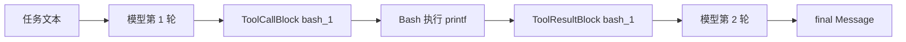
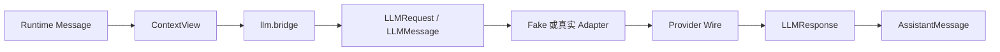

# 00. 用一个真实运行看懂 Agent

> 本篇是整套设计文档的实践入口。先看一次可复现的运行，再回到 01～14 篇理解它为什么这样设计。

## 1. 先运行，再阅读

在仓库根目录执行：

```powershell
$env:PYTHONUTF8='1'
uv run python -m scripts.run_bash_agent_demo `
  --command "printf 'hello-from-tool\n'" `
  --no-trace
```

默认使用 Fake Provider，不需要 API Key。它不是绕过 Runtime 的假数据：Fake Adapter 仍然接收模型请求、返回工具调用，真实 Runtime 仍然调度 Bash、记录结果，并发起下一轮模型请求。

源码入口：

- Demo：[`scripts/run_bash_agent_demo.py`](../../scripts/run_bash_agent_demo.py)
- Agent 组装：[`agents/starter.py`](../../src/simple_long_horizon_agent/agents/starter.py)
- 核心循环：[`core.py`](../../src/simple_long_horizon_agent/core.py)
- Fake 模型：[`llm/adapters/fake.py`](../../src/simple_long_horizon_agent/llm/adapters/fake.py)

## 2. 这个例子到底要完成什么

输入任务是：

```text
Use bash to run command: `printf 'hello-from-tool\n'`
```

Agent 的可用能力中有一个名为 `bash` 的工具。Fake Provider 根据请求中的工具声明和任务文本，确定性地产生两次响应：

1. 第一次响应：说明“将运行命令”，并发出 `bash_1` 工具调用；
2. 第二次响应：读取工具结果，返回 `kind="final"` 的最终消息。

这正好覆盖最小长周期闭环：



## 3. 一个容易忽略的事实：`run()` 是惰性的

```python
state, events = agent.run(task, max_turns=3)
```

调用完成后，State 只有初始化任务：

```text
len(state.events)   == 1
len(state.messages) == 1
```

因为 `events` 是生成器。只有调用者开始消费它，Runtime 才会继续执行模型和工具：

```python
for event in events:
    print(event.kind)
```

消费完成后，本次运行的观测结果是：

```text
yielded events      == 15
state.events        == 16
state.messages      == 4
AgentEnd.reason     == "done"
```

15 个事件是循环产生的事件，初始任务 Message 在调用 `run()` 时已经写入 State，因此最终 State 中共有 16 个事件。

## 4. State 中的四条消息

`state.messages` 是从 `State.events` 投影出来的 transcript，不是 Provider SDK 返回对象的列表。

| 索引 | role | kind | sender → target | 关键内容 |
| ---: | --- | --- | --- | --- |
| 0 | user | task | user → bash_agent | 原始任务文本 |
| 1 | assistant | step | bash_agent → user | `I'll run the requested command with bash.` + `ToolCallBlock(id="bash_1")` |
| 2 | user | tool_result | tool → bash_agent | `ToolResultBlock(tool_call_id="bash_1", tool_name="bash")` |
| 3 | assistant | final | bash_agent → user | `Bash observation: ...` |

其中最重要的配对关系是：

```text
ToolCallBlock.id             = "bash_1"
ToolResultBlock.tool_call_id = "bash_1"
```

Runtime 依靠这个 ID 把“模型请求的行动”和“环境返回的观察”连起来。并行调用时，多个结果也会被放入一个 `tool_result` UserMessage 中，每个 Block 保留自己的 ID。

## 5. 事件顺序：控制流的真实记录

本例的事件种类顺序如下：

```text
message(task)
agent_start
turn_start
model_request
model_response(step)
message(assistant tool call)
tool_execution_start
tool_execution_end
message(tool result)
turn_end

turn_start
model_request
model_response(final)
message(final)
turn_end
agent_end(reason="done")
```

Message 回答“模型和工具交换了什么”；其它 Event 回答“Runtime 何时做了什么”。如果只保存最终文本，就无法知道工具是否执行、是否报错、模型看到了什么，或者运行是正常完成还是预算耗尽。

## 6. 两次模型请求看到了什么

每轮请求前，Runtime 都执行：

```text
active_context_messages()
    → build_context_view()
    → messages_to_llm_messages()
    → 加上 system prompt
    → ModelRequestEvent
```

本例中两次 `ModelRequestEvent` 的核心统计为：

| 请求 | visible_count | llm_message_count | 含义 |
| ---: | ---: | ---: | --- |
| 1 | 1 | 2 | 一条 task Message，加一条 system prompt |
| 2 | 3 | 4 | task、assistant tool call、tool result，再加 system prompt |

`visible_count` 是对话上下文数量；`llm_message_count` 还包括静态 system prompt。这个差异应保留在文档和 Trace 中，不能用一个“消息数”模糊带过。

## 7. 从 Runtime Message 到 Provider Wire

模型边界不是核心状态的一部分，而是一次投影：



核心代码只处理项目自己的 `Message`、`ContentBlock` 和 `Event`。供应商响应的原始快照可以放进 AssistantMessage 的 `sidecar["raw"]`，但不会让 SDK 对象污染 State。

## 8. 工具结果为什么不是异常

Bash 的成功输出会变成可见的 `ToolResultBlock.content`；未知工具、参数错误、异常和超时也会被转换成 `is_error=True` 的结果，再反馈给模型。

所以一次工具失败的正常语义是：

```text
模型提出行动
→ 工具边界执行失败
→ 错误 ToolResult
→ 模型获得反馈并决定是否修正
```

只有 `ToolResult.terminate=True`、外部 `abort` 或回合预算耗尽，才会改变 Runtime 的停止原因。

## 9. 把这个例子推广到长任务

本例没有触发压缩，但长任务只是在同一个循环中增加了一个“请求前投影”步骤：

```text
完整 State.events / messages
        ↓ 保留全部事实
active_context_indices
        ↓ 只选择当前活跃内容
ContextView
        ↓ 仍可被策略过滤
模型输入
```

- Compression 修改活跃索引并追加摘要，不删除原始消息；
- Recall 根据摘要引用的 transcript index 有界读取原始消息；
- Skills 通过 `init_state` 在任务开始时注入菜单或方法；
- Memory 通过普通 Tool 和 Hook 跨运行保存经验。

这四者的时间范围不同，不能统称为一个模糊的“记忆模块”。

## 10. 阅读顺序

读完本例后按下面顺序进入源码和设计：

1. [01. 项目目标与范围](01-product-goals-and-scope.md)
2. [02. 系统总体架构](02-system-architecture.md)
3. [03. 核心概念与数据流](03-domain-model-and-data-flow.md)
4. [04. Agent 核心运行机制](04-agent-runtime.md)
5. [05. 模型访问边界](05-model-access.md)
6. [06. 工具与外部能力](06-tools-and-integrations.md)
7. [07. 上下文与长周期能力](07-context-and-long-horizon.md)
8. [08. Agent 组合与工作流](08-agent-composition-and-workflows.md)
9. [09. 轨迹与可观测性](09-trace-and-observability.md)
10. [10. 评测与运行体系](10-evaluation-and-operations.md)


## 11. 证据与验证

- 确定性 Demo：[`scripts/run_bash_agent_demo.py`](../../scripts/run_bash_agent_demo.py)
- Runtime 与惰性执行：[`tests/unit/test_core.py`](../../tests/unit/test_core.py)
- 工具调用和结果配对：[`tests/unit/test_core.py`](../../tests/unit/test_core.py)
- 上下文统计和 TokenUsage：[`tests/unit/test_context_usage.py`](../../tests/unit/test_context_usage.py)、[`tests/unit/test_token_usage.py`](../../tests/unit/test_token_usage.py)
- 压缩与 Recall：[`tests/unit/test_compression_control.py`](../../tests/unit/test_compression_control.py)
- 设计与文档检查：`uv run python -m scripts.lint_docs`、`uv run python -m scripts.arch_lint`

本篇中的事件数量和消息结构来自当前 Fake Provider 运行；Provider 的具体文本可以变化，但“任务—工具调用—工具结果—下一轮—final”的协议和事件关系由源码与测试约束。
