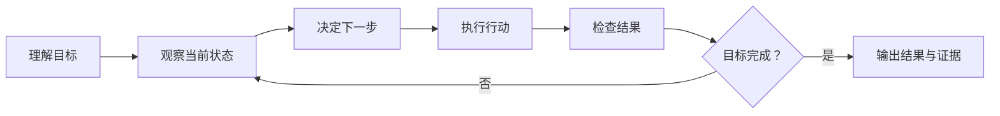
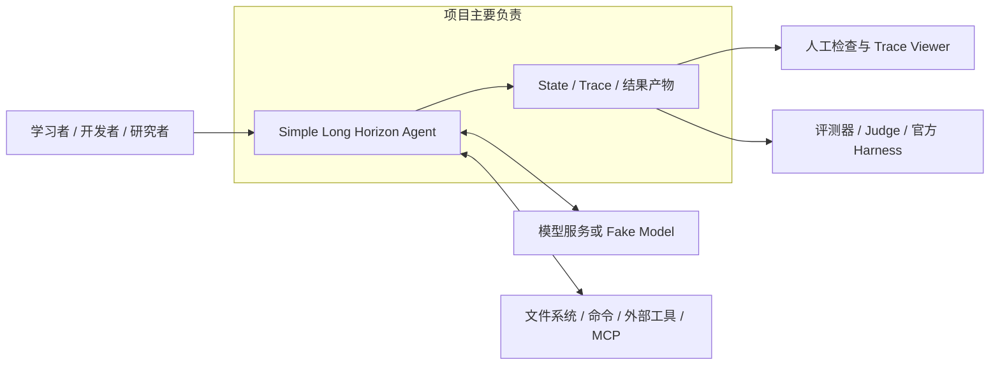

# 01. 项目目标与范围

> 本篇回答一个最基础的问题：Simple Long Horizon Agent 为什么存在，它希望达到什么效果，又不打算解决什么问题。
>
> 本篇只讨论项目目标、使用场景和范围。系统如何分层、各模块如何协作，将在[下一篇：系统总体架构](02-system-architecture.md)中说明。

## 1. 一句话定位

Simple Long Horizon Agent 是一个面向学习、实验和真实多步骤任务的小型 Agent 系统：它让模型能够持续观察、行动、检查和修正，同时让整个过程保持容易理解、修改、观察和验证。

这个定位包含两个同等重要的方向：

- **足够简单**：核心机制应当能够通过阅读直接理解，适合教学、研究和快速改造；
- **实际有效**：系统不能停留在聊天示例，而应当能够使用工具、接触真实环境并持续完成任务。

项目追求的不是“功能最少”，而是“每一层复杂度都能解释它解决了什么问题”。

## 2. 项目要解决的核心问题

### 2.1 单次模型回答无法完成长周期任务

许多真实任务不是“收到问题后直接给出答案”，而是一个持续变化的过程。例如修复软件缺陷时，Agent 需要先检查仓库、定位问题、修改文件、运行测试，再根据测试结果继续调整。任何一步都可能产生新的信息，后续决策必须依赖前面的实际结果。

这类任务需要形成闭环：

模型调用只是其中的“决定下一步”。要让这个闭环真正工作，还必须解决行动执行、结果反馈、状态连续性、停止条件和过程记录等问题。

### 2.2 模型本身不能直接作用于真实环境

模型可以生成文本或表达调用工具的意图，但读取文件、执行命令、修改工作区、访问外部服务都需要运行系统完成。系统必须把模型意图转换成受控行动，再把行动结果以模型能够继续理解的形式反馈回去。

如果缺少统一的工具边界，每一种能力都会把自己的调用格式、异常语义和生命周期带进核心循环，系统很快会变得难以理解和替换。

### 2.3 长时间运行会同时遇到信息过多和信息丢失

任务运行得越久，积累的消息、日志和工具结果越多；但模型一次能够读取的上下文有限。简单丢弃旧内容会失去重要证据，把所有信息永久放入上下文又无法持续扩展。

系统需要区分几种不同的信息需求：

- 完整记录：为了回放和审计，发生过的事实不能消失；
- 当前上下文：下一步决策只需要最相关的信息；
- 按需知识：技能说明不应全部预加载；
- 跨运行经验：已经完成的任务可能为未来任务提供帮助。

这些需求相关但并不相同，因此不能只用一个含义模糊的“Memory”概念处理。

### 2.4 Agent 的“完成”需要被观察和验证

模型说“任务完成了”不代表目标真的完成。真实任务还可能因为回合预算耗尽、外部中止、工具要求终止或环境失败而结束。如果系统只保存最终文本，人无法判断过程中发生了什么，也无法比较不同模型和策略。

因此，长周期运行需要同时保留：

- Agent 看到了什么；
- 模型做出了什么决定；
- 调用了哪些工具；
- 工具返回了什么；
- 上下文是否被压缩；
- 为什么结束；
- 消耗了多少时间和模型资源；
- 最终产物是否通过外部检查。

可观察和可验证不是运行结束后的附加功能，而是长周期系统能够被信任、调试和改进的前提。

### 2.5 大型框架会掩盖本项目最想研究的部分

成熟 Agent 框架通常提供大量抽象、配置和自动发现机制。这些能力在大型生产系统中可能有价值，但也会让学习者难以直接看到模型调用、状态变化、工具反馈和停止判断之间的关系。

本项目选择先保留一个能被完整阅读的简单实现，再围绕明确问题增加能力。它希望成为可以理解和改造的实验基础，而不是要求使用者先接受一个庞大框架的全部概念。

## 3. 项目愿景

项目希望提供一个“从简单核心自然生长到真实能力”的 Agent 基础：

1. 初学者可以通过一次确定性演示看懂完整 Agent 循环；
2. 开发者可以替换模型、工具或工作方式，而不必重写整个系统；
3. Agent 可以在真实环境中持续行动，并根据反馈修正自己；
4. 长任务能够控制上下文，同时保留原始事实和恢复路径；
5. 单 Agent 可以进一步组合成委派、并行、反思和验证工作流；
6. 每次运行都能形成可检查的轨迹和产物；
7. 同一套运行机制可以进入可重复的实验和 Benchmark。

愿景的重点不是把所有能力塞进核心，而是让这些能力围绕清楚的边界逐步组合。

## 4. 目标用户

### 4.1 学习者与教学者

希望通过一个完整但不过度复杂的项目理解：

- Agent 循环如何工作；
- 模型与工具如何协作；
- 状态、上下文和记忆有什么区别；
- 多 Agent 与工作流如何建立在单 Agent 之上；
- 可观测性为什么是 Agent 系统的一部分。

对这类用户，代码和文档的可读性本身就是产品能力。

### 4.2 Agent 开发者与小团队

希望快速构建面向编程、研究、终端操作或内部流程的专用 Agent，并根据任务需要替换模型、增加工具、调整上下文策略或组合工作流。

项目适合作为可修改的基础和实验起点，而不是只能通过配置使用的封闭产品。

### 4.3 研究与实验人员

希望在相同任务和预算下比较：

- 不同模型与推理配置；
- 不同工具集合；
- 不同提示词和 Agent 风格；
- 不同上下文压缩策略；
- 单 Agent 与多 Agent 工作流；
- 不同完成检查和评测方式。

对这类用户，轨迹、成本、运行配置和结果必须能够被检查和复现。

### 4.4 Benchmark 与运行维护者

希望把同一个 Agent 放入本地进程、容器或远程执行环境，批量运行任务、收集产物并调用相应评分方式。

这类用户关注运行隔离、产物传输、失败恢复和评分一致性，但项目不因此演变成通用分布式调度平台。

## 5. 典型使用场景

项目关注的场景可以分为四组。

### 5.1 学习与演示

- 使用确定性模型完成一次“接收任务 → 调用工具 → 获得结果 → 返回答案”的演示；
- 查看一次运行中的消息、事件和工具交互；
- 修改一个局部策略并观察行为如何变化；
- 在没有外部 API 或复杂服务的情况下运行示例。

### 5.2 真实多步骤任务

- 检查并修改一个代码仓库；
- 使用终端命令调查环境或处理文件；
- 读取长文件、图片或工具生成的结果；
- 在多轮失败与修正后完成目标；
- 在预算或时间限制内提交当前最好结果。

### 5.3 复杂 Agent 协作

- 父 Agent 把一个明确子任务委派给专门 Agent；
- 先规划再执行；
- 生成答案后由另一个 Agent 批评并修订；
- 多个 Agent 并行尝试，再聚合结果；
- 在模型声明完成后，用外部检查决定是否真正停止。

### 5.4 评测与研究

- 对一组任务重复运行同一 Agent 配置；
- 在相同模型和预算下比较不同 Agent 方案；
- 在容器中隔离任务环境；
- 实时观察长时间运行的轨迹；
- 保存结果、成本和评分；
- 使用确定性 Fake 或 Oracle 路径检查评测接线，而不依赖真实模型表现。

项目并不假设每个场景都必须使用全部能力。一个教学 Demo 可以只使用最小循环；一个长时间 Benchmark 才可能同时使用压缩、记忆、工作流、实时轨迹和容器执行。

## 6. 项目需要达到的核心效果

这一节描述项目对外应呈现的能力，而不规定内部使用哪些类或文件实现。

### 6.1 能持续推进任务

系统应当能够：

- 接收文本或包含图片等内容的任务；
- 在多个回合之间保留必要状态；
- 每一轮根据当前上下文生成下一步；
- 把行动结果送回后续决策；
- 在明确条件下正常结束或停止；
- 在同一会话中接收后续任务并继续运行。

### 6.2 能安全、清楚地使用外部能力

系统应当提供统一方式描述和执行工具，使模型能够调用本地命令、读取或编辑文件、连接外部服务，以及委派其他 Agent。

工具成功、失败、超时、部分更新和主动终止都应具有清楚语义，并能进入运行记录。外部能力不应拥有或复制 Agent 主循环。

这里的“安全”主要指调用边界清楚、错误可见、生命周期受控；项目本身不等同于完整的操作系统沙箱或多租户安全平台。

### 6.3 能隔离不同模型供应商

核心运行时应当使用项目自己的消息和模型调用语义，不直接依赖某家供应商的响应对象。不同 API 对工具结果、图片、推理内容和停止原因的表达差异，应在模型访问边界处理。

这样，同一 Agent 设计可以更换模型供应商，也可以使用确定性 Fake 实现进行教学和测试。

### 6.4 能支持有限上下文下的长时间工作

系统应当在完整历史与模型当前可见内容之间建立明确区分：

- 历史事实可以持续追加和回放；
- 当前上下文可以过滤或压缩；
- 压缩不应等价于删除原始证据；
- Agent 应当能够按需找回被压缩的重要内容；
- 技能知识和跨运行经验应通过各自清楚的边界参与运行。

### 6.5 能组合复杂工作方式

系统应当允许通过普通 Agent 运行组合出串行、并行、路由、反思、委派和目标检查等工作方式。

组合层应当保留各步骤的结果和运行证据，而不是把所有子过程压成一个无法检查的最终字符串。复杂编排不应产生另一套与核心循环不一致的消息和工具规则。

### 6.6 能观察、解释和验证运行过程

系统应当保留足够的结构化事实，使人能够回答：

- Agent 何时开始和结束；
- 每轮看到了哪些上下文；
- 模型和工具各自做了什么；
- 是否发生压缩、重试、阻止或中止；
- 子 Agent 和工作流如何参与；
- 最终结果及成本如何产生。

这些事实可以进一步形成终端输出、JSONL 轨迹、层级 Span、可视化页面、训练样本和成本报告。

### 6.7 能进行可重复的实验与评测

系统应当能够把任务定义、运行环境、Agent 配置、执行方式、产物存储和评分方式分开。更换本地进程、容器或远程执行位置时，不应要求重新设计 Agent 本身。

一次评测应当留下明确的输入、轨迹、结果和评分产物，使不同方案能够在可比较条件下运行。

## 7. 能力的优先级

仓库包含很多功能，但它们对项目身份的重要程度不同。

### 7.1 核心身份

没有以下能力，项目就不再是它所描述的 Simple Long Horizon Agent：

- 可检查的多轮 Agent 循环；
- 模型调用、工具、状态和编排之间的明确分离；
- 工具行动与结果反馈；
- 清楚的停止与预算语义；
- 结构化、可追踪的运行事实；
- 容易理解和修改的直接控制流。

### 7.2 长周期支撑能力

这些能力让核心循环能够处理更长、更复杂的真实任务：

- 上下文视图与压缩；
- 被压缩信息的 Recall；
- Skills 按需加载；
- 跨运行 Memory；
- 子 Agent 和多阶段 Workflow；
- 完成检查和 Goal Loop。

它们很重要，但应当建立在核心循环之上，而不是使核心依赖某一种具体策略。

### 7.3 实验与运行能力

这些能力让系统可以被研究、比较和规模化运行：

- 标准化 Trace 和 Viewer；
- 成本与训练数据导出；
- Eval Suite、Backend 和 Artifact Store；
- 本地、容器和远程运行；
- 批量、链式和可恢复任务；
- 官方评分器与 Oracle 检查。

它们扩展了项目的使用范围，但不应把 Benchmark 或基础设施逻辑带回核心 Agent 运行时。

## 8. 质量目标与优先顺序

当设计目标发生冲突时，项目大致遵循以下优先顺序。

| 优先级 | 质量目标 | 期望效果 |
| --- | --- | --- |
| 1 | 可理解性 | 核心流程能够通过阅读直接理解，概念和命名保持清楚 |
| 2 | 行为有效性 | Agent 能在真实环境中行动、接收反馈并完成有意义任务 |
| 3 | 可观察与可验证 | 关键决策、行动、停止原因和结果都有结构化证据 |
| 4 | 可修改性 | 模型、工具、策略和工作流可以在明确边界内替换 |
| 5 | 可测试性 | 纯逻辑与 I/O 分离，核心行为可以不依赖外部服务验证 |
| 6 | 可复现性 | 运行配置、轨迹、产物、成本和评分可以被重新检查 |
| 7 | 适度扩展性 | 新能力能够接入，但不能以隐藏核心行为为代价 |

这个顺序意味着项目愿意接受一些显式装配和局部重复，以换取直接控制流；也不会为了理论上的大规模扩展能力，提前引入难以教学和检查的基础设施。

## 9. 系统范围与外部边界

项目位于调用者、模型服务、任务环境和评测系统之间。

### 9.1 项目范围内

- Agent 的多轮控制流程；
- 项目自有的数据和状态语义；
- 模型访问和供应商适配边界；
- 工具描述、调度和结果反馈；
- 上下文选择、压缩与信息恢复；
- Skills、Memory 和生命周期接入；
- Agent 组装、委派与工作流；
- 运行事件、轨迹、成本和可视化数据；
- 评测任务执行、环境适配、产物传递和评分接线；
- 支持这些边界的测试、演示和运行入口。

### 9.2 与项目集成但不由项目拥有

- 模型本身的能力、训练方式和服务可用性；
- 操作系统、Shell、Docker 和远程主机；
- MCP Server 或其他外部工具服务；
- Benchmark 数据集和官方评分实现；
- 被 Agent 操作的目标仓库和任务环境；
- API 凭据、网络策略和部署权限。

项目负责清楚地连接这些外部系统、记录交互结果并暴露失败，不承诺控制外部系统本身。

## 10. 明确的非目标

### 10.1 不是生产级大规模 Agent 平台

项目不以多租户服务、海量并发、GPU 调度、组织级权限系统、服务治理或生产 SLA 为首要目标。评测层可以支持多实例和远程运行，但不会因此把核心设计优化成分布式平台。

### 10.2 不隐藏核心行为

项目不追求通过魔法配置、动态插件扫描、元编程或重量级依赖注入隐藏装配过程。新增抽象必须让系统更容易理解，而不是只减少几行显式代码。

### 10.3 不绑定单一模型供应商

项目可以充分支持某个供应商的工具调用、图片和推理连续性，但这些差异不应成为核心运行时的数据模型。

### 10.4 不承诺模型一定完成任务

系统提供循环、工具、上下文、检查和评测能力，但最终效果仍受模型能力、提示词、任务环境、工具质量和预算影响。框架不能把不可靠的模型自动变成始终正确的执行者。

### 10.5 不把所有状态都称为 Memory

当前会话历史、模型可见上下文、压缩摘要、技能知识、工作流步骤和跨运行经验有不同生命周期。项目不会为了表面统一而用一个万能状态容器掩盖这些差异。

### 10.6 不替代完整安全沙箱

工具可以实施参数检查、工作目录约束、超时和错误处理，容器也可以提供环境隔离；但项目不宣称自身已经解决任意不可信代码执行、秘密管理或多租户隔离的全部安全问题。

### 10.7 不要求所有使用方式都启用全部模块

最小 Agent 不应被迫依赖 Memory、MCP、Workflow、Docker 或某个 Benchmark。外围能力应当按任务需要组合。

## 11. 关键设计取舍

### 11.1 简单性与能力

项目不是通过删除真实能力来保持简单，而是通过清楚的边界控制复杂度。核心循环保持小；Provider、工具、压缩、记忆和评测在各自层中发展。

### 11.2 完整记录与有限上下文

系统既需要保存完整事实，又不能把全部事实无限放入模型窗口。设计因此将“历史是否存在”和“本轮是否可见”分开处理。

### 11.3 模型自主性与外部验证

模型需要有选择下一步行动的空间，但运行时必须提供预算、终止、Hook 和完成检查。Agent 的声明是运行事实的一部分，不自动等同于客观成功。

### 11.4 供应商能力与项目可移植性

系统保留图片、思考和工具调用等重要能力，同时用项目自有数据承接它们。供应商特性可以被适配，供应商对象不能成为核心事实。

### 11.5 真实运行与确定性反馈

真实模型和环境是最终使用场景，但它们不稳定、昂贵且难以重复。项目同时提供 Fake、Oracle、单元测试和 Demo，使关键边界可以在没有网络的情况下检查。

### 11.6 显式组合与通用框架

串行、并行、反思和评测流程优先使用普通函数和清楚的数据结构组合。只有出现稳定、重复且有独立责任的概念时，才增加新的抽象层。

## 12. 如何判断项目达到了目标

项目是否成功，不能只看功能数量或 Benchmark 分数。至少需要从下面几个方面观察。

### 12.1 新人能够建立正确认知

读者能够从一个小型示例解释：任务如何进入状态、模型如何选择工具、工具结果如何反馈、Agent 为什么停止，以及轨迹如何记录这些事实。

### 12.2 能力可以沿边界替换

更换模型供应商、工具、上下文策略或工作流时，修改应集中在相应边界，而不是迫使整个系统理解新的供应商对象或任务细节。

### 12.3 长任务能够持续且有界地运行

Agent 可以进行多轮行动；上下文增长受到管理；原始事实仍可恢复；回合、Token 或时间预算能够阻止无限运行。

### 12.4 运行结果能够被解释

无论任务正常完成、失败、被中止还是耗尽预算，人都可以根据结构化记录还原关键过程，并区分“模型认为完成”和“外部验证通过”。

### 12.5 实验能够被比较

同一任务可以使用不同模型、工具或工作流运行，并留下足以比较行为、结果和成本的产物。评测基础设施的变化不会改变核心 Agent 语义。

### 12.6 复杂度始终能够说明理由

每个主要模块都能回答：它解决了什么原本无法解决的问题；如果移除会失去什么；为什么这个责任没有放入核心循环。

## 13. 用完整场景检查目标

下面的场景用于检查本篇描述的目标是否完整，不规定具体实现形式。

### 场景一：最小可理解循环

给 Agent 一个简单任务。模型先请求一个确定性工具，再根据工具结果返回答案。

期望读者能观察到：

- 任务进入运行状态；
- 模型输出工具调用意图；
- 工具实际执行并返回结果；
- 结果进入下一轮模型上下文；
- Agent 明确正常完成；
- 整个过程可以被检查，且不需要真实模型服务。

这个场景验证“简单、完整、可教学”。

### 场景二：真实长任务

Agent 在代码仓库中调查问题、修改文件并运行验证命令。执行中产生大量工具输出，上下文需要压缩；稍后 Agent 又需要找回某个原始细节。

期望系统表现为：

- 多轮行动持续使用同一运行历史；
- 过长内容不会无限占据当前模型窗口；
- 压缩后的原始事实仍然存在并可按需恢复；
- 最终状态能区分正常完成、预算耗尽或外部中止；
- 修改产物和验证证据可以被检查。

这个场景验证“长周期、真实行动、信息连续和有界运行”。

### 场景三：复杂协作与评测

多个 Agent 独立尝试一个任务，另一个阶段汇总或验证结果；整个任务在容器中执行并由评分器判断。

期望系统表现为：

- 每个子步骤保留独立运行状态；
- 聚合结果能够追溯到各个子步骤；
- 执行环境和产物传输不侵入 Agent 核心循环；
- 轨迹、最终产物、评分和成本能够一起保存；
- 替换本地或远程执行位置时，任务与 Agent 设计保持稳定。

这个场景验证“可组合、可观察、可评测和可复现”。

## 14. 本篇理解检查

读完本篇后，读者应当能够回答：

- 为什么长周期任务不能只靠一次模型调用？
- 项目如何同时追求简单和实际有效？
- 哪些能力构成项目的核心身份？
- 上下文、技能和跨运行记忆为什么不是同一件事？
- 为什么轨迹和评测属于系统设计，而不只是外围工具？
- 项目适合哪些用户和任务？
- 哪些问题明确不在项目当前目标内？
- 当简单性、生产扩展性和功能数量发生冲突时，项目优先保护什么？

如果这些问题仍需要阅读源码才能回答，说明本篇还不够清楚。

## 15. 后续文档

- [返回设计文档总览](README.md)
- [下一篇：系统总体架构](02-system-architecture.md)
- 核心概念将在 `03-domain-model-and-data-flow.md` 中定义。
- Agent 的完整运行过程将在 [`04-agent-runtime.md`](04-agent-runtime.md) 中展开。

## 16. 参考依据

本篇根据当前项目定位、协作原则、运行能力和测试范围整理。以下链接用于核对事实或继续深入，不是理解正文的前置条件：

- [`README.md`](../../README.md)：项目定位、特点、场景和状态。
- [`README.zh-CN.md`](../../README.zh-CN.md)：项目中文介绍。
- [`AGENTS.md`](../../AGENTS.md)：项目使命、非目标和设计约束。
- [`docs/glossary.md`](../glossary.md)：Agent、Loop、State、Memory 和 Evaluation 术语。
- [`core.py`](../../src/simple_long_horizon_agent/core.py)：核心循环和停止语义的参考实现。
- [`context_view.py`](../../src/simple_long_horizon_agent/context_view.py)：上下文视图与压缩边界。
- [`memory/base.py`](../../src/simple_long_horizon_agent/memory/base.py)：跨运行 Memory 的接入边界。
- [`workflow/`](../../src/simple_long_horizon_agent/workflow/README.md)：多 Agent 工作流和结果结构。
- [`evals/README.md`](../../evals/README.md)：评测系统的目标与执行边界。
- [`runs/README.md`](../../runs/README.md)：运行入口、实验复现和质量门禁。
- [`tests/README.md`](../../tests/README.md)：核心行为的验证范围。
