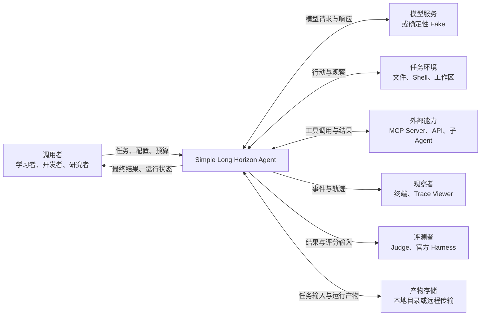
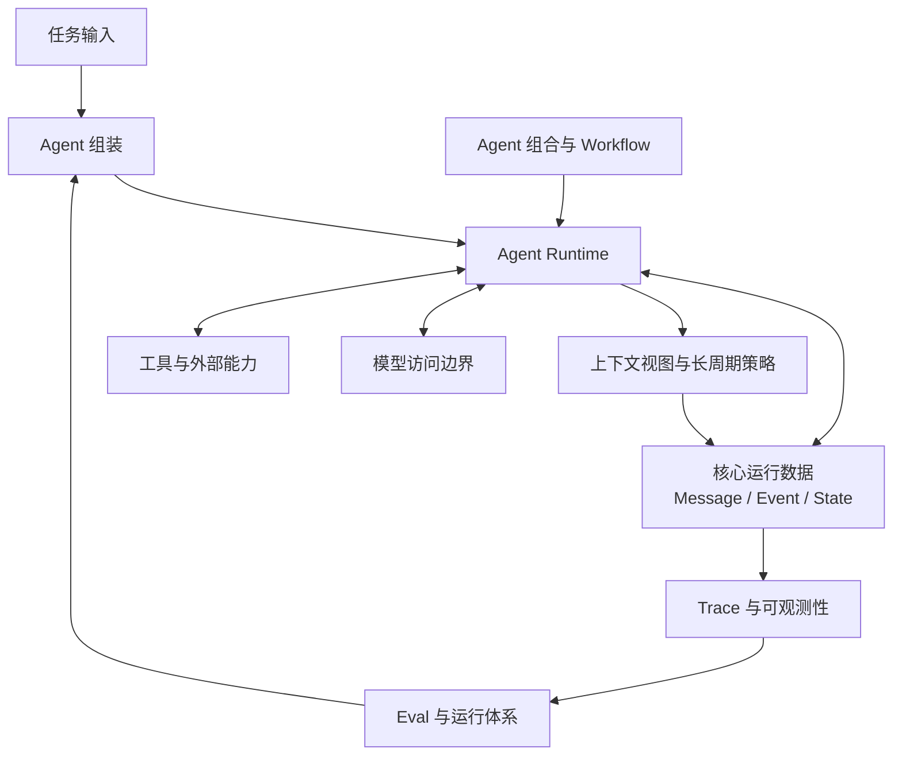
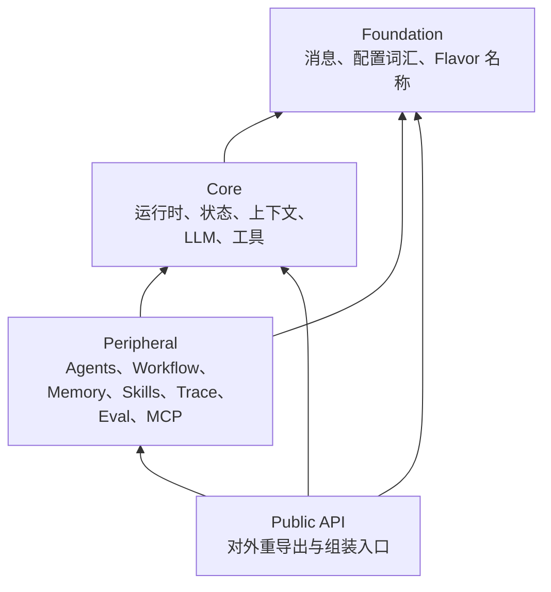
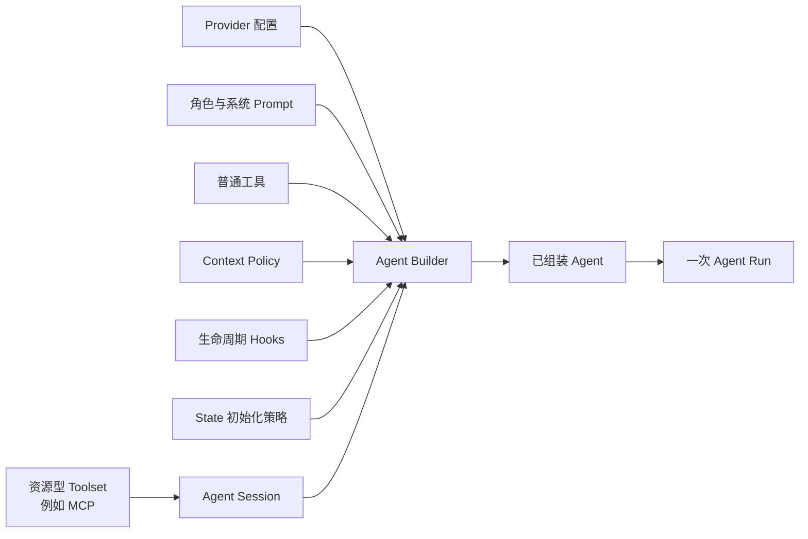
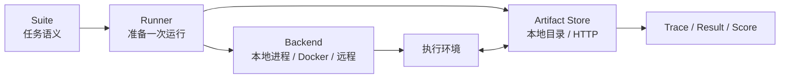
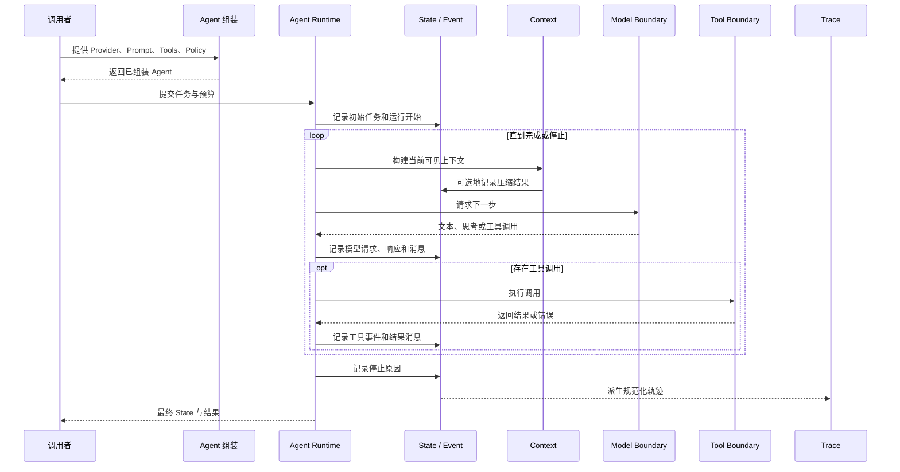

# 02. 系统总体架构

> 本篇回答：Simple Long Horizon Agent 由哪些部分组成，各部分为什么这样划分，它们如何协作，以及哪些依赖方向必须保持清楚。
>
> 本篇建立系统级全景，不详细展开消息字段、单轮时序或具体 Provider。核心数据将在下一篇 [`03-domain-model-and-data-flow.md`](03-domain-model-and-data-flow.md) 中说明。

## 1. 从项目目标推导架构

[上一篇](01-product-goals-and-scope.md)确定了项目的核心矛盾：系统既要足够简单，能够被完整理解和修改；又要支持模型、工具、长上下文、多 Agent、轨迹和评测等真实能力。

如果把这些能力全部写进一个 Agent 类，短期内看起来集中，长期却会出现几个问题：

- 模型供应商格式与核心状态混在一起；
- 工具执行和模型调用互相了解过多细节；
- 上下文压缩可能直接修改或删除运行历史；
- Memory、Skills 和 Workflow 会各自发明一套运行方法；
- Trace 和 Eval 为了取数据侵入核心控制流；
- 增加一种能力需要修改多个无关部分；
- 学习者无法看清最小 Agent 循环究竟做了什么。

项目因此采用“**小型运行内核 + 项目自有数据 + 明确边界 + 外围组合**”的结构：

1. 用项目自己的消息和事件表达运行事实；
2. 用一个显式循环驱动所有普通 Agent；
3. 在边界处转换模型和工具的外部格式；
4. 用策略、Hook 和初始化入口增加长周期能力；
5. 用普通 Agent 运行组合复杂工作流；
6. 从事件事实派生轨迹和评测产物；
7. 让外围能力依赖核心，核心不反向依赖外围。

这七点构成总体架构的主线。

## 2. 系统上下文

系统本身不是模型、操作系统或 Benchmark。它位于调用者和这些外部参与者之间，负责协调交互并保留运行事实。

### 2.1 系统从外部接收什么

- 用户任务以及后续补充；
- 模型、Prompt、工具和 Agent 配置；
- 回合、Token、时间等运行预算；
- 任务环境或工作目录；
- 可选的技能、Memory 和工作流策略；
- Eval 实例、运行环境和评分输入。

### 2.2 系统向外部产生什么

- Agent 的最终回答或当前最好结果；
- 对文件、仓库和环境造成的任务产物；
- 完整消息历史和运行事件；
- 可阅读、可回放的 Trace；
- Token、成本、耗时和停止原因；
- Benchmark 结果和评分产物；
- 可选的跨运行经验。

### 2.3 系统不能控制什么

系统可以适配并记录外部行为，但不能保证模型始终正确、网络始终可用、工具环境始终安全、Docker 主机始终在线，或官方评测器始终稳定。架构的责任是让这些外部依赖的边界和失败清楚可见。

## 3. 三种互补的架构视图

理解本项目需要同时使用三种视图。任何一种单独使用都会遗漏重要信息。

### 3.1 逻辑视图：一次任务如何工作

逻辑视图关心系统在运行时承担的责任。

在这张图中，`Agent Runtime` 是控制中心，但不是所有信息的所有者：

- 运行事实属于核心数据；
- 模型格式属于模型访问层；
- 外部行动属于工具能力；
- 上下文选择属于上下文策略；
- 多步骤协作属于编排层；
- Trace 和评分是事实的下游消费者。

### 3.2 依赖视图：源码允许怎样连接

依赖视图关心模块之间的静态方向。当前项目将内部模块分为四个依赖等级：

箭头表示“可以依赖”。规则是：高层可以依赖同层或更低层，低层不能反向依赖高层。

这意味着：

- 消息协议不能导入 Agent、Trace 或 Eval；
- 核心循环不能导入预设 Agent、MCP、Memory、Workflow 或评测套件；
- Workflow 可以复用核心 Agent；
- Trace 可以读取核心 Event；
- Eval 可以组装 Agent 并导出 Trace；
- 顶层公共 API 可以重导出已经稳定的能力。

项目使用架构检查脚本固化这个方向。它还限制 Provider SDK、Docker、MCP 等外部依赖只能出现在拥有它们的模块中。

### 3.3 装配视图：能力如何进入一次运行

装配视图关心一个具体 Agent 如何获得模型、工具、策略和资源。

普通工具只是值，可以直接绑定到 Agent。MCP 连接等能力拥有需要开启和关闭的资源，因此由 Session 管理生命周期。Skills 通过状态初始化进入运行；Memory 通过工具和 Hook 进入运行；这些能力都不要求核心循环理解它们的具体类型。

## 4. 总体分层

从人的理解角度，可以把系统划分为六个逻辑层。这里的“层”用于解释责任，不等同于文件夹，也不完全等同于架构检查中的源码分区。

| 逻辑层 | 主要责任 | 代表模块 |
| --- | --- | --- |
| 领域事实层 | 定义系统用什么数据表达运行事实 | `messages.py`、`protocols.py`、`state.py` |
| 运行控制层 | 驱动 Agent 循环、上下文构建和工具调度 | `core.py`、`context_view.py`、`compression/`、`hooks.py` |
| 外部边界层 | 连接模型、工具、MCP 和真实环境 | `llm/`、`llm_agent.py`、`tools/`、`mcp/` |
| 组装与编排层 | 创建可运行 Agent，组合子 Agent 和 Workflow | `agents/`、`agent_flavors.py`、`workflow/` |
| 长周期知识层 | 注入技能、保存跨运行经验 | `skills/`、`memory/` |
| 观察与实验层 | 派生 Trace，执行 Eval，保存和评分产物 | `trace/`、`evals/`、`runs/`、`studio/` |

有些能力跨越逻辑层。例如上下文压缩依赖运行状态，同时又服务长周期目标；`llm_agent.py` 同时理解核心 Agent 和模型协议，是两层之间的装配桥。跨层本身不是问题，关键是责任和依赖方向必须明确。

## 5. 领域事实层

领域事实层回答：“系统认为哪些信息是事实，以及这些事实如何保存？”

### 5.1 组成

- `messages.py`：运行时消息和内容块；
- `protocols.py`：Agent、Turn、Model、Tool、Hook、Compression 和 Goal 事件；
- `state.py`：追加事件、维护消息快照和活跃上下文索引。

### 5.2 主要职责

- 用项目自有类型表达用户输入、运行时指导、模型输出和工具交互；
- 把运行生命周期表达为结构化事件；
- 为每次运行提供可追加、可回放的 State；
- 从事件派生当前消息快照；
- 区分完整消息历史与当前活跃上下文；
- 为上层模块提供稳定、供应商无关的数据语言。

### 5.3 明确不负责

- 不调用模型；
- 不执行工具；
- 不选择压缩策略；
- 不决定 Workflow；
- 不写 Trace 文件或计算评分；
- 不保存 Provider SDK 的原生对象作为核心结构。

### 5.4 为什么它位于最底层

所有模块都需要谈论消息、事件或状态。如果这些概念由模型适配器、工具或评测器定义，其他模块就会依赖某个外部系统。把项目自有数据放在底层，使模型、工具、Workflow 和 Trace 可以围绕同一种事实语言协作。

## 6. 运行控制层

运行控制层回答：“已经组装好的 Agent 如何持续推进一次任务？”

### 6.1 组成

- `core.py`：Agent 值、主循环和工具调度；
- `context_view.py`：模型可见上下文及压缩策略协议；
- `compression/`：对活跃上下文应用压缩决策；
- `hooks.py`：少量命名生命周期点上的追加式决策。

### 6.2 主要职责

- 初始化或继续一次 Agent 运行；
- 在每轮开始构建模型可见上下文；
- 在需要时先执行上下文压缩；
- 记录模型请求、响应和消息事件；
- 识别并调度工具调用；
- 把多个工具结果组成下一轮可用的反馈；
- 处理正常完成、工具终止、外部中止和预算耗尽；
- 在固定生命周期点调用 Hook；
- 以惰性事件流向调用者暴露进度。

### 6.3 明确不负责

- 不把请求翻译成 OpenAI 或 Anthropic 格式；
- 不实现具体 Bash、Read 或 MCP 行为；
- 不知道 Skill 文件如何发现；
- 不知道 Memory 存在何处；
- 不定义串行、并行或反思工作流；
- 不知道 SWE-bench 等具体 Benchmark。

### 6.4 核心循环为什么是唯一运行模型

Skills、Memory、子 Agent 和 Workflow 最终都复用普通 Agent 运行。这样，工具结果、停止语义和事件记录只有一套规则。外围能力可以增加运行前后的内容，或组合多次运行，但不创建第二个不兼容的 Agent 内核。

## 7. 模型访问边界

模型访问边界回答：“核心 Agent 如何使用不同模型，而不理解供应商细节？”

### 7.1 组成

- `llm/types.py`：供应商无关的模型消息、工具、请求、响应和流事件；
- `llm/provider.py`：模型与 API 类型的配置描述；
- `llm/bridge.py`：运行时数据与模型边界数据之间的转换；
- `llm/stream.py`：按 API 类型分派模型适配器；
- `llm/adapters/`：Fake、OpenAI Chat、OpenAI Responses、Anthropic；
- `llm/retry.py`：限流重试和非法工具调用修复；
- `llm_agent.py`：把 Provider、Prompt 和工具组装为 LLM-backed Agent。

### 7.2 主要职责

- 提供与具体供应商无关的模型调用协议；
- 将运行时消息投影为模型可见消息；
- 把工具能力投影为模型工具定义；
- 在最外层适配具体供应商的 Wire Format；
- 将供应商响应还原为项目自有的模型响应和助手消息；
- 规范化停止原因、Token 使用量和思考内容；
- 在适合的边界处理可恢复模型调用错误。

### 7.3 明确不负责

- 不驱动 Agent 多轮循环；
- 不执行模型产生的工具调用；
- 不决定哪些历史消息应被压缩；
- 不保存 Workflow 状态；
- 不让 Provider 的原生响应替代运行时 Message。

### 7.4 `llm_agent.py` 为什么单独存在

纯 LLM 层不应该知道 Agent 循环，核心 Agent 又不应该知道供应商调用细节。`llm_agent.py` 是明确的装配点：它同时认识两边的公共协议，把模型访问能力封装成核心只需要调用的 `generate` 行为。这个桥接位置防止两个模块互相渗透。

## 8. 工具与外部能力边界

工具边界回答：“模型决定行动之后，系统如何接触真实环境？”

### 8.1 组成

- `tools/__init__.py`：工具和工具结果的共同契约；
- `tools/bash.py`、`read.py`、`edit.py`：本地环境能力；
- `tools/recall.py`：读取被压缩出活跃上下文的原始消息；
- `tools/task.py`：把子 Agent 作为一个可委派工具；
- `mcp/`：把 MCP Server 的工具适配为同一工具契约；
- `agents/toolsets.py`：管理资源型工具源的生命周期；
- `hooks.py`：在工具执行前后提供有限策略点。

### 8.2 主要职责

- 用统一描述向模型公开能力；
- 接收有身份的工具调用和结构化参数；
- 返回可见内容、错误状态、终止请求和附加细节；
- 对工具异常、超时和未知工具生成模型可理解的错误结果；
- 支持独立调用并发执行和有状态调用顺序执行；
- 保留工具调用与结果之间的身份关联；
- 对需要连接的能力显式管理打开和关闭。

### 8.3 明确不负责

- 工具不拥有主 Agent 循环；
- 单个工具不决定整轮结果如何记录；
- MCP 不向核心引入第二套 Tool 类型；
- Hook 不允许任意修改已发生的消息和工具调用；
- 工具层不判断整个用户目标是否完成。

### 8.4 为什么子 Agent 也表现为工具

当父模型需要自主决定是否委派时，“调用子 Agent”与“调用搜索或 Bash”具有相似的决策形状：模型选择能力、传入参数、等待结果、再继续当前循环。把委派放入工具边界可以复用现有反馈机制，同时子 Agent 内部仍运行自己的完整 State 和事件流。

## 9. 上下文与长周期知识边界

这部分回答：“运行越来越长时，信息如何保持可用但不失控？”

项目刻意把几种生命周期不同的机制分开。

| 机制 | 作用范围 | 主要责任 | 不应替代 |
| --- | --- | --- | --- |
| State 历史 | 一次运行 | 保存完整事实 | 当前模型窗口 |
| Context View | 一次模型请求 | 选择本轮可见内容 | 永久记忆 |
| Compression | 一次运行 | 缩小活跃上下文 | 删除原始历史 |
| Recall | 一次运行 | 按索引恢复压缩前内容 | 全量重新注入 |
| Skills | 运行开始或按需 | 提供任务方法和脚本知识 | 跨运行经验库 |
| Memory | 多次运行 | 注入和沉淀任务族经验 | 当前 Transcript |

### 9.1 上下文与压缩

`context_view.py` 定义可见性和压缩策略协议，`compression/` 负责把策略决策应用到 State 的活跃索引。完整消息继续保留，下一轮只看到压缩后的活跃视图。

这种设计将“发生过什么”与“现在给模型看什么”分离，兼顾审计和有限窗口。

### 9.2 Skills

`skills/` 发现技能元数据、生成菜单，并在任务明确提及或配置预加载时把技能正文记录到初始 State。技能脚本仍由普通 Read/Bash 工具运行。因此 Skills 是知识注入层，不是特殊 Agent Runtime。

### 9.3 Memory

`memory/` 通过绑定产生普通工具和 Session Hook：开始时注入先前经验，结束时从本次 State 提炼并持久化知识。核心循环只看见 Hook 发出的消息和绑定的工具，不需要认识文件系统 Memory 的内部结构。

### 9.4 为什么不合并

合并会掩盖重要差异：Context View 是临时投影，Compression 是一次运行中的视图变换，Skill 是外部方法知识，Memory 是跨运行持久化。如果它们共享一个万能接口，调用时机、数据可信度和恢复方式会变得模糊。

## 10. Agent 组装与工作流层

这一层回答：“如何从基础能力得到面向具体任务的 Agent，以及如何组合复杂流程？”

### 10.1 Agent 组装

`agents/` 提供可直接使用的 Agent Builder 和 Session：

- 选择 Provider、Prompt 和角色；
- 绑定 Bash、Read、Task、Skill 等工具或能力；
- 安装 Context Policy、Hook 和 State 初始化策略；
- 通过 Toolset 打开 MCP 等资源；
- 返回仍由核心循环驱动的普通 Agent。

`agent_flavors.py` 维护跨运行入口共享的 Flavor 名称；`agents/flavors.py` 将名称映射到具体 Agent 或 Workflow Facade。名称词汇与具体组装分开，避免底层配置反向依赖外围 Agent 实现。

### 10.2 Workflow 编排

`workflow/` 使用普通 Python 控制流协调多个完整 Agent Run：

- Sequential：前一步输出进入后一步；
- Planner/Executor：计划和执行分开；
- Reflection：生成、批评和修订循环；
- Routing：选择最合适的专家；
- Parallel：独立并发执行后聚合；
- PDR：并行尝试、提炼经验、再执行；
- Goal Loop：在预算内反复继续，并使用外部完成检查。

### 10.3 主要职责

- 复用已经组装好的 Agent；
- 为每个步骤建立独立运行状态；
- 明确传递任务、上下文和上一步输出；
- 保存每个步骤的结果和 State；
- 定义高于单 Agent 的停止或聚合条件；
- 必要时把子运行重新组合成一个可读轨迹。

### 10.4 明确不负责

- 不重新定义 Message 和 Tool 协议；
- 不在多个 Worker 间共享一个可变 State；
- 不把 Workflow 模式写入核心 `run()`；
- 不依赖某个 Benchmark 才能工作；
- 不隐藏步骤产物，只保留最终文本。

### 10.5 Builder 和 Workflow 的区别

Builder 解决“一个 Agent 拥有哪些能力”；Workflow 解决“多个 Agent Run 如何协作”。一个复杂 Agent 并不一定需要 Workflow，一个 Workflow 也可以使用非常简单的 Agent。

## 11. Trace 与可观测性层

可观测性层回答：“如何从运行事实理解系统行为？”

### 11.1 组成

- `trace/run_trace.py`：规范化一次运行的 Trace；
- `trace/spans.py`：从事件生成层级 Span；
- `trace/training.py`：重建模型轮次；
- `trace/openai_export.py`：导出训练记录；
- `trace/live.py`：运行中的增量写入；
- `trace/render.py`：终端可读输出；
- `studio/trace-viewer/`：浏览和分析 JSONL Trace。

### 11.2 主要职责

- 消费 State 中已经记录的 Event；
- 将事件转换为不同观察视角；
- 关联 Agent、Turn、Model、Tool 和 Compression 的层级关系；
- 保存规范化数据，同时允许原始供应商数据外置；
- 支持实时观察、成本分析和训练数据导出；
- 合并子 Agent 或 Workflow 的嵌套运行证据。

### 11.3 明确不负责

- 不决定下一轮模型看到什么；
- 不改变工具执行结果；
- 不替核心 Runtime 记录新的业务事实；
- 不把 Viewer 展示结构变成运行时状态；
- 不因为下游格式需要而污染 Message 协议。

### 11.4 为什么 Trace 从 Event 派生

Agent 运行只需要稳定记录一次事实。终端展示、Span 树、训练样本和 Viewer 是不同的阅读方式。如果核心同时维护这些表示，它们会发生漂移。事件作为单一事实源，让观察产品可以独立演进和重新生成。

## 12. Eval 与运行体系

这一层回答：“如何把 Agent 放进可重复的任务环境并得到可比较结果？”

### 12.1 组成

- `src/simple_long_horizon_agent/evals/protocols.py`：Suite、Backend、Store 和 Run 的协议；
- `src/simple_long_horizon_agent/evals/runner.py`：准备并运行单个实例；
- `src/simple_long_horizon_agent/evals/backends/`：本地进程、本地 Docker、远程 Docker 和 Fake；
- `src/simple_long_horizon_agent/evals/stores/`：本地目录和 HTTP 产物传输；
- `src/simple_long_horizon_agent/evals/in_container.py`：执行环境中的通用 Agent Runner；
- `src/simple_long_horizon_agent/evals/suites/`：随包进入容器的轻量套件逻辑；
- 仓库根目录 `evals/`：Host 侧数据集、镜像和官方评分适配；
- `runs/`：面向操作者的统一入口、Profile 和脚本。

### 12.2 两个正交选择

评测架构将“在哪里运行”和“产物放在哪里”分开：

更换 Backend 不应改变 Suite 和 Agent；更换 Store 不应改变任务语义。这使本地调试、容器执行和远程运行共享同一条主路径。

### 12.3 Host 与执行环境分离

一个容器化 Suite 分为两部分：

- Host 侧负责数据集、镜像、运行计划和官方评分器；
- 执行环境侧负责准备工作区、构建 Agent 任务、提取任务产物和可选的环境内评分。

两部分通过序列化输入和 Artifact Store 连接，而不是共享 Python 对象。这使执行环境保持轻量，也防止私有评分信息进入 Agent 上下文。

### 12.4 明确不负责

- Eval 不定义核心 Agent 循环；
- Benchmark 逻辑不进入 `core.py`；
- Backend 不理解任务的评分语义；
- Store 不理解其中字节代表任务、Trace 还是分数；
- 核心 Runtime 不知道自己运行在本机还是容器中。

## 13. 支撑模块与工程边界

并非所有目录都是运行时模块，但它们共同保护架构。

| 位置 | 作用 | 架构意义 |
| --- | --- | --- |
| `config.py`、`llm/config.py`、`src/simple_long_horizon_agent/evals/profile.py` | 配置声明和解析 | 让配置由拥有其语义的层管理 |
| `model_metadata.py` | 上下文窗口、价格和成本计算 | 将模型元数据与 Provider SDK 分开 |
| `scripts/` | Demo、文档生成、Lint 和分析工具 | 提供入口但不成为核心依赖 |
| `runs/` | 可复制的运行与质量门禁 | 让实验操作路径显式、可复现 |
| `tests/` | 单元和可选端到端检查 | 把行为边界变成可执行反馈 |
| `examples/` | 小型组合示例 | 展示使用方法，不成为协议来源 |
| `studio/` | Trace Viewer | 消费轨迹，不控制 Agent |

配置、脚本和测试不是“最后再加的杂项”。它们确保系统边界可以被使用、检查和持续维护，但运行核心不能反向依赖它们。

## 14. 一次普通任务如何穿过各层

下面只展示系统级路径，具体消息变化和时序将在后续文档展开。

这条路径体现几个重要关系：

- Builder 只负责组装，不拥有运行；
- Runtime 负责顺序，不拥有外部格式；
- State 记录事实，不决定下一步；
- Context 决定可见性，不删除事实；
- Model 决定建议行动，不直接执行；
- Tool 执行行动，不判断整体目标；
- Trace 解释事实，不控制运行。

## 15. 外围能力如何接入核心

项目没有通用动态插件系统，而是使用少量明确接入点。

| 接入点 | 输入或行为 | 适合的能力 | 不适合的用途 |
| --- | --- | --- | --- |
| `Agent.generate` | 可见消息 → 下一条消息 | Fake 或 LLM-backed 决策 | Workflow 调度 |
| `Agent.tools` | 一组工具值 | Bash、Read、Task、Memory Tool | 修改历史状态 |
| `Agent.context_policy` | 可见性与压缩策略 | 上下文管理 | 跨运行持久化 |
| `Agent.init_state` | 根据任务创建初始 State | Skills、预置上下文 | 每轮动态控制 |
| `Agent.hooks` | 有限生命周期决策 | Memory、策略门、提醒 | 任意中间件链 |
| `Toolset` / Session | 资源打开、工具提供、关闭 | MCP 等连接型能力 | 普通无资源工具 |
| `task` Tool | 委派独立子 Agent | 模型自主委派 | 固定 Workflow 编排 |
| Workflow 函数 | 组合完整 Agent Run | 串行、并行、反思、PDR | 供应商格式适配 |
| Trace projection | Event → 观察产品 | Span、Viewer、训练导出 | 改变运行决策 |
| Eval Protocol | Suite、Backend、Store | 新任务集和执行环境 | 改写核心 Agent |

明确接入点的价值在于：新增能力前先判断它属于哪个责任，而不是默认把逻辑放进核心循环。

## 16. 依赖规则与禁止方向

### 16.1 必须保持的依赖方向

- Message 是最底层项目语言；
- Event 和 State 依赖 Message；
- Runtime 依赖 Message、Event、State、Context、LLM 协议和 Tool 契约；
- Provider Adapter 依赖项目 LLM 协议；
- Agents、Skills、Memory、MCP、Workflow、Trace 和 Eval 可以依赖 Runtime；
- Scripts、Runs、Tests、Examples 和 Studio 依赖库，而不是被库依赖。

### 16.2 明确禁止或避免

- 核心状态不得以 Provider SDK 对象为主要数据；
- `core.py` 不得导入具体 Agent Preset、Workflow 或 Eval Suite；
- LLM 层不得执行工具或调度回合；
- 工具不得绕过 State 隐藏模型可见结果；
- Compression 不得通过删除历史实现窗口控制；
- Hook 不得原地修改既有消息；
- Workflow 不得发明第二套 Agent Loop；
- Trace 不得成为运行时的可变控制状态；
- Benchmark 细节不得进入通用 Eval Runner；
- 可选重依赖不得泄漏到不拥有它们的模块。

### 16.3 为什么使用静态检查

依赖方向很容易在一次“方便的导入”中被破坏。只依靠文档提醒不足以长期维持，因此项目用架构 Lint 检查模块分区、Provider SDK 隔离、可选依赖范围和导入路径完整性。

## 17. 状态所有权

清楚的状态所有权能避免不同层通过共享字典互相控制。

| 状态 | 所有者 | 生命周期 | 其他模块如何使用 |
| --- | --- | --- | --- |
| Runtime Message | State | 一次运行及 Resume | Context、LLM Bridge、Trace 读取 |
| Event Stream | State | 一次运行及 Resume | Trace、成本、评测读取 |
| Active Context Indices | State Snapshot | 一次运行 | Compression 更新，Context 读取 |
| Provider 配置 | Agent / LLM Request | Agent 或一次请求 | Adapter 读取 |
| Tool 资源 | Toolset / Session | Session | Agent 只持有打开后的 Tool |
| Skill 元数据 | Skills 层 | 发现或初始化阶段 | 初始 State 注入 |
| Persistent Memory | Memory 实现 | 跨运行 | Hook 和 Tool 访问 |
| Workflow Steps | Workflow Result | 一次 Workflow | Trace、调用者、Eval 读取 |
| Run Artifact | Artifact Store | 一次或一批 Eval | Backend、Runner、评分器交换 |
| Viewer State | Studio | 一次查看会话 | 不回写 Runtime |

`State.data` 是少量实验或 Harness 元数据的扩展位置，不是绕开正式协议的通用消息总线。频繁、稳定且跨模块使用的信息应该进入明确类型或事件。

## 18. 失败如何跨越模块边界

总体架构不要求所有失败都变成异常，也不允许所有失败都被吞掉。失败是否成为数据，取决于谁还有机会处理它。

| 失败位置 | 典型处理 | 原因 |
| --- | --- | --- |
| 无效 Message 或配置 | 在边界拒绝并报告无效值 | 继续运行只会扩大错误 |
| 工具不存在、参数错误、执行异常 | 形成错误 Tool Result | 模型可能在下一轮自我修正 |
| 工具超时 | 错误 Tool Result，调用结束事件 | 保持调用与结果配对 |
| 可恢复模型限流 | 在模型访问边界重试 | 调用尚未进入下一轮状态 |
| 模型产生非法工具调用 | 追加纠正上下文并重新请求 | 给模型有限修复机会 |
| 外部 Abort | Runtime 以明确原因停止 | 调用者拥有中止权 |
| 回合或 Goal 预算耗尽 | 记录预算终止状态 | 不是正常完成，也不一定是异常崩溃 |
| Memory 初始化失败 | 记录可见说明，主任务继续 | Memory 是可选支撑能力 |
| Eval 基础设施异常 | Runner 或 Dataset 层报告并按策略重试 | 不应伪装成 Agent 任务失败 |

共同原则是：失败不能悄悄消失；如果上层仍能采取行动，失败应成为结构化反馈；如果契约已经无法成立，则应尽早失败。

## 19. 架构为何保持同步优先

当前核心通过同步生成器产生惰性 Event Stream，工具内部可以使用线程并发，Workflow 也可以并行运行独立 Agent。

这种选择符合项目目标：

- 直接的 `for` 循环比完整异步框架更容易阅读；
- 调用者只有在消费事件时才推进运行，可以实时输出或中止；
- 并行发生在边界清楚的地方：独立工具调用或独立 Agent State；
- 模型适配协议保留流事件形状，将来可以扩展真实流式行为；
- 不为当前不需要的高并发服务场景提前增加复杂度。

同步优先不等于拒绝并发，而是把并发限制在能够说明所有权和结果顺序的边界。

## 20. 架构质量检查

判断一项设计是否符合本项目架构，可以使用下面的问题：

1. 新能力解决的问题属于哪个模块？
2. 它是否需要修改核心循环，还是可以通过现有接入点完成？
3. 它产生的是运行事实、临时视图、外部资源还是派生产物？
4. 它是否把 Provider、Benchmark 或工具细节带入更低层？
5. 模型能够看到的变化是否都进入 State 和 Event？
6. 失败是否留在正确边界，并让能够处理它的一层看到？
7. 是否创建了第二套 Message、Tool、State 或 Agent Loop？
8. 是否让可选能力成为最小 Agent 的必需依赖？
9. 是否仍能使用 Fake 或纯逻辑测试验证主要行为？
10. 新抽象是否比显式组合更容易理解？

如果这些问题没有清楚答案，设计很可能正在模糊模块边界。

## 21. 本篇理解检查

读完本篇后，读者应当能够回答：

- 为什么项目需要逻辑、依赖和装配三种架构视图？
- 哪些模块构成领域事实层和运行控制层？
- `llm_agent.py` 为什么不直接放进纯 LLM 层？
- 工具、MCP 和子 Agent 如何共享同一种能力边界？
- State 历史、Context、Compression、Skills 和 Memory 有什么区别？
- Agent Builder 与 Workflow 分别解决什么问题？
- Trace 为什么只能从 Event 派生，而不应控制 Runtime？
- Eval 为什么要把 Suite、Backend 和 Artifact Store 分开？
- 核心模块为什么不能导入外围模块？
- 一项新能力应该怎样选择接入点？

如果读者能够把一个新需求放入正确模块，并说明它的上下游关系，本篇就达到了建立系统全景的目的。

## 22. 后续文档

- [返回设计文档总览](README.md)
- [上一篇：项目目标与范围](01-product-goals-and-scope.md)
- [下一篇：核心概念与数据流](03-domain-model-and-data-flow.md)将详细说明 Message、Content Block、Event、State 及其数据流。
- `04-agent-runtime.md` 将展开主循环的逐轮时序和停止语义。

## 23. 参考依据

以下位置用于核对本篇的架构边界，不是阅读正文的前置条件：

- [`AGENTS.md`](../../AGENTS.md)：使命、实现原则和文档约束。
- [`scripts/arch_lint.py`](../../scripts/arch_lint.py)：模块分区、Provider SDK 和可选依赖的静态规则。
- [`messages.py`](../../src/simple_long_horizon_agent/messages.py)：最底层消息协议。
- [`state.py`](../../src/simple_long_horizon_agent/state.py)：追加式 State 与派生 Snapshot。
- [`core.py`](../../src/simple_long_horizon_agent/core.py)：唯一普通 Agent 循环和工具调度。
- [`llm_agent.py`](../../src/simple_long_horizon_agent/llm_agent.py)：Runtime 与 LLM 层的装配桥。
- [`llm/README.md`](../../src/simple_long_horizon_agent/llm/README.md)：模型访问层职责与非职责。
- [`agents/README.md`](../../src/simple_long_horizon_agent/agents/README.md)：Agent Builder、Session 和 Toolset。
- [`workflow/README.md`](../../src/simple_long_horizon_agent/workflow/README.md)：多 Agent Workflow。
- [`docs/memory.md`](../memory.md)：跨运行 Memory 边界。
- [`evals/README.md`](../../evals/README.md)：Suite、Backend、Store 和 Host/Container 分离。
- [`runs/README.md`](../../runs/README.md)：运行入口和质量门禁。
- [`tests/README.md`](../../tests/README.md)：行为验证范围。
