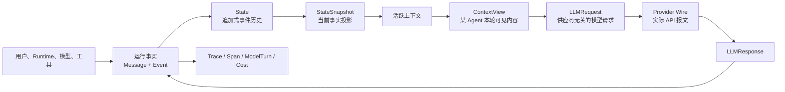
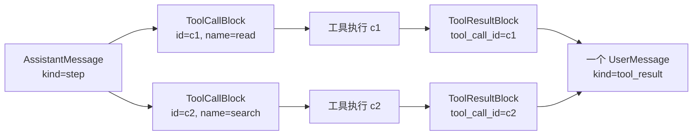
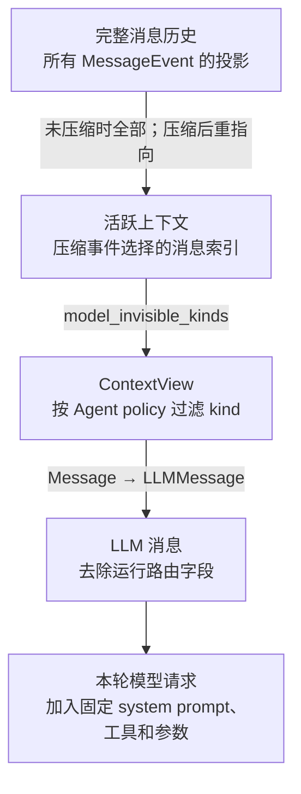
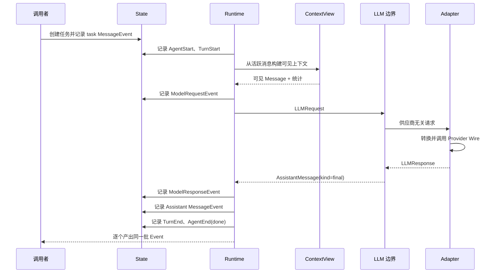
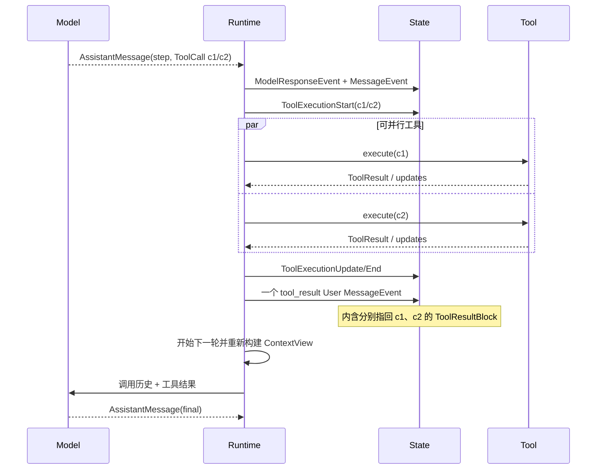
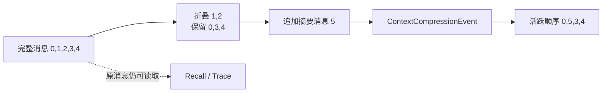

# 03. 核心概念与数据流

> 本篇回答：Simple Long Horizon Agent 用什么数据描述一次运行，这些数据由谁创建、如何转换、保存在哪里，以及哪些关系在任何实现中都必须成立。
>
> 本篇关注稳定的数据语义，不要求读者理解 Python 类型声明。Agent 如何逐轮推进将在 [`04-agent-runtime.md`](04-agent-runtime.md) 中展开，Provider 的具体适配将在 [`05-model-access.md`](05-model-access.md) 中展开。

先阅读 [00. 用一个真实运行看懂 Agent](00-running-example.md)。本篇会把该案例中的 4 条 Message、16 条 State Event 以及两次 Model Request 抽象成可复用的数据模型。

## 1. 为什么先定义项目自己的数据语言

[上一篇](02-system-architecture.md)把系统划分为运行时、模型访问、工具、上下文、编排和可观测等模块。这些模块要协作，首先需要对“正在发生什么”使用同一种表达。

如果系统直接使用某家模型供应商的消息字典，会产生几个问题：

- 运行时需要的发送者、接收者和任务阶段没有稳定位置；
- 不同供应商对工具结果、图片和思考内容的表达不同；
- Provider SDK 对象可能进入 State，使历史无法稳定回放；
- Trace 只能猜测某个字典代表请求、响应还是工具行动；
- 切换供应商会迫使核心循环和工具层一起改变；
- 上下文压缩容易误把“本轮可见内容”当成“完整历史”。

项目因此先建立自己的领域语言，再在边界处投影：

这张图包含两条原则：

1. **运行事实先于外部格式。** Provider Wire 是一次边界转换，不是核心状态的语言。
2. **事实与视图分离。** State 保留发生过的事情，ContextView 只回答某个 Agent 下一次模型调用应该看到什么。

## 2. 数据地图

系统中的核心数据可以分为六组：

| 数据组 | 代表对象 | 回答的问题 | 生命周期 |
| --- | --- | --- | --- |
| 内容 | Content Block | 一条内容具体包含什么 | 随所属消息或响应存在 |
| 对话事实 | Message | 谁向谁表达了什么，处于什么运行阶段 | 进入 State 后贯穿一次运行 |
| 运行事实 | Event | 消息之外还发生了哪些控制、模型和工具活动 | 追加到一次运行的事件流 |
| 当前投影 | StateSnapshot、活跃上下文、ContextView | 完整事实在当前步骤应如何读取 | 可从事件重建或按请求重新计算 |
| 模型边界 | LLMMessage、LLMRequest、LLMResponse | 一次供应商无关的模型调用是什么 | 一次模型调用 |
| 外部证据与派生产物 | Provider Wire、RunTrace、Span、ModelTurn | 实际跨线数据是什么，如何观察和分析 | 调试、回放、训练或评测阶段 |

不要把这些对象合并成一个“万能消息”。它们的生命周期、所有者和可信范围不同。

## 3. Content Block：统一表达一条消息中的内容

一条消息不一定只有文本。模型可能接收图片、输出思考内容、请求多个工具，工具也可能返回文本与截图。项目把消息内容表示为有顺序的 Content Block 序列，而不是若干互不关联的可选字段。

### 3.1 五种内容块

| 内容块 | 表达的事实 | 主要创建者 | 主要读取者 |
| --- | --- | --- | --- |
| TextBlock | 普通文本 | 用户、Runtime、模型、工具 | 模型、终端、Trace |
| ImageBlock | 已规范化的图片数据和 MIME 类型 | 输入解析或工具 | 模型 Adapter、Trace |
| ThinkingBlock | 模型产生的思考内容及连续性元数据 | Provider Adapter | 后续模型调用、Trace |
| ToolCallBlock | 模型请求调用某个工具及其参数 | 模型响应 Adapter | Runtime 工具调度 |
| ToolResultBlock | 某个工具调用的结果、错误状态和可见内容 | 工具调度层 | 下一轮模型、Trace |

所有 Message 和 LLMMessage 都使用同一种有序内容块序列。这样做有三个收益：

- 文本、思考和工具调用能保留模型产生它们时的顺序；
- Runtime 与 LLM 边界不需要维护两套内容类型；
- Adapter 只负责把同一语义翻译成不同供应商格式。

### 3.2 合法放置规则

共享内容模型不代表任意内容块可以放在任意消息里。系统在消息进入协议时校验以下关系：

| 消息类型 | 可以承载的关键内容 | 禁止的关键内容 |
| --- | --- | --- |
| UserMessage | 文本、图片；工具结果消息可承载 ToolResultBlock | ThinkingBlock、ToolCallBlock |
| RuntimeMessage | 文本、图片等运行时可见说明 | ThinkingBlock、ToolCallBlock、ToolResultBlock |
| AssistantMessage | 文本、图片、ThinkingBlock、ToolCallBlock | ToolResultBlock |

ToolResultBlock 的内部可见内容只允许文本或图片。工具执行过程、子 Agent 事件和其他诊断信息不应伪装成模型可见内容；它们可以进入 Event 或受控 sidecar。

### 3.3 为什么内容使用不可变值

消息和内容块一旦被记录，就代表已经发生的事实。它们采用不可变的数据形状，调用者不能通过替换字段悄悄改变历史。需要修正或补充时，应追加新消息或新事件。

不可变不等于所有嵌套外部对象都具备无限深度的物理冻结；设计契约是：记录后的协议值不得被业务代码原地修改，边界转换需要复制可变字典。

## 4. Message：模型对话与运行路由的共同事实

Message 是运行时对话记录。它不仅包含模型可见内容，还包含多 Agent 运行所需的发送者、目标和运行语义。

### 4.1 三种消息角色

| 消息类型 | 谁产生 | 表达什么 | 模型侧角色 |
| --- | --- | --- | --- |
| UserMessage | 用户，或代替环境反馈的工具调度层 | 任务、补充输入、工具结果 | user |
| RuntimeMessage | Runtime、Harness、Hook 或支撑能力 | 动态说明、摘要、上下文、运行指导 | system |
| AssistantMessage | 模型或 Agent | 文本输出、思考和工具调用 | assistant |

RuntimeMessage 与固定 system prompt 必须区分：

- **固定 system prompt** 属于 Agent 配置，每次请求使用，但不作为普通对话消息进入 State；
- **RuntimeMessage** 是运行过程中动态产生、需要在历史和 Trace 中可见的说明。

供应商通常没有 `runtime` 角色，所以 RuntimeMessage 在模型边界投影为 `system`。类型名称描述“谁产生它”，role 描述“模型如何接收它”。

### 4.2 role、kind、sender、target 是四个维度

这四个字段回答不同问题：

| 字段 | 回答的问题 | 示例 |
| --- | --- | --- |
| role | 模型把这条消息当作什么角色 | user、system、assistant |
| kind | Runtime 应把它当作什么运行语义 | task、step、final、tool_result、summary |
| sender | 谁产生了消息 | user、writer、tool、runtime |
| target | 语义上发给谁 | writer、user、all |

例如，工具结果是 UserMessage，因为它作为下一轮环境反馈进入模型；它同时通常具有 `kind="tool_result"`、`sender="tool"`，并以发起工具调用的 Agent 为 target。

`role` 不能由 `kind` 替代。`kind="summary"` 可以是 Runtime 产生的系统消息，也可以按某个压缩策略成为用户侧续接摘要；模型侧角色由消息类型决定，运行语义由 kind 决定。

当前 ContextView 使用的是一次运行的共享 transcript，并只按可见 kind 过滤；`sender` 和 `target` 主要用于路由语义、Trace 和组合流程理解，不自动构成访问控制或消息隔离。需要独立上下文的子 Agent 应拥有独立 State，而不是依赖 target 隐藏共享历史。

### 4.3 MessageKind 表达任务阶段

常用 kind 的语义如下：

| kind | 含义 | 典型后续行为 |
| --- | --- | --- |
| task | 初始任务 | 保留为任务锚点 |
| message | 普通补充或输出 | 继续按调用者逻辑处理 |
| system | 动态运行说明 | 作为运行时指导进入上下文 |
| step | 非终结的 Assistant 回合 | 通常执行工具并进入下一轮 |
| thought | 作为探索或推理节点展示的 Assistant 回合 | 由组合流程继续处理 |
| final | Agent 的终结输出 | Runtime 正常停止 |
| tool_result | 工具执行反馈 | 进入下一次模型上下文 |
| summary | 被压缩历史的替代摘要 | 留在活跃上下文 |
| context | 委派或支撑能力注入的额外上下文 | 提供给目标 Agent |

kind 是一个受控集合。新增稳定运行语义时，应扩展统一协议，而不是在不同模块散落自由字符串。

### 4.4 Message Sidecar 的边界

Sidecar 是少量非正文附加信息的逃生口，例如：

- 只供某个 Provider Adapter 读取的 namespaced hint；
- 调试所需的原始请求/响应快照；
- 工具结果的非模型可见 details；
- 上下文压缩内部模型调用的元数据。

Sidecar 不能成为第二套消息协议。频繁使用、语义稳定、跨模块读取的数据，应提升为明确字段、内容块或事件。

## 5. Tool Call 与 Tool Result：用身份建立因果关系

工具交互不是两段碰巧相邻的文本，而是一组必须可配对的请求和结果。

### 5.1 配对契约

- 每个 ToolCallBlock 必须有非空且在该交互中可识别的 `id` 和工具名；
- ToolResultBlock 用 `tool_call_id` 指回原调用，并保留工具名；
- 每个结果独立携带 `is_error`，并行调用可以部分成功、部分失败；
- 一个 Assistant 回合产生的多个工具结果被合并为一个 UserMessage；
- 结果消息在所有工具完成后按原 ToolCall 顺序组装，不以并发完成顺序改变模型看到的对应关系；
- 上下文压缩不能只保留调用或只保留结果，形成悬空工具对。

工具执行错误通常成为 `is_error=true` 的 ToolResultBlock，而不是立即让整个 Runtime 崩溃。因为模型仍可能读取错误、修正参数或选择其他工具。

### 5.2 为什么运行时采用“一个结果包”

这是项目自有的规范形状，能自然表达“同一轮并行调用的一组反馈”。不同 Provider 仍可有不同 wire 表达：

- Anthropic Adapter 可保留一个 user 消息中的多个 tool_result block；
- OpenAI Chat Adapter 可拆成多个 `role="tool"` 条目；
- 这些差异只存在于 Adapter，State 中仍是一种稳定结构。

因此，Provider Wire 的条目数不一定等于 Runtime Message 的条目数，但工具调用身份和顺序语义必须保持一致。

## 6. TokenUsage：一次模型调用的资源事实

TokenUsage 记录 Provider 对一次调用报告的使用量，并附着在该调用产生的 AssistantMessage 上。它不把总输入量虚构地分摊到早先的用户消息，因为 Provider 只报告整次请求的输入总量。

项目使用统一约定：

| 字段 | 含义 |
| --- | --- |
| input_tokens | 本次新处理的、非缓存输入 |
| output_tokens | 本次 Assistant 输出 |
| cache_read_tokens | 从缓存读取的输入部分 |
| cache_write_tokens | 写入缓存的输入部分 |

两个总量服务不同目的：

- `total_tokens = input_tokens + output_tokens`，缓存单独保留，避免成本统计误导；
- `context_tokens` 是四项之和，表示本次调用占用的完整上下文窗口。

某些 Provider 把缓存 Token 包含在输入总量中，Adapter 必须在边界处规范化，避免重复计算。全零 usage 被解释为“供应商没有提供可信数据”，进入运行消息时使用 `None`，而不是声称这次调用真的消耗了零 Token。

上下文估算优先使用最近一次可信 usage 作为历史前缀基线，再估算其后的新增消息；如果压缩已经移除了旧内容，旧基线失效，系统退回逐消息估算。

## 7. Event：比对话更完整的运行事实

Message 回答“对话里出现了什么”，Event 回答“运行过程中发生了什么”。模型请求、工具开始、Hook 决策和停止原因都很重要，但不应伪装成对话消息让模型看到。

### 7.1 事件类别

| 类别 | Event | 记录的事实 |
| --- | --- | --- |
| 对话 | MessageEvent | 一条 Message 被正式写入运行历史 |
| Agent 生命周期 | AgentStart、AgentEnd | Agent 启动、固定 prompt、停止原因 |
| 回合生命周期 | TurnStart、TurnEnd | 一轮控制流程的边界及是否被工具终止 |
| 模型访问 | ModelRequest、ModelResponse | 可见消息数量、请求投影、工具定义、输出类型、usage、模型和 Adapter |
| 上下文 | ContextCompression | 哪些消息退出活跃视图、替代消息位置、压缩前后大小和策略 |
| 工具执行 | ToolExecutionStart、Update、End | 调用身份、增量更新、错误和终止信号 |
| Hook | HookFired | 生命周期扩展点是否触发、阻止或追加消息 |
| Goal | GoalStatus | 外层目标循环的状态、预算和原因 |

### 7.2 Message 与 Event 的关系

每条进入 State 的 Message 都由 MessageEvent 承载，因此消息顺序可以从事件流重建。但不是每个 Event 都产生 Message：

- ModelRequestEvent 记录模型将被调用，不向模型注入一条“请求事件”；
- ToolExecutionUpdateEvent 用于实时观察，不自动成为下一轮上下文；
- AgentEndEvent 记录停止原因，不伪装成 Assistant 最终回答；
- GoalStatusEvent 属于外层编排审计，不进入普通 Agent transcript。

这一区分让“模型看到的内容”和“观察者需要知道的事实”同时完整，而不互相污染。

### 7.3 事件的时序身份

事件在写入 State 时统一获得：

- 运行内递增的 index；
- 相对于本次运行起点的单调 elapsed 时间；
- 可跨文件引用的唯一 UUID。

调用者创建事件时只提供领域字段，State 负责统一盖章。这保证不同模块不会各自发明时间和顺序规则。事件一经记录不可原地修改；较晚才能收集到的嵌套操作可以保留真实的运行相对时间，再按父 State 的追加顺序写入。

## 8. State：追加式事实容器

State 是一次 Agent 运行携带的状态，但它不是一个随意覆盖字段的全局变量。其核心结构是：

| 部分 | 作用 | 是否事实来源 |
| --- | --- | --- |
| task | 本次运行的原始任务输入 | 是，但默认初始化还会将其写成 task Message |
| events | 按发生顺序追加的完整 Event Stream | 是，运行历史的主事实来源 |
| snapshot | 从 Event 派生的当前消息与活跃索引 | 否，可重建缓存 |
| data | Harness 或实验的运行级元数据 | 仅属于扩展调用者，不是核心消息总线 |

默认 Agent 初始化会创建 State，并记录一条发给 Agent 的 `kind="task"` 消息。直接构造 State 不等于自动写入任务消息；自定义初始化者必须明确建立所需的初始 transcript。

### 8.1 为什么追加而不是覆盖

追加式 State 能够回答：

- Agent 当时实际看到了什么；
- 某个工具结果来自哪个调用；
- 上下文在何时被压缩；
- 一次运行为什么停止；
- 当前投影是否能从事实重新计算；
- Trace、成本和训练样本依据哪些事件产生。

如果压缩直接删除消息，或模型响应覆盖前一轮状态，这些问题都无法可靠回答。

### 8.2 StateSnapshot 为什么存在

每次读取都从完整 Event Stream 回放，会让核心循环变得低效。StateSnapshot 因此缓存两项当前投影：

1. 所有 MessageEvent 对应的消息列表；
2. 当前仍属于活跃上下文的消息索引。

Snapshot 只响应会影响这两项投影的事件：

- MessageEvent 把新消息追加到消息列表，并在已有活跃索引中追加其位置；
- ContextCompressionEvent 用新的活跃索引重新指向上下文。

其他生命周期、模型和工具 Event 保留在事件历史中，但不改变消息投影。Snapshot 丢失或需要校验时，可以顺序应用全部 Event 重建，因此它不是第二个事实来源。

## 9. 完整历史、活跃上下文与模型可见上下文

长周期系统必须把三种“历史”分开：

### 9.1 完整消息历史

它包含 State 中记录过的全部 Message，索引稳定。即使某条旧消息已被压缩出活跃上下文，它仍可供 Trace、Recall 和审计读取。

### 9.2 活跃上下文

它是完整消息列表的一组有序索引。未发生压缩时，所有消息都活跃；压缩发生后，原消息仍存在，但活跃索引改为“保留消息 + 替代摘要 + 最近消息”。

替代摘要本身以新 MessageEvent 追加，因此它拥有新的高索引；在活跃显示顺序中，它可以被插回较早的逻辑位置。任何读取者都不应假设活跃上下文索引永远单调递增。

### 9.3 ContextView

ContextView 是为某个 Agent、某一次模型请求构建的不可变视图，包含：

- 通过可见性策略后的消息序列；
- 压缩前输入的总消息数与可见消息数；
- 估算字符数和 Token 数；
- 具备可信输出 usage 的消息数量。

ContextView 只执行可见性投影，不负责压缩。压缩策略在它之前改变活跃索引；可见性策略再移除明确不应到达模型的 kind。两者不能混用：保护一条消息不被摘要，不等于把它从模型面前隐藏。

## 10. Runtime Message、LLMMessage 与 Provider Wire

模型访问跨越三个语义层：

| 层次 | 保留什么 | 刻意不包含什么 | 所有者 |
| --- | --- | --- | --- |
| Runtime Message | role、content、sender、target、kind、usage、model、sidecar | Provider SDK 对象 | Runtime / State |
| LLMMessage / LLMRequest | 模型角色、统一内容块、工具定义、system prompt、推理和请求参数 | sender、target、kind 等运行路由 | LLM 边界 |
| Provider Wire | 某家 API 要求的 messages/input/tools 等实际字段 | 项目内部抽象保证 | Provider Adapter |

### 10.1 请求方向

1. Runtime 从 ContextView 取得 Message；
2. Bridge 移除运行路由字段，将 sidecar 中允许透传的 provider hint 提升到 LLMMessage；
3. Agent 的固定 system prompt、工具定义和调用参数组成 LLMRequest；
4. Adapter 把统一内容块翻译为特定 Provider Wire；
5. Adapter 保存实际请求与响应的 raw 快照，供调试和证据核对。

运行路由头可以按场景显式加入文本，但普通模型调用默认不加入。Provider 不需要理解谁是 `writer`、target 是 `all` 或 kind 是 `summary`；这些是 Runtime 语义。

### 10.2 响应方向

1. Adapter 把流式片段汇总为 LLMResponse；
2. LLMResponse.content 是规范化响应的事实来源，文本、思考和工具调用都是其派生读取方式；
3. stop reason、TokenUsage、实际模型标识和 raw 快照一并返回；
4. Bridge 将响应包装为 AssistantMessage，并补回 sender、target 和 kind；
5. Runtime 先记录 ModelResponseEvent，再用 MessageEvent 把 AssistantMessage 写入 State。

供应商原始对象不能替代 LLMResponse 或 Message。raw 快照是受控的调试证据，不是核心模块判断正常行为的协议。

## 11. 无工具任务的端到端数据流

下面是一轮完成的最短路径：

需要注意，Runtime 产出的 Event 同时被记录进 State。消费者可以边运行边打印或持久化事件，但消费行为不应改变事件本身的语义。

## 12. 工具调用任务的数据流

工具任务在模型响应后增加“行动—观察”阶段：

工具是否并行执行属于控制层；模型看到的结果顺序仍按原始调用顺序稳定组装。ToolExecution Event 提供执行层事实，ToolResultBlock 提供下一轮模型所需的观察，两者缺一不可，但不能互相替代。

## 13. 上下文压缩的数据流

压缩的目标是缩小下一次模型请求，不是重写历史：

1. Runtime 在模型请求前读取当前活跃上下文；
2. CompressionStrategy 返回要折叠的消息索引和替代消息；
3. Runtime 校验目标，普通折叠会对齐 ToolCall/ToolResult 配对；
4. 替代摘要通过新的 MessageEvent 追加到 State；
5. ContextCompressionEvent 记录被压缩索引、新活跃索引、前后 Token 和策略；
6. Snapshot 应用事件，重指向活跃上下文；
7. ContextView 从新的活跃上下文构建下一次模型输入；
8. Recall 仍可以按稳定索引读取被压缩出去的原始消息。

项目也允许对单条超大消息做一对一缩写，但替代消息必须保持相同 role 和工具调用身份集合，避免因为缩短内容而破坏协议结构。

## 14. 事实、投影和派生产物

判断数据能否被重新计算，是避免双重事实来源的关键。

| 数据 | 类型 | 丢失后如何恢复 | 能否反向控制 Runtime |
| --- | --- | --- | --- |
| State.events | 原始运行事实 | 不能凭派生产物完整恢复 | 是 Runtime 自己的记录基础 |
| MessageEvent 中的 Message | 对话事实 | 从事件流读取 | 作为后续上下文输入 |
| StateSnapshot.messages | 事实投影缓存 | 回放 MessageEvent | 否 |
| active_context_indices | 当前投影 | 回放 ContextCompressionEvent 与后续 MessageEvent | 由压缩事件更新 |
| ContextView | 单次请求视图 | 从当前活跃消息和 policy 重建 | 否 |
| LLMMessage / LLMRequest | 边界投影 | 从可见消息、Agent 配置和工具定义重建 | 仅用于本次模型调用 |
| Provider raw | 外部边界证据 | 通常不能从规范化数据无损恢复 | 否，不应成为核心控制协议 |
| RunTrace | State 的可观测封装 | 从 State 构建 | 否 |
| Span、ModelTurn、Cost | 分析派生产物 | 从 Event 和 Message 重新计算 | 否 |

Trace 序列化可以省略可重建的冗余请求投影，并把体积很大的 raw 快照外置去重。这种存储优化不能改变运行时事实或引用关系。

## 15. 关键不变量与非法状态

一套行为相近的实现至少需要维持以下不变量：

### 15.1 消息不变量

- Message 内容统一为有序 Content Block 序列；
- 已记录 Message 不原地修改；
- ThinkingBlock 和 ToolCallBlock 只属于 AssistantMessage；
- ToolResultBlock 只属于 UserMessage，其内部只含文本或图片；
- role 是模型语义，kind 是运行语义，两者不互相推断；
- 稳定的常用元数据不能长期藏在开放字典中。

### 15.2 工具不变量

- ToolCall id 和工具名非空；
- ToolResult 必须通过 tool_call_id 指向原调用；
- 并行调用允许部分失败，但每个调用都要形成明确结果；
- 结果按原调用顺序组装；
- 压缩和改写不得制造孤立的 ToolCall 或 ToolResult。

### 15.3 State 与 Event 不变量

- Event 只追加，不覆盖；
- index、elapsed 和 UUID 由 State 统一写入；
- Message 进入 State 必须经过 MessageEvent；
- Snapshot 可由 Event Stream 重建；
- 压缩只改变活跃投影，不删除完整消息历史；
- 非消息 Event 不应自动进入模型上下文。

### 15.4 边界不变量

- Provider SDK 对象和 wire role 不能成为核心 State 的规范协议；
- Runtime 路由字段不进入普通 LLMMessage；
- Provider 格式差异由 Adapter 吸收；
- LLMResponse.content 是规范化模型输出的来源，便利属性只是派生视图；
- 缺失 TokenUsage 与真实零使用量不能混为一谈。

典型非法状态包括：把 ToolCallBlock 放进 UserMessage、结果缺少调用 id、用 target 当作安全隔离、压缩时删除事件、在 Trace 中修改 Runtime、把 OpenAI 的 `role="tool"` 直接保存为第四种核心消息角色，或用陈旧 usage 估算压缩后的完整窗口。

## 16. 为什么这样设计

### 16.1 一个内容模型，而不是每层一套 Block

共享内容块减少无意义转换，并保证图片、思考和工具身份跨层不丢失。边界差异集中在 Message 路由字段和 Provider Wire，而不是复制全部内容模型。

### 16.2 Message 与 Event 分开，而不是全部写进 transcript

模型只需要与决策有关的对话内容；人和评测系统还需要请求、耗时、停止原因和工具生命周期。分开后，两类需求都能完整表达。

### 16.3 事件为事实、Snapshot 为缓存

这允许实时运行保持简单高效，同时保留回放和一致性检查能力。Snapshot 出错可以重建，Event 丢失则不能由视图补回。

### 16.4 完整历史与活跃视图分开

长周期任务既需要控制有限上下文，又需要追溯旧证据。只保存完整历史会溢出模型窗口，只保存摘要会失去可恢复性；稳定索引和活跃投影同时满足两者。

### 16.5 供应商无关请求与原始证据并存

规范化类型保证 Runtime 可移植，raw 快照保证出现适配问题时仍能回答“实际发出了什么”。两者分别服务正常运行和边界调试。

## 17. 扩展数据模型时的判断顺序

增加新信息前，应依次判断：

1. 它是否需要被模型看到？若是，考虑 Content Block 或 Message；
2. 它是否描述已经发生的运行活动？若是，考虑 Event；
3. 它是否只是从已有事实计算出的当前视图？若是，保持为派生对象；
4. 它是否只属于某个 Provider？若是，留在 Adapter、namespaced extra 或 raw；
5. 它是否是某个 Harness 的临时运行元数据？若是，可使用 State.data；
6. 它是否已被多个模块稳定读取？若是，不应继续藏在 sidecar 或自由字典中；
7. 加入后能否明确说明创建者、所有者、生命周期、读取者和校验规则？

例如，新增音频能力不只是给 wire 字典加一个字段。需要先决定音频是否成为稳定 Content Block、怎样规范化输入、哪些消息角色可承载、工具结果能否返回、各 Adapter 如何降级，以及 Trace 如何保存或引用大对象。

## 18. 本篇理解检查

读完本篇后，读者应当能够回答：

- 为什么项目不能直接把 Provider 消息字典保存进 State？
- Message 与 Event 分别记录什么，二者如何关联？
- role、kind、sender、target 为什么不能合并？
- ToolCallBlock 与 ToolResultBlock 通过什么保持因果关系？
- 为什么并行工具结果在 Runtime 中组成一个 UserMessage？
- State.events 与 StateSnapshot 谁是事实来源？
- 完整历史、活跃上下文和 ContextView 有什么区别？
- 上下文压缩为什么会出现 `0,5,3,4` 这样的活跃索引顺序？
- Runtime Message、LLMMessage 和 Provider Wire 各自拥有什么信息？
- TokenUsage 为什么只附在 AssistantMessage 上？
- Trace、Span 和 ModelTurn 中哪些可以从事件重新计算？
- 新增一种稳定数据时，应如何选择 Content Block、Message、Event、sidecar 或 State.data？

如果读者可以根据这些规则画出一轮工具调用和一次上下文压缩的数据流，并判断其中哪些是事实、哪些是视图，本篇就达到了目的。

## 19. 后续文档

- [返回设计文档总览](README.md)
- [上一篇：系统总体架构](02-system-architecture.md)
- [下一篇：Agent 核心运行机制](04-agent-runtime.md)将使用这些数据对象说明完整 Agent 循环、工具调度和停止条件。
- [`05-model-access.md`](05-model-access.md) 将进一步展开 LLMRequest、流式响应、Adapter 和具体 Provider Wire。
- [`07-context-and-long-horizon.md`](07-context-and-long-horizon.md) 将进一步展开压缩、Recall、Skills 和跨运行 Memory。
- [`09-trace-and-observability.md`](09-trace-and-observability.md) 将进一步展开 Event Stream、Trace、Span、存储和 Viewer。

## 20. 参考依据

以下位置用于核对本篇的数据契约，不是理解正文的前置条件：

- [`CONTEXT.md`](../../CONTEXT.md)：Message、LLMMessage、Content Block 和 Provider Adapter 的统一术语。
- [`messages.py`](../../src/simple_long_horizon_agent/messages.py)：内容块、三类 Message、TokenUsage、构造与校验规则。
- [`protocols.py`](../../src/simple_long_horizon_agent/protocols.py)：完整 Event 集合及事件字段。
- [`state.py`](../../src/simple_long_horizon_agent/state.py)：追加式 Event State、Snapshot 和活跃上下文索引。
- [`context_view.py`](../../src/simple_long_horizon_agent/context_view.py)：可见性投影、ContextView 和 Token 估算。
- [`llm/types.py`](../../src/simple_long_horizon_agent/llm/types.py)：LLMMessage、LLMRequest、LLMResponse 和流事件协议。
- [`llm/bridge.py`](../../src/simple_long_horizon_agent/llm/bridge.py)：Runtime Message 与 LLM 数据之间的双向桥接。
- [`core.py`](../../src/simple_long_horizon_agent/core.py)：事件创建顺序和工具结果组装。
- [`compression/runtime.py`](../../src/simple_long_horizon_agent/compression/runtime.py)：压缩决策、工具对齐和活跃投影更新。
- [`trace/run_trace.py`](../../src/simple_long_horizon_agent/trace/run_trace.py)：RunTrace 与事件序列化边界。
- [`tests/unit/test_core.py`](../../tests/unit/test_core.py)：ContextView、压缩和 Snapshot 重建的行为验证。
- [`tests/unit/test_token_usage.py`](../../tests/unit/test_token_usage.py)：TokenUsage 规范化和上下文估算验证。
- [`tests/unit/test_real_adapters.py`](../../tests/unit/test_real_adapters.py)：工具结果包在不同 Provider Wire 中的转换验证。
- [`tests/unit/test_compression_control.py`](../../tests/unit/test_compression_control.py)：压缩后 Recall 仍可读取原始历史的验证。
