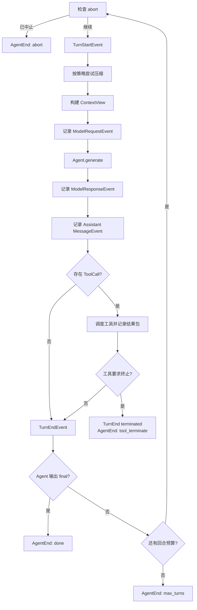
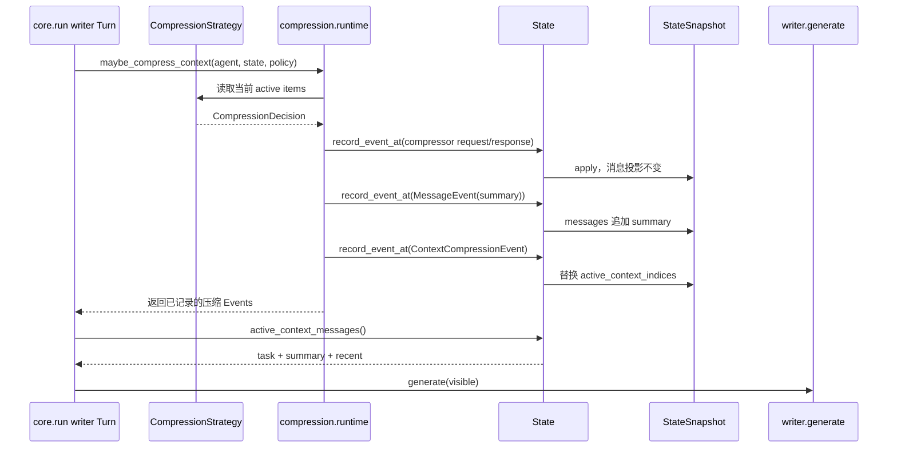

# 04. Agent 核心运行机制

> 本篇回答：Agent 如何从任务开始，反复观察、决策、行动和接收反馈，直到明确完成或触及运行边界。

本篇沿用 [00. 用一个真实运行看懂 Agent](00-running-example.md) 中的 `printf` 案例。阅读时可以把每个步骤对应回那次运行的事件顺序，而不是只看抽象循环。

## 1. Runtime 解决什么问题

模型调用只产生一次响应，长周期任务却需要多轮推进。Runtime 的职责是把模型、工具、上下文和 State 连接成一个可检查的循环，同时让每一步都成为明确事件。

核心设计不是“自动完成一切”的黑盒，而是四个可读对象和一个显式循环：

```text
Agent + Message + State + ContextView + run()
```

- Agent 保存生成函数及本次运行所需配置；
- State 保存追加式事实；
- ContextView 决定本轮模型可见内容；
- Message 承载任务、输出和工具反馈；
- `run()` 只负责按固定顺序推进生命周期。

Runtime 不负责 Provider 报文、具体工具业务、跨运行 Memory、复杂 Workflow 或评分。这些能力通过边界接入。

## 2. Agent 是运行配置，不是隐藏状态容器

一个 Agent 主要由以下部分组成：

| 部分 | 作用 |
| --- | --- |
| name | 事件归属、消息发送者和上下文身份 |
| generate | 根据本轮可见 Message 生成下一条 Message |
| role / system_prompt | Agent 的固定职责与模型请求前言 |
| tools | 本次运行可调用的能力集合 |
| context_policy | 可见性与压缩策略 |
| hooks | 有限生命周期扩展点 |
| llm_provider | 标记和装配模型访问；纯程序 Agent 可为空 |
| init_state | 自定义初始 transcript，例如注入 Skills |
| compose_trace_state | Workflow facade 的最终轨迹投影入口 |

Agent 自己不保存对话历史；同一个 Agent 配置可以运行多个互相隔离的 State。工具在构造时绑定，并在每次 `run()` 开始时按名称建立调度快照，避免运行中修改工具集合造成不确定行为。

`generate` 只接收可见消息并返回 Message。Provider、工具和角色等依赖在组装 Agent 时闭包化，使核心循环既能运行真实模型，也能使用确定性函数测试。

## 3. 新运行如何开始

`Agent.run(task)` 是常用入口，但真正执行是惰性的：

1. 使用默认或自定义 initializer 创建 State；
2. 默认 initializer 把任务记录为 `kind="task"` 的 UserMessage；
3. 返回 State 与 Event 迭代器；
4. 调用者消费迭代器时，循环才真正向前运行；
5. 运行期间产生的每个 Event 同时写入同一个 State。

这种接口让调用者可以实时打印、持久化或中止，也可以在开始消费前追加委派上下文。若调用者不消费迭代器，Agent 不会完成模型调用或工具执行。

### 3.1 最小调用示例：什么时候真正触发运行

```python
agent = Agent(name="writer", generate=generate)

# 这一步创建 State，并返回一个惰性 Event Iterator。
state, events = agent.run("读取 README.md", max_turns=3)

# 这一步才拉动 Runtime：模型调用、工具执行和后续回合都会发生。
for event in events:
    print(event)

# 消费结束后，再从同一个 State 读取完整事实。
print(state.task)       # 原始运行任务
print(state.messages)   # MessageEvent 派生的 transcript
print(state.events)     # 完整 Event Stream
```

可以把调用拆成两个时间点：

```text
agent.run(task)
  ├─ init_state(agent, task)
  ├─ State.task = task
  ├─ MessageEvent(task) 已写入 State
  └─ 返回 (state, events)

消费 events
  ├─ AgentStartEvent
  ├─ TurnStartEvent
  ├─ ModelRequestEvent → generate(...)
  ├─ ModelResponseEvent / Assistant MessageEvent
  ├─ 可选工具执行与 ToolResult MessageEvent
  └─ AgentEndEvent
```

因此，下面的代码不会发起模型请求：

```python
state, events = agent.run("读取 README.md")
# 如果此处直接返回，events 没有被消费，Runtime 也没有推进。
```

调用者可以用 `for` 实时观察，也可以用 `list(events)` 一次性执行；两者都会推进同一个生成器。事件每次 `yield` 前已经记录到 `state`，所以观察者不需要再手动写一份运行历史。

### 3.2 默认 initializer 与自定义 initializer

`Agent.run()` 的初始化选择只有一个入口：有 `agent.init_state` 就调用它，否则使用默认实现。默认实现等价于：

```python
def _default_init_state(agent, task):
    state = State(task=task)
    state.send("task", "user", agent.name, task)
    return state
```

它建立两条不同用途的数据：`State.task` 保存运行级原始输入，`state.send(...)` 创建模型可见的 `UserMessage(kind="task")`，并产生第一个 `MessageEvent`。`State(task=task)` 本身只创建容器，不会自动创建消息。

自定义 initializer 的契约是“接收 Agent 和任务，返回已经准备好的 State”：

```python
def init_state(agent, task):
    state = State(task=task)
    state.send(
        "system",
        "runtime",
        agent.name,
        "可用能力：read_file、search、bash",
    )
    state.send("task", "user", agent.name, task)
    return state

agent = Agent(
    name="writer",
    generate=generate,
    init_state=init_state,
)
```

初始化顺序会成为模型和 Trace 看到的事实：这里先有运行说明，再有用户任务。如果 initializer 只返回 `State(task=task)`，`state.messages` 为空，核心 Runtime 不会替它补写任务；除非这是一个明确不需要普通任务消息的特殊流程，否则模型可能看不到用户任务。Skills Agent 也是同一机制：Skills 层安装 initializer，调用者仍然只需调用普通的 `agent.run(task)`。

### 3.3 运行完成后的 `resume`

`resume(state, followup)` 不重新初始化，也不复制会话，而是在原 State 上追加一条新的 `UserMessage(kind="task")` 后重新调用同一个 Runtime：

```python
state, events = agent.run("读取 README.md")
for _ in events:
    pass

state, events = agent.resume(state, "继续检查 StateSnapshot")
for _ in events:
    pass
```

此时 `state.task` 仍是第一次的原始输入，后续要求只出现在 transcript 和新增 Event 中：

```text
State.task = "读取 README.md"
task Message 1 = "读取 README.md"
task Message 2 = "继续检查 StateSnapshot"
```

这使 `run()` 表示“新建运行”，`resume()` 表示“延续已有事实”。恢复时应保持 Agent name 一致；跨进程恢复还需要调用者序列化并重建 State 和外部资源。

## 4. 一轮的固定顺序



顺序本身就是契约：请求事件必须先于生成，响应事件必须先于响应消息，工具调用消息必须先于工具执行，工具结果必须在下一轮构建 ContextView 前进入 State。

### 4.1 为什么 task Message 排在 AgentStart 前面

`Agent.run(task)` 先初始化 State，并由默认 initializer 把任务写成 `kind="task"` 的 UserMessage；这个写入产生第一个 MessageEvent。此时循环尚未执行。调用者开始消费返回的 Event 迭代器后，`run()` 才记录 AgentStartEvent 并触发 SESSION_START Hook。因此默认运行的开头是：

```text
0 MessageEvent(task)   # 建立初始 transcript
1 AgentStartEvent      # 开始消费惰性 Runtime 循环
2 TurnStartEvent       # 第一轮模型决策即将开始
```

这里的 `0`、`1`、`2` 是 State 在追加事件时分配的顺序索引，不是事件类型编号。自定义 initializer 必须自己建立需要的初始 transcript；若它没有写入 task Message，就不能假设所有运行都以同样的 MessageEvent 开头。

`State.task` 与第 0 条 task Message 内容相同但职责不同：前者保存新 State 的原始运行输入，后者建立模型可见 transcript。`State(task=...)` 的 dataclass 构造器不会隐式记录 Event；这一步必须由默认或自定义 initializer 显式完成。完整数据归属见[领域模型文档](03-domain-model-and-data-flow.md#81-为什么-task-还要写成-message)。

因此自定义 initializer 不能把“返回 `State`”误认为“已经建立了模型对话”：

```python
def incomplete_init(agent, task):
    return State(task=task)  # events/messages 仍为空

def complete_init(agent, task):
    state = State(task=task)
    state.send("task", "user", agent.name, task)
    return state
```

前者适合明确不需要普通 task Message 的特殊流程；普通 Agent、Skills Agent 和需要让模型执行用户任务的初始化器应采用后者，或在它前面追加自己的 Runtime/context 消息。

### 4.2 Turn 的准确边界

当前 Runtime 中，一个 Turn 可以近似理解为“一次模型决策，以及这次决策直接引发的工具处理”：

```text
TurnStartEvent
  → 请求前压缩检查
  → 构建 ContextView
  → ModelRequestEvent
  → Agent.generate
  → ModelResponseEvent
  → MessageEvent(AssistantMessage)
  → 可选：ToolExecutionEvent + MessageEvent(tool_result)
  → TurnEndEvent
```

因此 `Model Call` 是 Turn 的一部分，而不是 Turn 的同义词。Turn 还拥有请求前上下文处理、消息写入、工具调度和终止判断。这个边界让 Span Viewer 可以把模型访问和工具执行都归入促成它们的同一轮控制流程。

在贯穿本文的 Bash 示例中，第一次模型调用只能提出工具请求，不能同时知道尚未产生的工具结果：

```text
Turn 1
  模型看到：task
  模型输出：ToolCallBlock(id="bash_1")
  Runtime：执行 Bash，写入 ToolResultBlock(tool_call_id="bash_1")

Turn 2
  模型看到：task + Assistant tool call + tool_result
  模型输出：final AssistantMessage
```

所以一次需要模型读取工具结果的任务通常至少有两个 Turn。工具完成不会“自动唤醒”上一轮模型；结果先作为新的 UserMessage 进入 State，再由下一轮重新构建 ContextView 并调用模型。

### 4.3 Agent 结束与 Turn 结束不能合并

AgentStart/AgentEnd 包围整次运行，TurnStart/TurnEnd 只包围其中一次控制循环。一名 Agent 连续调用模型十次，应表现为一对 Agent 生命周期事件和最多十对 Turn 生命周期事件，而不是十次 Agent 启动。

几个边界情况可以帮助理解：

| 情况 | 可能的生命周期序列 | 含义 |
| --- | --- | --- |
| 第一轮直接 final | AgentStart → TurnStart → TurnEnd → AgentEnd(done) | 一轮正常完成 |
| 工具返回 `terminate=true` | TurnEnd(terminated=true) → AgentEnd(tool_terminate) | 工具要求立即停止 |
| 第一轮前 abort | AgentStart → AgentEnd(abort) | 尚未开始任何模型决策 |
| `max_turns=0` | AgentStart → AgentEnd(max_turns) | 没有可用回合预算 |

正常 `final` 不会把 `TurnEndEvent.terminated` 设为 true：`terminated` 专门表达工具终止信号，正常完成由后续 `AgentEndEvent(reason="done")` 表达。这样观察者可以区分“模型认为任务完成”“工具要求停止”“外部中止”和“预算耗尽”。

## 5. Runtime 如何让压缩在同一轮生效

每一轮都从 State 重新构建上下文，而不是复用上一轮列表。压缩发生在本轮 writer 模型请求之前：如果策略命中，Runtime 先把 decision 转换成主 State 中的正式事实，再从更新后的 Snapshot 读取活跃消息。因此摘要影响的是**当前 Turn 接下来尚未发出的 writer 请求**，不是等到下一个 Turn 才生效。

### 5.1 从 `core.run()` 到 `CompressionDecision`

请求前控制链如下：

```text
core.run()
  → maybe_compress_context(agent, state, policy)
  → strategy(active, agent_name)
  → CompressionDecision
  → compression.runtime._apply_decision(...)
  → State.record_event_at(...)
  → StateSnapshot.apply(...)
  → core.run() 继续构建 writer 的 ContextView
```

这里有两个不同阶段：

1. Strategy 读取当前活跃消息，选择需要替换的索引，返回 `CompressionDecision`；
2. Compression Runtime 校验并应用 decision，把结果转换成正式 Event。

`CompressionDecision` 是 Strategy 与 Runtime 之间的临时交接对象，包含目标索引、replacement、策略标签以及可选的内部 trace events。它本身不会写入 `State.events`，也不能直接修改 Snapshot。这样 Strategy 只负责“建议怎样压缩”，State 的修改规则仍集中在 Runtime。

### 5.2 Decision 如何写进主 State

以需要 compressor 模型的 `SummarizeStrategy` 为例，一个 decision 最终按以下顺序记录：

```text
1. ModelRequestEvent(agent="compressor")
2. ModelResponseEvent(agent="compressor", usage=...)
3. MessageEvent(UserMessage(kind="summary"))
4. ContextCompressionEvent(agent="writer", strategy="summarize")
```

前两个 Event 来自 `decision.trace_events`，用于保留摘要生成时发生的内部模型调用。第三个 Event 把 replacement 作为普通 summary Message 追加到完整 transcript。第四个 Event 记录哪些旧消息被替代，以及新的活跃顺序。

规则压缩或 Agent-controlled compact 没有额外 compressor 调用时，可以没有前两个 Event；但只要真正改变活跃上下文，就仍然会记录 replacement MessageEvent 和 ContextCompressionEvent。



### 5.3 `record_event_at()` 为什么就是生效点

每次调用 `State.record_event_at()` 都连续完成两件事：

```python
self.events.append(stamped)
self.snapshot.apply(stamped)
```

因此 Event 一旦进入主 State，对应的当前投影也在同一个调用中更新：

| Event | `state.events` | `state.snapshot` |
| --- | --- | --- |
| compressor ModelRequestEvent | 追加生成证据 | 忽略 |
| compressor ModelResponseEvent | 追加模型、usage 等证据 | 忽略 |
| summary MessageEvent | 追加摘要消息事实 | 将摘要追加到 `messages` |
| ContextCompressionEvent | 追加压缩动作事实 | 用事件中的列表替换 `active_context_indices` |

真正改变后续模型输入的是最后一行。summary MessageEvent 只保证摘要存在于完整消息历史中；ContextCompressionEvent 才指定“当前应该按什么顺序读取哪些消息”。

`maybe_compress_context()` 会先完整应用 decision，再把已经记录的压缩 Events 返回给 `core.run()`。核心循环随后才调用：

```python
context = build_context_view(
    agent.name,
    state.active_context_messages(),
    policy=policy,
)
```

所以不需要额外 commit、刷新或下一轮触发。这里的“写入”默认也是写入内存中的 `State`，不是自动写文件或数据库；持久化和 Trace 导出只是后续读取 `state.events` 的外围能力。

### 5.4 完整历史为什么没有被删除

假设压缩前的完整消息为：

```text
0 task
1 old A
2 old B
3 recent
```

Strategy 决定用 summary 替换 1、2。Runtime 先把 summary 追加为新消息 4，再记录新的活跃顺序：

```text
StateSnapshot.messages       = [0 task, 1 old A, 2 old B, 3 recent, 4 summary]
active_context_indices       = [0, 4, 3]
```

接下来的 writer ContextView 读取 `[0, 4, 3]`，所以模型看到 `task + summary + recent`；旧消息 1、2 仍留在完整历史中，Trace、Recall 和 Snapshot 重建仍可读取。高索引 summary 被插回旧内容的逻辑位置，因此活跃索引不要求数字单调递增。

压缩完成后的同一 Turn 继续为：

```text
ContextCompressionEvent(writer)
  → state.active_context_messages()
  → build_context_view(writer, ...)
  → ModelRequestEvent(writer)       # 已包含 summary，不包含 old A / old B
  → writer.generate(visible)
```

因此工具结果、Hook 新消息、摘要和 follow-up 都会在下一次尚未发出的模型请求中生效。压缩属于请求前控制，不会在模型生成途中改变已经发出的输入。策略类型、摘要证据和索引保护规则见[上下文与长周期能力](07-context-and-long-horizon.md#5-compression缩小当前运行的工作上下文)。

## 6. 生成函数的两种实现

### 6.1 程序化 Agent

教学、测试或简单策略可以直接提供函数：读取 Message 列表，返回 AssistantMessage。它不需要 Provider，也不会被 Trace 误标成真实模型调用来源。

### 6.2 LLM-backed Agent

模型 Agent 由装配层创建。`core.run()` 不直接操作 `LLMRequest` 或 Provider SDK；它只调用 `agent.generate(visible)`。对于 `make_llm_agent()` 创建的 Agent，这个 generate 闭包才进入模型访问层：

```text
core.run()
  → build_context_view(...)
  → visible: list[Message]
  → ModelRequestEvent(writer)           # Runtime 先记录将要调用模型
  → agent.generate(visible)
      → Message[] → LLMMessage[]        # Bridge 去掉 Runtime 路由
      → 组装一个 LLMRequest             # 完整的一次模型调用输入
      → complete_with_tool_call_retry()
          → Provider Adapter / Wire
          → LLMResponse                 # 完整的一次模型调用输出
      → LLMResponse → AssistantMessage  # Bridge 补回 Runtime 身份
  → ModelResponseEvent(writer)
  → MessageEvent(AssistantMessage)
  → 可选工具调度
```

这里的三个 LLM 对象不是同一级别：

| 对象 | 粒度 | 回答的问题 |
| --- | --- | --- |
| `LLMMessage` | 请求中的一条对话消息 | 某个 role 说了什么？ |
| `LLMRequest` | 一次完整模型调用 | 调哪个 Provider，发送哪些消息、工具和参数？ |
| `LLMResponse` | 一次调用的完整结果 | 模型产生了什么、为何停止、用了多少 Token？ |

一个 `LLMRequest` 通常包含多条 `LLMMessage`；`LLMResponse` 不是 `LLMMessage` 的子类型，也不是可以直接写进 State 的 Runtime Message。它还缺少 `sender`、`target` 和 `kind`，所以必须先由 Response Bridge 包装为 `AssistantMessage`。

生成函数内部依次完成：

1. Message 投影为 LLMMessage；
2. 工具投影为 LLMTool；
3. 组装 LLMRequest；
4. 调用带恢复策略的模型完成接口；
5. 将 LLMResponse 包装成 AssistantMessage；
6. `stop_reason="end_turn"` 映射为 `kind="final"`，其他可继续形态映射为 `step`。

请求 Bridge 同时构成信息边界：模型正文 `content` 保留，`sender`、`target`、`kind` 等 Runtime 路由字段截止；`Message.sidecar` 中只有明确作为 Provider hint 的 `sidecar["extra"]` 被复制到 `LLMMessage.extra`，`details`、`raw` 和 `compression` 不会随普通请求发给 Provider。对应 Adapter 只处理自己认识的命名空间，未知 hint 被忽略。

Runtime 因而不需要知道哪家 Provider 被调用，只处理返回的统一 Message。三种对象的字段、sidecar 提升规则及 wire 示例见[模型访问边界](05-model-access.md#4-llmmessagellmrequest-与-llmresponse)。

## 7. 工具调用如何形成下一轮

AssistantMessage 可以同时包含文本、思考和多个 ToolCallBlock。Runtime 先完整记录这条消息，再调度工具：

- 为每个调用记录 ToolExecutionStart；
- 执行 PRE_TOOL_USE Hook；
- 根据工具 execution mode 选择并行池或顺序执行；
- 收集增量 update、最终结果、错误和 terminate；
- 按原始调用顺序构造一个 tool-result UserMessage；
- 记录结果消息后执行 POST_TOOL_USE Hook；
- 若没有工具要求终止，进入下一轮。

模型调用与工具调用不是递归嵌套在 `generate` 内。工具反馈通过 State 进入下一轮，这使完整行动链可观察、可压缩、可恢复。

## 8. 四种 Agent 停止原因

| 原因 | 触发条件 | 是否正常完成 | 留下的事实 |
| --- | --- | --- | --- |
| done | 当前 Agent 输出自己的 `kind="final"` 消息 | 是 | final Message、TurnEnd、AgentEnd |
| max_turns | 回合预算耗尽仍无 final | 否，截断 | AgentEnd(reason=max_turns) |
| tool_terminate | 任一工具结果要求停止 | 按工具语义停止，不等于模型完成 | ToolExecutionEnd(terminate)、终止 TurnEnd、AgentEnd |
| abort | 外部 abort flag 在回合开始或工具等待中生效 | 否，外部中止 | AgentEnd(reason=abort) 或错误工具反馈 |

`final` 必须由正在运行的 Agent 发送。历史中其他 Agent 的 final，或 target 指向当前 Agent 的 final，都不应误停当前循环。

回合耗尽不是异常抛出，也不能伪装成成功；显式停止原因让调用者、Trace 和 Eval 正确区分结果。

## 9. Hook：受限的生命周期扩展

Runtime 只开放四个 HookPoint：

- SESSION_START：在第一轮前观察或追加运行说明；
- PRE_TOOL_USE：观察或阻止一个工具调用；
- POST_TOOL_USE：结果包记录后追加提醒或上下文；
- SESSION_END：统一退出路径上的收尾观察。

Hook 可以返回 block reason 或要追加的 Message，但不能编辑历史。PRE_TOOL_USE 阶段禁止插入消息，因为插在 Assistant tool call 与 User tool result 之间会破坏 Provider 要求的配对；该阶段只能阻止，阻止结果会被合成为错误 ToolResult，让模型下一轮可见。多个 Hook 按注册顺序执行，首个阻止决定结束后续决策。

每次实际触发都会记录 HookFiredEvent，使原本不可见的控制决策可审计。

## 10. resume：延续 State，而不是复制会话

`Agent.resume(state, followup)` 在现有 State 中追加新的 task Message，再运行同一个循环。此前 Message、Event、压缩视图和 Trace 均继续累积。

`resume()` 不会把 `State.task` 改成 followup。原字段继续表示这份 State 最初的运行输入，followup 则作为新的 `UserMessage(kind="task")` 进入 transcript。这让一次持续运行同时保留“最初为何启动”和“后来要求继续做什么”。

适用场景包括：

- 用户在已有任务后追加要求；
- 两轮之间更换模型推理强度；
- 中间保存 State，稍后继续；
- 使用相同身份重新组装 Agent。

恢复时 Agent name 应保持一致，因为消息归属和组合语义依赖身份。resume 不是进程级持久化协议；若要跨进程恢复，调用者还需要可靠序列化并重建 State 及外部资源。

## 11. 事件流与控制权

`run()` 是同步生成器。其含义是：

- 消费者拉取下一个 Event 时，系统继续工作；
- 每个 yield 前事件已经写入 State；
- 消费者可实时显示，但不能把显示层变成事实来源；
- 工具可在线程池中并发，事件仍由主生成器按受控顺序写入；
- 同步外观保持教学可读性，同时允许边界内并发。

Runtime 没有后台守护线程替调用者无限推进。谁消费迭代器，谁拥有运行节奏和外部中止权。

## 12. 关键不变量

- 一次普通 Agent 运行只有一条明确主循环；
- 所有退出路径最终经过 SESSION_END 和 AgentEndEvent；
- 同一 Event 既被 yield，也被记录，二者不漂移；
- 每轮请求使用当时 State 重新构建的 ContextView；
- Assistant 输出先记录，再执行其中的工具调用；
- 每组工具调用都形成结果包，包括未知工具、Hook 阻止、异常和超时；
- `max_turns`、abort、tool terminate 与 final 具有不同停止语义；
- 外围能力通过 initializer、policy、hooks、tools 或 facade 组合，不复制核心循环。

## 13. 为什么保持循环紧凑

长周期能力容易诱导系统把规划、Memory、重试、评测和多 Agent 全塞进 Runtime。当前设计刻意保持核心小，因为：

- 学习者可以从上到下读懂完整控制流；
- Fake generate 和 Fake Tool 能覆盖主要行为；
- Provider 故障由模型层处理，工具故障由工具边界反馈；
- Skills 改初始状态，Compression 改活跃视图，Hooks 改有限决策点；
- Workflow 组合普通运行，而不是引入第二套隐藏生命周期。

判断是否应修改核心循环的标准是：该行为是否改变所有 Agent 都必须遵守的逐轮契约。若只属于某类 Agent 或某个实验，应优先使用现有接入点。

## 14. 本篇理解检查

- 为什么 `Agent.run()` 返回的迭代器必须被消费？
- 一轮中压缩、ContextView、模型请求、响应消息和工具结果的顺序是什么？
- 为什么只追加 summary Message 还没有完成压缩，必须再记录 ContextCompressionEvent？
- 程序化 Agent 与模型 Agent 如何共用同一个 Runtime？
- 为什么 PRE_TOOL_USE Hook 不能追加 Message？
- `final`、max turns、tool terminate 和 abort 有何区别？
- resume 保留什么，又要求调用者负责什么？
- 为什么工具并发不要求核心改成异步框架？

## 15. 相关文档与参考依据

- [返回设计文档总览](README.md)
- [上一篇：核心概念与数据流](03-domain-model-and-data-flow.md)
- [下一篇：模型访问边界](05-model-access.md)将展开 `generate` 背后的模型访问边界。
- [`core.py`](../../src/simple_long_horizon_agent/core.py)：Agent、run、resume 和工具调度。
- [`hooks.py`](../../src/simple_long_horizon_agent/hooks.py)：HookPoint、决策合并与事件记录。
- [`llm_agent.py`](../../src/simple_long_horizon_agent/llm_agent.py)：模型 Agent 的装配函数。
- [`tests/unit/test_core.py`](../../tests/unit/test_core.py)：循环、停止、压缩、工具与恢复验证。
- [`tests/unit/test_hooks.py`](../../tests/unit/test_hooks.py)：Hook 顺序、阻止和消息发射验证。
