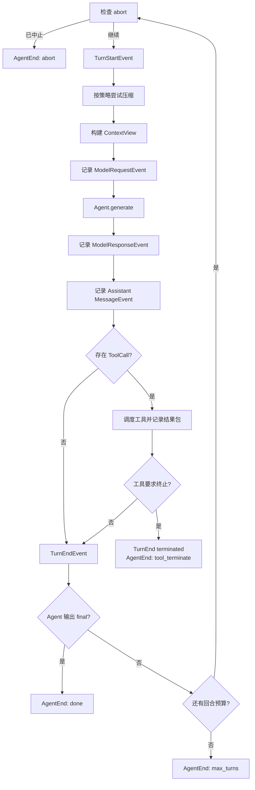

# 04. Agent 核心运行机制

> 本篇回答：Agent 如何从任务开始，反复观察、决策、行动和接收反馈，直到明确完成或触及运行边界。

## 1. Runtime 解决什么问题

模型调用只产生一次响应，长周期任务却需要多轮推进。Runtime 的职责是把模型、工具、上下文和 State 连接成一个可检查的循环，同时让每一步都成为明确事件。

核心设计不是“自动完成一切”的黑盒，而是四个可读对象和一个显式循环：

```text
Agent + Message + State + ContextView + run()
```

- Agent 保存生成函数及本次运行所需配置；
- State 保存追加式事实；
- ContextView 决定本轮模型可见内容；
- Message 承载任务、输出和工具反馈；
- `run()` 只负责按固定顺序推进生命周期。

Runtime 不负责 Provider 报文、具体工具业务、跨运行 Memory、复杂 Workflow 或评分。这些能力通过边界接入。

## 2. Agent 是运行配置，不是隐藏状态容器

一个 Agent 主要由以下部分组成：

| 部分 | 作用 |
| --- | --- |
| name | 事件归属、消息发送者和上下文身份 |
| generate | 根据本轮可见 Message 生成下一条 Message |
| role / system_prompt | Agent 的固定职责与模型请求前言 |
| tools | 本次运行可调用的能力集合 |
| context_policy | 可见性与压缩策略 |
| hooks | 有限生命周期扩展点 |
| llm_provider | 标记和装配模型访问；纯程序 Agent 可为空 |
| init_state | 自定义初始 transcript，例如注入 Skills |
| compose_trace_state | Workflow facade 的最终轨迹投影入口 |

Agent 自己不保存对话历史；同一个 Agent 配置可以运行多个互相隔离的 State。工具在构造时绑定，并在每次 `run()` 开始时按名称建立调度快照，避免运行中修改工具集合造成不确定行为。

`generate` 只接收可见消息并返回 Message。Provider、工具和角色等依赖在组装 Agent 时闭包化，使核心循环既能运行真实模型，也能使用确定性函数测试。

## 3. 新运行如何开始

`Agent.run(task)` 是常用入口，但真正执行是惰性的：

1. 使用默认或自定义 initializer 创建 State；
2. 默认 initializer 把任务记录为 `kind="task"` 的 UserMessage；
3. 返回 State 与 Event 迭代器；
4. 调用者消费迭代器时，循环才真正向前运行；
5. 运行期间产生的每个 Event 同时写入同一个 State。

这种接口让调用者可以实时打印、持久化或中止，也可以在开始消费前追加委派上下文。若调用者不消费迭代器，Agent 不会完成模型调用或工具执行。

## 4. 一轮的固定顺序



顺序本身就是契约：请求事件必须先于生成，响应事件必须先于响应消息，工具调用消息必须先于工具执行，工具结果必须在下一轮构建 ContextView 前进入 State。

## 5. 模型请求前为什么先处理上下文

每一轮都重新从 State 构建上下文，而不是复用上一轮列表：

1. 压缩策略先读取当前活跃上下文；
2. 若策略给出决定，Runtime 追加替代消息与 ContextCompressionEvent；
3. ContextView 再按 Agent policy 过滤不可见 kind；
4. ModelRequestEvent 记录本轮可见数量、估算大小、工具定义和模型消息投影；
5. `generate` 收到与记录一致的可见 Message 列表。

因此工具结果、Hook 新消息、摘要和 follow-up 都会在正确的下一轮生效。压缩属于请求前控制，不会在模型生成途中偷偷改变输入。

## 6. 生成函数的两种实现

### 6.1 程序化 Agent

教学、测试或简单策略可以直接提供函数：读取 Message 列表，返回 AssistantMessage。它不需要 Provider，也不会被 Trace 误标成真实模型调用来源。

### 6.2 LLM-backed Agent

模型 Agent 由装配层创建。其生成函数完成：

1. Message 投影为 LLMMessage；
2. 工具投影为 LLMTool；
3. 组装 LLMRequest；
4. 调用带恢复策略的模型完成接口；
5. 将 LLMResponse 包装成 AssistantMessage；
6. `stop_reason="end_turn"` 映射为 `kind="final"`，其他可继续形态映射为 `step`。

Runtime 不需要知道哪家 Provider 被调用，只处理返回的统一 Message。

## 7. 工具调用如何形成下一轮

AssistantMessage 可以同时包含文本、思考和多个 ToolCallBlock。Runtime 先完整记录这条消息，再调度工具：

- 为每个调用记录 ToolExecutionStart；
- 执行 PRE_TOOL_USE Hook；
- 根据工具 execution mode 选择并行池或顺序执行；
- 收集增量 update、最终结果、错误和 terminate；
- 按原始调用顺序构造一个 tool-result UserMessage；
- 记录结果消息后执行 POST_TOOL_USE Hook；
- 若没有工具要求终止，进入下一轮。

模型调用与工具调用不是递归嵌套在 `generate` 内。工具反馈通过 State 进入下一轮，这使完整行动链可观察、可压缩、可恢复。

## 8. 四种 Agent 停止原因

| 原因 | 触发条件 | 是否正常完成 | 留下的事实 |
| --- | --- | --- | --- |
| done | 当前 Agent 输出自己的 `kind="final"` 消息 | 是 | final Message、TurnEnd、AgentEnd |
| max_turns | 回合预算耗尽仍无 final | 否，截断 | AgentEnd(reason=max_turns) |
| tool_terminate | 任一工具结果要求停止 | 按工具语义停止，不等于模型完成 | ToolExecutionEnd(terminate)、终止 TurnEnd、AgentEnd |
| abort | 外部 abort flag 在回合开始或工具等待中生效 | 否，外部中止 | AgentEnd(reason=abort) 或错误工具反馈 |

`final` 必须由正在运行的 Agent 发送。历史中其他 Agent 的 final，或 target 指向当前 Agent 的 final，都不应误停当前循环。

回合耗尽不是异常抛出，也不能伪装成成功；显式停止原因让调用者、Trace 和 Eval 正确区分结果。

## 9. Hook：受限的生命周期扩展

Runtime 只开放四个 HookPoint：

- SESSION_START：在第一轮前观察或追加运行说明；
- PRE_TOOL_USE：观察或阻止一个工具调用；
- POST_TOOL_USE：结果包记录后追加提醒或上下文；
- SESSION_END：统一退出路径上的收尾观察。

Hook 可以返回 block reason 或要追加的 Message，但不能编辑历史。PRE_TOOL_USE 阶段禁止插入消息，因为插在 Assistant tool call 与 User tool result 之间会破坏 Provider 要求的配对；该阶段只能阻止，阻止结果会被合成为错误 ToolResult，让模型下一轮可见。多个 Hook 按注册顺序执行，首个阻止决定结束后续决策。

每次实际触发都会记录 HookFiredEvent，使原本不可见的控制决策可审计。

## 10. resume：延续 State，而不是复制会话

`Agent.resume(state, followup)` 在现有 State 中追加新的 task Message，再运行同一个循环。此前 Message、Event、压缩视图和 Trace 均继续累积。

适用场景包括：

- 用户在已有任务后追加要求；
- 两轮之间更换模型推理强度；
- 中间保存 State，稍后继续；
- 使用相同身份重新组装 Agent。

恢复时 Agent name 应保持一致，因为消息归属和组合语义依赖身份。resume 不是进程级持久化协议；若要跨进程恢复，调用者还需要可靠序列化并重建 State 及外部资源。

## 11. 事件流与控制权

`run()` 是同步生成器。其含义是：

- 消费者拉取下一个 Event 时，系统继续工作；
- 每个 yield 前事件已经写入 State；
- 消费者可实时显示，但不能把显示层变成事实来源；
- 工具可在线程池中并发，事件仍由主生成器按受控顺序写入；
- 同步外观保持教学可读性，同时允许边界内并发。

Runtime 没有后台守护线程替调用者无限推进。谁消费迭代器，谁拥有运行节奏和外部中止权。

## 12. 关键不变量

- 一次普通 Agent 运行只有一条明确主循环；
- 所有退出路径最终经过 SESSION_END 和 AgentEndEvent；
- 同一 Event 既被 yield，也被记录，二者不漂移；
- 每轮请求使用当时 State 重新构建的 ContextView；
- Assistant 输出先记录，再执行其中的工具调用；
- 每组工具调用都形成结果包，包括未知工具、Hook 阻止、异常和超时；
- `max_turns`、abort、tool terminate 与 final 具有不同停止语义；
- 外围能力通过 initializer、policy、hooks、tools 或 facade 组合，不复制核心循环。

## 13. 为什么保持循环紧凑

长周期能力容易诱导系统把规划、Memory、重试、评测和多 Agent 全塞进 Runtime。当前设计刻意保持核心小，因为：

- 学习者可以从上到下读懂完整控制流；
- Fake generate 和 Fake Tool 能覆盖主要行为；
- Provider 故障由模型层处理，工具故障由工具边界反馈；
- Skills 改初始状态，Compression 改活跃视图，Hooks 改有限决策点；
- Workflow 组合普通运行，而不是引入第二套隐藏生命周期。

判断是否应修改核心循环的标准是：该行为是否改变所有 Agent 都必须遵守的逐轮契约。若只属于某类 Agent 或某个实验，应优先使用现有接入点。

## 14. 本篇理解检查

- 为什么 `Agent.run()` 返回的迭代器必须被消费？
- 一轮中压缩、ContextView、模型请求、响应消息和工具结果的顺序是什么？
- 程序化 Agent 与模型 Agent 如何共用同一个 Runtime？
- 为什么 PRE_TOOL_USE Hook 不能追加 Message？
- `final`、max turns、tool terminate 和 abort 有何区别？
- resume 保留什么，又要求调用者负责什么？
- 为什么工具并发不要求核心改成异步框架？

## 15. 相关文档与参考依据

- [返回设计文档总览](README.md)
- [上一篇：核心概念与数据流](03-domain-model-and-data-flow.md)
- 下一篇 `05-model-access.md` 将展开 `generate` 背后的模型访问边界。
- [`core.py`](../../src/simple_long_horizon_agent/core.py)：Agent、run、resume 和工具调度。
- [`hooks.py`](../../src/simple_long_horizon_agent/hooks.py)：HookPoint、决策合并与事件记录。
- [`llm_agent.py`](../../src/simple_long_horizon_agent/llm_agent.py)：模型 Agent 的装配函数。
- [`tests/unit/test_core.py`](../../tests/unit/test_core.py)：循环、停止、压缩、工具与恢复验证。
- [`tests/unit/test_hooks.py`](../../tests/unit/test_hooks.py)：Hook 顺序、阻止和消息发射验证。

