# 05. 模型访问边界

> 本篇回答：系统怎样使用不同模型和 API，同时让 Runtime、State 与工具协议保持供应商无关。

案例锚点：在 [00. 用一个真实运行看懂 Agent](00-running-example.md) 中，第一次 `model_request` 携带一条 task Message 和 system prompt；Fake Adapter 返回带 `ToolCallBlock("bash_1")` 的响应，第二次请求再把工具结果转换成模型可读的 LLMMessage。

## 1. 为什么模型访问必须独立

不同模型接口在 system prompt、工具结果、图片、思考内容、流式事件、TokenUsage 和停止原因上都有差异。若 Runtime 直接构造 SDK 请求，切换 Provider 会改变核心循环，历史也会混入外部对象。

模型访问层因此建立一个稳定中间协议：

```mermaid
flowchart LR
    Runtime["Runtime Message"] --> Bridge["Bridge"]
    Bridge --> Request["LLMMessage / LLMRequest"]
    Request --> Registry["Adapter Registry"]
    Registry --> Adapter["Provider Adapter"]
    Adapter --> Wire["实际 API Wire"]
    Wire --> Stream["统一 StreamEvent"]
    Stream --> Response["LLMResponse"]
    Response --> Bridge2["Response Bridge"]
    Bridge2 --> Assistant["AssistantMessage"]
```

核心目标不是抹平所有供应商能力，而是把共同语义规范化，把不可共同表达的选项留在受控扩展位置。

## 2. 模块边界

模型访问层负责：

- Provider 配置值与模型元数据；
- 供应商无关请求、响应和流事件；
- Runtime Message 与 LLMMessage 的投影；
- Tool 到 LLMTool 的投影；
- Adapter 注册和分发；
- wire 请求/响应转换；
- TokenUsage、stop reason、thinking 和 tool call 规范化；
- 可恢复限流与非法工具调用重试。

它不负责：

- State、回合和停止循环；
- 工具的实际执行；
- Context 压缩策略；
- Agent 路由与 Workflow；
- Trace 持久化或成本评分。

`make_llm_agent` 同时依赖 Runtime 与 LLM 层，所以位于两者之上的装配位置，而不是让纯 LLM 包导入 Agent。

## 3. Provider：配置值，不是客户端会话

Provider 描述一次模型访问所需的稳定配置，例如：

- `api`：选择哪一种 Adapter；
- `model`：请求模型标识；
- `base_url` 与认证信息；
- 默认 temperature、最大输出和 reasoning；
- 是否重放 reasoning 等模型族行为。

Provider 是不可变配置值，不保存对话状态，也不等于 SDK client。模型注册表负责用名称映射 Provider 规格；环境加载器负责将环境变量解析为 Provider。Runtime 只持有已解析 Provider，不自行读取任意环境变量。

## 4. LLMRequest 的组成

一次请求包含：

| 部分 | 来源 | 作用 |
| --- | --- | --- |
| provider | Agent 组装 | 选择 Adapter、模型和端点 |
| messages | ContextView 经 Bridge 投影 | 本轮对话输入 |
| tools | AgentTool 的声明投影 | 告诉模型可调用能力，不含 execute |
| system_prompt | Agent 固定配置 | 每次调用的稳定前言 |
| temperature / max_tokens / reasoning | Agent 或 Provider 默认值 | 控制生成 |
| timeout_seconds | 请求或统一配置 | 限制单次调用等待 |
| extra | namespaced 供应商扩展 | 表达尚未进入公共协议的选项 |

LLMRequest 是纯数据，适合记录和回放。工具声明只保留名称、描述和 JSON Schema；本地执行函数绝不能跨模型边界。

## 5. Adapter Registry 与分发

每个 Adapter 实现同一函数形状：接收 LLMRequest，产出 StreamEvent 迭代器。注册表以 `provider.api` 为键选择实现。

内置路径包括确定性 Fake、OpenAI Chat、OpenAI Responses 和 Anthropic Messages。注册同名 API 会替换旧实现，便于测试或受控扩展；未知 API 必须明确失败并列出可用适配器，不能静默回退到错误协议。

新增 Provider 的最小边界是：

1. 定义可解析的 Provider 配置；
2. 实现请求到 wire 的转换；
3. 实现 wire 响应到统一 StreamEvent/LLMResponse 的转换；
4. 注册 Adapter；
5. 用无网络 stub 测试真实报文形状；
6. 验证 Runtime 无需修改。

## 6. 统一流事件

Adapter 对外产出以下事件：

| kind | 语义 |
| --- | --- |
| text_delta | 新增文本片段 |
| thinking_delta | 新增思考片段 |
| tool_call_start | 工具调用开始，参数可能尚不完整 |
| tool_call_delta | 工具参数 JSON 增量 |
| tool_call_complete | 完整且已解析的工具调用 |
| usage_update | 使用量更新 |
| done | 最终 LLMResponse，且必须最后出现 |

`iter_stream` 允许调用者实时消费；`complete` 排空事件并取得最终响应。Adapter 若未产生合法 done 响应，应明确失败，而不是拼凑不完整结果。

当前 Agent 主循环使用完整响应路径，但保留统一流协议，使实时 UI 和未来扩展无需改写 Provider 适配。

## 7. 请求转换中的差异

### 7.1 system prompt

项目在 LLMRequest 中单独保存固定 system prompt。不同 Adapter 可将其放入顶层 system 字段或首条 system message。ModelRequestEvent 同时记录可重建的规范输入；raw request 保留实际跨线形状。

### 7.2 工具结果

运行时一个 UserMessage 可包含多个 ToolResultBlock：

- Anthropic wire 保持一个 user message 内的多个 tool_result；
- OpenAI Chat 将其拆为多个 `role="tool"` 条目；
- 若某接口的 tool role 不能携带图片，Adapter 可增加相邻 user 图片消息，同时保留工具来源说明。

差异只改变 wire 排列，不改变 Runtime 工具身份。

### 7.3 Thinking

ThinkingBlock 在统一内容序列中保留文本、签名、是否脱敏及必要的来源提示。Adapter 决定哪些字段可在后续请求中重放。思考内容是否展示给最终用户属于可见性产品决策，不等于是否应在协议和 Trace 中保存。

### 7.4 Extra

请求级和消息级 extra 允许供应商特性先以命名空间形式进入边界，例如缓存锚点。Adapter 只读取自己的命名空间，未知项应被忽略，从而保持 transcript 可跨 Provider 使用。成熟且普遍的能力应提升为明确字段，不能永久堆积在 extra。

## 8. 响应规范化

Adapter 必须将供应商结果转为：

- 有序 Content Block；
- 统一 StopReason：end_turn、tool_use、max_tokens 或 error；
- 统一 TokenUsage；
- 实际服务模型标识；
- 可选 raw 请求/响应快照。

LLMResponse.content 是来源，`text`、`thinking_blocks` 和 `tool_calls` 是派生读取方式。Bridge 将其包装为 AssistantMessage，并附加 Runtime 的 sender、target、kind。全零 usage 转成未知值，避免下游误认为零消耗。

## 9. 两层恢复策略

模型访问将两种失败分开处理。

### 9.1 Provider 暂时失败

限流、HTTP 429、部分服务器暂时错误可在请求尚未进入 Runtime State 前重试。使用有限次数和退避；非暂时错误直接抛出。这样不会在 transcript 中制造多个看似真实的 Assistant 回合。

### 9.2 模型产生非法工具调用

模型可能返回未知工具名、空名称或无法解析的参数。这是模型可自我修正的输出问题：

1. 检查响应中的 ToolCallBlock；
2. 将原 Assistant 输出与明确修复提示临时追加到重试请求；
3. 再给模型有限机会；
4. 成功后只把最终规范响应交给 Runtime；
5. 超过次数则明确失败。

这与执行阶段“工具不存在”不同：前者在模型边界尽早修复结构，后者由 Runtime 形成错误 ToolResult 供下一轮处理。

## 10. Timeout 的所有权

LLMRequest 的 timeout 限制单次模型调用。Agent 装配可使用调用参数或统一配置覆盖默认值。Provider SDK 如何实现超时属于 Adapter；Runtime 的 abort 和 max turns 是更外层的运行边界，两者不能相互替代。

一次请求超时不应被描述为 Agent 正常结束。是否重试取决于错误分类；最终未恢复的错误向调用者传播，并保留此前已记录的运行事实。

## 11. Raw 快照为什么保留又隔离

规范化协议不可能覆盖供应商所有字段。raw 快照回答：

- 实际发送了什么 body；
- reasoning、cache control 等选项是否落到 wire；
- 服务返回了哪些安全、拒绝或缓存细节；
- 某个 Adapter 的规范化是否正确。

raw 通过 AssistantMessage sidecar 进入调试链路，但 Runtime 不读取它来决定普通控制流。轨迹持久化会将逐轮增长的 raw 请求历史外置并去重，避免主 JSONL 产生平方级膨胀。

## 12. 配置与密钥边界

- 模型注册表保存可公开的模型规格，不应把密钥写入设计或轨迹；
- 环境解析集中在 LLM 配置层；
- 容器运行只传递明确允许的 Provider 环境变量；
- request extra 不能成为绕过配置校验的任意全局配置；
- Fake Provider 默认无需网络和密钥，用于教程与测试。

## 13. 关键不变量

- Runtime State 只保存项目拥有的 Message，不保存 SDK 响应对象；
- LLMMessage 不携带 sender、target、kind 等运行路由；
- LLMTool 不携带本地 execute；
- 每个 Stream 最后有且只有一个可用 done 响应；
- Adapter 保持内容顺序、工具调用身份和错误状态；
- Provider 特有 wire role 不扩张核心 Message role；
- TokenUsage 在边界统一，缓存不得重复计数；
- raw 是证据，不是核心控制协议；
- 新 Adapter 不要求修改核心 Runtime。

## 14. 本篇理解检查

- Provider、Adapter、LLMRequest 和 SDK client 有什么区别？
- 为什么 `make_llm_agent` 不属于纯 LLM 包？
- 一个工具结果包为何可能变成多个 OpenAI wire message？
- StreamEvent 与 Runtime Event 是否是同一事件流？
- Provider 限流与模型非法工具调用为什么使用不同恢复策略？
- raw 与规范化 LLMResponse 各自解决什么问题？

## 15. 相关文档与参考依据

- [返回设计文档总览](README.md)
- [上一篇：Agent 核心运行机制](04-agent-runtime.md)
- [下一篇：工具与外部能力](06-tools-and-integrations.md)将说明 LLMTool 声明背后的本地能力。
- [`llm/README.md`](../../src/simple_long_horizon_agent/llm/README.md)：模型层现有职责说明。
- [`llm/types.py`](../../src/simple_long_horizon_agent/llm/types.py)：统一请求、响应与流协议。
- [`llm/stream.py`](../../src/simple_long_horizon_agent/llm/stream.py)：Adapter 注册与完成路径。
- [`llm/bridge.py`](../../src/simple_long_horizon_agent/llm/bridge.py)：Runtime/LLM 双向投影。
- [`llm/retry.py`](../../src/simple_long_horizon_agent/llm/retry.py)：限流与工具调用修复。
- [`llm_agent.py`](../../src/simple_long_horizon_agent/llm_agent.py)：Agent 装配边界。
- [`tests/unit/test_real_adapters.py`](../../tests/unit/test_real_adapters.py)：各 Provider wire 转换验证。
- [`tests/unit/test_llm_retry.py`](../../tests/unit/test_llm_retry.py)：恢复策略验证。
- [`tests/unit/test_model_registry.py`](../../tests/unit/test_model_registry.py)：模型注册表验证。
