# 05. 模型访问边界

> 本篇回答：系统怎样使用不同模型和 API，同时让 Runtime、State 与工具协议保持供应商无关。

案例锚点：在 [00. 用一个真实运行看懂 Agent](00-running-example.md) 中，第一次 `model_request` 携带一条 task Message 和 system prompt；Fake Adapter 返回带 `ToolCallBlock("bash_1")` 的响应，第二次请求再把工具结果转换成模型可读的 LLMMessage。

## 1. 为什么模型访问必须独立

不同模型接口在 system prompt、工具结果、图片、思考内容、流式事件、TokenUsage 和停止原因上都有差异。若 Runtime 直接构造 SDK 请求，切换 Provider 会改变核心循环，历史也会混入外部对象。

模型访问层因此建立一个稳定中间协议：

```mermaid
flowchart LR
    Runtime["Runtime Message"] --> Bridge["Bridge"]
    Bridge --> Request["LLMMessage / LLMRequest"]
    Request --> Registry["Adapter Registry"]
    Registry --> Adapter["Provider Adapter"]
    Adapter --> Wire["实际 API Wire"]
    Wire --> Stream["统一 StreamEvent"]
    Stream --> Response["LLMResponse"]
    Response --> Bridge2["Response Bridge"]
    Bridge2 --> Assistant["AssistantMessage"]
```



核心目标不是抹平所有供应商能力，而是把共同语义规范化，把不可共同表达的选项留在受控扩展位置。

## 2. 模块边界

模型访问层负责：

- Provider 配置值与模型元数据；
- 供应商无关请求、响应和流事件；
- Runtime Message 与 LLMMessage 的投影；
- Tool 到 LLMTool 的投影；
- Adapter 注册和分发；
- wire 请求/响应转换；
- TokenUsage、stop reason、thinking 和 tool call 规范化；
- 可恢复限流与非法工具调用重试。

它不负责：

- State、回合和停止循环；
- 工具的实际执行；
- Context 压缩策略；
- Agent 路由与 Workflow；
- Trace 持久化或成本评分。

`make_llm_agent` 同时依赖 Runtime 与 LLM 层，所以位于两者之上的装配位置，而不是让纯 LLM 包导入 Agent。

## 3. Provider：配置值，不是客户端会话

Provider 描述一次模型访问所需的稳定配置，例如：

- `api`：选择哪一种 Adapter；
- `model`：请求模型标识；
- `base_url` 与认证信息；
- 默认 temperature、最大输出和 reasoning；
- 是否重放 reasoning 等模型族行为。

Provider 是不可变配置值，不保存对话状态，也不等于 SDK client。模型注册表负责用名称映射 Provider 规格；环境加载器负责将环境变量解析为 Provider。Runtime 只持有已解析 Provider，不自行读取任意环境变量。

## 4. LLMMessage、LLMRequest 与 LLMResponse

三者共同构成一次供应商无关模型调用，但粒度不同：

```text
LLMRequest                         # 一次完整调用的输入包
├── provider / system_prompt
├── messages
│   ├── LLMMessage(role="user")   # 一条输入消息
│   ├── LLMMessage(role="assistant")
│   └── LLMMessage(role="user")
├── tools
└── reasoning / timeout / extra

                 ↓ Adapter / Provider Wire

LLMResponse                        # 这一次调用的完整输出
├── content
├── stop_reason
├── usage
├── model
└── raw
```

| 对象 | 核心字段 | 不拥有的职责 |
| --- | --- | --- |
| `LLMMessage` | role、content、消息级 extra | 不选择 Provider，不声明整次调用参数 |
| `LLMRequest` | provider、messages、tools、system prompt、生成参数、请求级 extra | 不保存模型生成结果 |
| `LLMResponse` | content、stop reason、usage、实际模型、raw | 不拥有 Runtime 的 sender、target、kind |

`LLMMessage` 只是 `LLMRequest.messages` 中的一项。它可以表达文本、图片、思考、工具调用或工具结果，但单独一条消息不足以发起调用，因为 Provider、其他历史消息、工具声明和超时都属于外层 Request。

`LLMResponse` 则是 Provider 调用结束后的规范化结果。它不是一条 Runtime `AssistantMessage`：模型访问层不知道这条输出在 Agent 系统中由谁发送、发给谁，以及应解释为 `step` 还是 `final`。这些运行语义由 `make_llm_agent()` 和 Response Bridge 在返回核心循环前补回。

一句话记忆：

```text
LLMMessage  = 完整输入中的一条消息
LLMRequest  = 一次模型调用的完整输入
LLMResponse = 一次模型调用的完整输出
```

### 4.1 LLMRequest 的组成

一次请求包含：

| 部分 | 来源 | 作用 |
| --- | --- | --- |
| provider | Agent 组装 | 选择 Adapter、模型和端点 |
| messages | ContextView 经 Bridge 投影 | 本轮对话输入 |
| tools | AgentTool 的声明投影 | 告诉模型可调用能力，不含 execute |
| system_prompt | Agent 固定配置 | 每次调用的稳定前言 |
| temperature / max_tokens / reasoning | Agent 或 Provider 默认值 | 控制生成 |
| timeout_seconds | 请求或统一配置 | 限制单次调用等待 |
| extra | namespaced 供应商扩展 | 表达尚未进入公共协议的选项 |

LLMRequest 是纯数据，适合记录和回放。工具声明只保留名称、描述和 JSON Schema；本地执行函数绝不能跨模型边界。

### 4.2 工具声明与本地执行是两条边界

Runtime 中的 `AgentTool` 同时包含“模型需要知道的声明”和“Runtime 才能使用的执行控制”：

```python
AgentTool(
    name="read",
    description="读取指定文件",
    parameters={
        "type": "object",
        "properties": {"path": {"type": "string"}},
        "required": ["path"],
    },
    execute=read_file,
    execution_mode="parallel",
    timeout_seconds=30,
)
```

模型只需要前三项：

```text
有什么工具？      name
工具做什么？      description
如何传参？        parameters
```

而 `execute`、`execution_mode` 和 `timeout_seconds` 只回答 Runtime 的问题：调用哪个本地函数、是否可以并行、单次最多等待多久。Bridge 的投影结果是没有本地函数的 `LLMTool`：

```python
LLMTool(
    name="read",
    description="读取指定文件",
    parameters={
        "type": "object",
        "properties": {"path": {"type": "string"}},
        "required": ["path"],
    },
)
```

`AgentTool.execute` 不会序列化到 HTTP，也不由 Provider 执行。模型只能请求 `read(path)`；Runtime 收到规范化的 `ToolCallBlock(name="read")` 后，仍需在本地已注册工具表中查找并调用对应的 `execute`。这既避免发送不可序列化的 Python 函数，也保留了本地权限、超时和并发控制。

### 4.3 一次 LLMRequest 如何跨过 Adapter

Runtime、State 和 Agent 配置准备好后，先形成供应商无关的纯数据请求：

```python
LLMRequest(
    provider=provider,
    system_prompt="你是代码架构分析助手。",
    messages=[
        LLMMessage(
            role="user",
            content=(TextBlock("请分析 README.md"),),
        ),
    ],
    tools=[read_llm_tool],
    reasoning="high",
    timeout_seconds=600,
    extra={},
)
```

此时还没有 OpenAI 或 Anthropic 的 JSON。Adapter 只在最后一步翻译字段：同一个 `LLMTool.parameters` 可能成为 OpenAI Chat 的 `function.parameters`，也可能成为 Anthropic 的 `input_schema`；`system_prompt` 可能成为首条 system message，也可能成为顶层 `system`；`reasoning="high"` 也由各 Adapter 转成自己的 reasoning/thinking 配置。

响应方向同样先规范化再执行：OpenAI 的 `tool_calls[].function` 和 Anthropic 的 `content[].type="tool_use"` 都转换成项目自己的：

```python
ToolCallBlock(
    id="call-1",
    name="read",
    arguments={"path": "README.md"},
)
```

Provider 从始至终只收到工具声明，不会拿到本地 `execute`；Runtime 才根据这个统一的调用身份执行工具并在下一轮写入 `ToolResultBlock`。

## 5. Adapter Registry 与分发

每个 Adapter 实现同一函数形状：接收 LLMRequest，产出 StreamEvent 迭代器。注册表以 `provider.api` 为键选择实现。

内置路径包括确定性 Fake、OpenAI Chat、OpenAI Responses 和 Anthropic Messages。注册同名 API 会替换旧实现，便于测试或受控扩展；未知 API 必须明确失败并列出可用适配器，不能静默回退到错误协议。

新增 Provider 的最小边界是：

1. 定义可解析的 Provider 配置；
2. 实现请求到 wire 的转换；
3. 实现 wire 响应到统一 StreamEvent/LLMResponse 的转换；
4. 注册 Adapter；
5. 用无网络 stub 测试真实报文形状；
6. 验证 Runtime 无需修改。

## 6. 统一流事件

`StreamEvent.kind` 是项目真实定义的模型访问协议，不只是文档示意。Adapter 对外可产出：

| kind | payload | 语义 |
| --- | --- | --- |
| `text_delta` | `{"delta": str}` | 新增文本片段 |
| `thinking_delta` | `{"delta": str}` | 新增思考片段 |
| `tool_call_start` | `{"tool_call": ToolCallBlock}` | 工具调用开始，参数可能尚不完整 |
| `tool_call_delta` | 调用 ID 与 JSON 参数增量 | 工具参数仍在逐片形成 |
| `tool_call_complete` | `{"tool_call": ToolCallBlock}` | 完整且已解析的工具调用 |
| `usage_update` | `{"usage": TokenUsage}` | 使用量更新 |
| `done` | `{"response": LLMResponse}` | 最终完整响应，必须最后出现 |

`iter_stream` 允许调用者消费这些事件；`complete` 排空事件流，找到最后的 `done`，并返回其中已经构造好的 `LLMResponse`。`complete` 不会根据早先 delta 自己猜测或重建一个响应；Adapter 必须保证 `done.response` 完整。若事件流没有合法 `done`，调用应明确失败。

需要区分协议能力与当前 Adapter 实现：

```text
统一协议支持
  → 真正的 text/thinking/tool 参数增量

当前 OpenAI Chat / Responses / Anthropic Adapter
  → 先执行阻塞式 SDK 请求
  → 取得完整 Provider 响应
  → 解析成完整 Content Block
  → emit_response() 将 Block 映射成统一 StreamEvent
```

例如当前公共 `emit_response()` 会把一个完整 `ThinkingBlock` 发成一次 `thinking_delta`，一个完整 `TextBlock` 发成一次 `text_delta`，一个完整 `ToolCallBlock` 发成 `tool_call_start` 后紧接 `tool_call_complete`，最后发出 `usage_update` 和 `done`。它通常不会把真实 Provider 网络片段逐字转发；`tool_call_delta` 虽已进入协议，但当前主要真实 Adapter 通常直接拥有完整参数，因此不一定产生该事件。

Fake Adapter 会按 `extra["chunk_size"]` 把文本拆成多个 `text_delta`，可用于验证调用者逐步消费事件的行为。无论事件粒度如何，最终 `done.response.content` 都必须是相同的规范化完整结果。

## 7. 请求转换中的差异

### 7.1 system prompt

项目在 LLMRequest 中单独保存固定 system prompt。不同 Adapter 可将其放入顶层 system 字段或首条 system message。ModelRequestEvent 同时记录可重建的规范输入；raw request 保留实际跨线形状。

### 7.2 工具结果

运行时一个 UserMessage 可包含多个 ToolResultBlock：

- Anthropic wire 保持一个 user message 内的多个 tool_result；
- OpenAI Chat 将其拆为多个 `role="tool"` 条目；
- 若某接口的 tool role 不能携带图片，Adapter 可增加相邻 user 图片消息，同时保留工具来源说明。

差异只改变 wire 排列，不改变 Runtime 工具身份。

### 7.3 Thinking

ThinkingBlock 在统一内容序列中保留文本、签名、是否脱敏及必要的来源提示。Adapter 决定哪些字段可在后续请求中重放。思考内容是否展示给最终用户属于可见性产品决策，不等于是否应在协议和 Trace 中保存。

### 7.4 Extra

请求级和消息级 `extra` 允许供应商特性先以命名空间形式进入边界，例如缓存锚点。Adapter 只读取自己的命名空间，未知项应被忽略，从而保持 transcript 可跨 Provider 使用。成熟且普遍的能力应提升为明确字段，不能永久堆积在 extra。

#### Message sidecar 如何穿过 Bridge

Runtime Message 的 `sidecar` 是消息旁边的本地附加信息，不是模型正文：

```text
Message
├── content                 # 模型可见正文
├── role
├── sender / target / kind  # Runtime 路由
└── sidecar                 # 非正文附加信息
    ├── extra               # 允许进入 LLM 边界的 Provider hint
    ├── details             # 工具或子 Agent 本地细节
    ├── raw                 # Provider 原始请求/响应证据
    └── compression         # 摘要生成的本地元数据
```

请求 Bridge 只执行受控投影：

```python
extra = dict(message.sidecar.get("extra") or {})

LLMMessage(
    role=message.role,
    content=message.content,
    extra=extra,
)
```

也就是：

```text
Message.sidecar["extra"]
    → Bridge 复制
LLMMessage.extra
    → 对应 Provider Adapter 选择性翻译
```

`sender`、`target`、`kind` 和其他 sidecar 字段不会进入普通 `LLMMessage`。其中 `details` 服务于工具、子 Agent 和 Trace；`raw` 保存边界核对材料；`compression` 保存摘要生成的局部元数据。把它们整包发给 Provider 会扩大请求、泄露本地诊断信息，并可能把旧请求/响应再次嵌套进新请求。

因此 Bridge 在这里也是信息防火墙：允许显式 Provider hint 穿过，同时阻止 Runtime 内部状态意外跨线。Response 方向可以把新的 raw 快照放回 `AssistantMessage.sidecar["raw"]` 供本地调试，但 raw 不会因此成为下一轮普通模型输入。

消息级与请求级 extra 的作用域也不同：

```text
LLMMessage.extra = 只控制某一条消息的 Provider 表达
LLMRequest.extra = 控制整次模型调用的 Provider 选项
```

消息级 hint 会随 transcript 跨 Provider 复用，因此应使用 `anthropic.*`、`openai_responses.*` 之类的命名空间，让不相关 Adapter 可以安全忽略。请求级 extra 已经绑定本次 `provider.api`，当前 Adapter 读取的是各自明确列出的白名单键，例如 OpenAI Chat 的 `seed`、Anthropic 的 `top_k`；未知键仍不能原样塞进 wire。两者都属于受控逃生口，不是任意透传字典。

#### 缓存锚点是什么

长上下文 Agent 的每次请求通常都会重复携带稳定前缀：固定 system prompt、任务说明、已经完成的代码分析和早期工具结果。缓存锚点是附着在某条 `LLMMessage` 上的 Provider hint，用来告诉支持该能力的 Adapter：

```text
这条消息的最后一个内容块，可以作为 Prompt Cache 的边界。
```

项目当前约定的 Anthropic hint 是：

```python
LLMMessage(
    role="assistant",
    content="前面的代码分析已经完成……",
    extra={"anthropic.cache_breakpoint": True},
)
```

Anthropic Adapter 读取自己的命名空间后，会把它翻译为最后一个 wire content block 上的：

```json
{
  "type": "text",
  "text": "前面的代码分析已经完成……",
  "cache_control": {"type": "ephemeral"}
}
```

`ephemeral` 表示 Provider 管理的临时缓存，不是项目的长期 Memory，也不会新增一条模型可见的“缓存指令”。缓存锚点只改变请求的处理提示，不改变 Message 的正文、State 的历史或 ToolCall/ToolResult 的因果关系。

#### 它如何帮助长任务

假设连续三次请求都带有相同的历史前缀：

```text
请求 1：system + task + 历史分析
请求 2：system + task + 历史分析 + 新工具结果
请求 3：system + task + 历史分析 + 新工具结果 + 新问题
```

可以把 `历史分析` 的最后一个 block 标记为锚点：

```text
system + task + 历史分析       ← 可复用前缀
------------------------------  cache breakpoint
本轮新增内容                   ← 每轮变化部分
```

在 Provider 支持且实际命中的情况下，后续请求可以复用锚点之前的输入，减少重复处理、延迟或输入成本。项目不把“设置了锚点”解释成“缓存一定命中”：是否写入、命中、过期和计费由 Provider 决定，运行时只能通过规范化后的 `cache_read_tokens` 与 `cache_write_tokens` 观察结果。

#### Provider 不同，行为也不同

```text
Runtime Message / sidecar["extra"]
    → Bridge
LLMMessage.extra["anthropic.cache_breakpoint"]
    → Anthropic Adapter
Provider Wire.cache_control = {"type": "ephemeral"}
```

换成 OpenAI Adapter 时，Anthropic 命名空间不是 OpenAI 的协议字段，Adapter 可以忽略它：消息正文照常发送，只是不带 Anthropic 的 `cache_control`。未知 hint 被忽略是刻意设计，而不是静默改变对话语义。

这里的 `anthropic.cache_breakpoint` 不是原样发给 Anthropic，也不会变成模型阅读的文字。Anthropic Adapter 将其翻译为最后一个 wire content block 的 `cache_control: {"type": "ephemeral"}`；其他 Adapter 不认识这个命名空间时只发送原正文。

缓存锚点和以下机制不要混淆：

| 机制 | 解决的问题 | 是否改变项目 State |
| --- | --- | --- |
| Prompt Cache 锚点 | Provider 是否复用重复输入前缀 | 否 |
| Context Compression | 活跃上下文过长时保留什么、摘要什么 | 是，追加事件并重指向活跃索引 |
| Recall / Memory | 如何取回同一次运行或跨运行的历史信息 | 可能追加可见消息或外部产物 |
| `sidecar["raw"]` | 保存实际 Provider 请求/响应证据 | 否，主要供 Trace 调试 |

因此锚点是性能和成本提示，不是记忆机制，也不能替代压缩。实际 wire 是否出现 `cache_control` 应通过 raw request 检查；实际缓存效果应通过 `TokenUsage` 的缓存读写字段核对。

## 8. 响应规范化

不同 Provider 的响应字段不同，但 Adapter 必须将它们转为同一种 `LLMResponse`：

- 有序 Content Block；
- 统一 StopReason：end_turn、tool_use、max_tokens 或 error；
- 统一 TokenUsage；
- 实际服务模型标识；
- 可选 raw 请求/响应快照。

例如：

```python
LLMResponse(
    content=(
        ThinkingBlock(text="需要先读取项目文件"),
        TextBlock(text="我先读取 README。"),
        ToolCallBlock(
            id="call-1",
            name="read",
            arguments={"path": "README.md"},
        ),
    ),
    stop_reason="tool_use",
    usage=TokenUsage(
        input_tokens=1200,
        output_tokens=80,
        cache_read_tokens=300,
        cache_write_tokens=0,
    ),
    model="served-model-id",
    raw={"request": {...}, "response": {...}},
)
```

### 8.1 `content` 是唯一规范化输出来源

`LLMResponse.content` 保存模型输出的有序结构。`response.text`、`response.thinking_blocks` 和 `response.tool_calls` 只是对同一个序列的筛选读取，不是三份可以独立修改的状态：

```text
LLMResponse.content
  ├─ response.text             → 提取 TextBlock 文本
  ├─ response.thinking_blocks  → 筛选 ThinkingBlock
  └─ response.tool_calls       → 筛选 ToolCallBlock
```

这样可以保留 Provider 能表达的内容顺序，也避免文本、思考和工具调用三份状态相互矛盾。Runtime 识别工具调用、Trace 展示输出、后续请求重放都应以 `content` 为准。

### 8.2 其他字段分别回答什么

| 字段 | 回答的问题 | 典型读取者 |
| --- | --- | --- |
| `stop_reason` | Provider 为什么结束这次生成？ | Agent Bridge、重试与分析层 |
| `usage` | 本次调用报告了多少输入、输出和缓存 Token？ | ModelResponseEvent、成本与上下文估算 |
| `model` | 实际服务响应的是哪个模型标识？ | Trace、成本、版本比较 |
| `raw` | 实际请求和原始响应是什么？ | Wire Debug、Adapter 核对 |

OpenAI 可能把缓存输入包含在 `prompt_tokens` 中，Adapter 会把它规范化为普通 `input_tokens` 与独立 `cache_read_tokens`，避免重复计数。请求使用模型别名时，响应返回的实际模型快照优先进入 `model`；若 Adapter 没有提供，`complete()` 才回退到请求模型标识。`raw` 是 Provider 边界证据，正常 Runtime 不应从 OpenAI/Anthropic 原始对象判断工具调用或停止行为。

### 8.3 从 LLMResponse 回到 State

`make_llm_agent()` 根据 `stop_reason` 为 Runtime Message 补回阶段语义：`end_turn` 映射为 `kind="final"`，其他响应映射为 `kind="step"`。Bridge 将规范内容、usage、model 和 raw 包装为 `AssistantMessage`：

```text
LLMResponse
  + sender / target / kind
  → AssistantMessage
  → ModelResponseEvent
  → MessageEvent(AssistantMessage)
  → State
```

工具是否实际执行仍由 `AssistantMessage.content` 中的 `ToolCallBlock` 和 Runtime 本地工具注册表决定；不能只依赖 Provider 的原始 stop 字段。全零 usage 在进入 AssistantMessage 时转成未知值，避免下游把“Provider 未提供数据”误解为“本次调用消耗为零”。

## 9. 两层恢复策略

模型访问将两种失败分开处理。

### 9.1 Provider 暂时失败

限流、HTTP 429、部分服务器暂时错误可在请求尚未进入 Runtime State 前重试。使用有限次数和退避；非暂时错误直接抛出。这样不会在 transcript 中制造多个看似真实的 Assistant 回合。

### 9.2 模型产生非法工具调用

模型可能返回未知工具名、空名称或无法解析的参数。这是模型可自我修正的输出问题：

1. 检查响应中的 ToolCallBlock；
2. 将原 Assistant 输出与明确修复提示临时追加到重试请求；
3. 再给模型有限机会；
4. 成功后只把最终规范响应交给 Runtime；
5. 超过次数则明确失败。

这与执行阶段“工具不存在”不同：前者在模型边界尽早修复结构，后者由 Runtime 形成错误 ToolResult 供下一轮处理。

## 10. Timeout 的所有权

LLMRequest 的 timeout 限制单次模型调用。Agent 装配可使用调用参数或统一配置覆盖默认值。Provider SDK 如何实现超时属于 Adapter；Runtime 的 abort 和 max turns 是更外层的运行边界，两者不能相互替代。

一次请求超时不应被描述为 Agent 正常结束。是否重试取决于错误分类；最终未恢复的错误向调用者传播，并保留此前已记录的运行事实。

## 11. Raw 快照为什么保留又隔离

规范化协议不可能覆盖供应商所有字段。raw 快照回答：

- 实际发送了什么 body；
- reasoning、cache control 等选项是否落到 wire；
- 服务返回了哪些安全、拒绝或缓存细节；
- 某个 Adapter 的规范化是否正确。

raw 通过 AssistantMessage sidecar 进入调试链路，但 Runtime 不读取它来决定普通控制流。轨迹持久化会将逐轮增长的 raw 请求历史外置并去重，避免主 JSONL 产生平方级膨胀。

### 11.1 Provider Wire、SDK 对象、raw 和 LLMResponse 不是一回事

可以把一次调用经过的对象分成四层：

```text
Provider HTTP JSON
  → Provider SDK 对象
  → Adapter 解析
  ├─→ LLMResponse              # 核心运行协议
  └─→ raw 快照                 # 边界调试证据
```

SDK（Software Development Kit）是 Provider 提供的 API 客户端库，例如：

```python
client = OpenAI(api_key="...")
sdk_response = client.responses.create(model="...", input=[...])
```

这里的 `sdk_response` 是 OpenAI SDK 自己定义的类实例；Anthropic SDK 会返回
另一种类实例。它们的属性路径、版本行为和可序列化方式都属于 Provider，不能
进入 `State`，也不能成为 Runtime 的控制协议。Adapter 负责把它转换成项目
拥有的 `LLMResponse`，并通过 `sdk_dump()` 尽量保存一个可追踪的 raw 快照。
当前 `sdk_dump()` 优先使用 SDK 的 `model_dump()`；没有该接口或转换失败时
允许保留原对象作为调试回退，所以 raw 是 best-effort 证据，不是核心数据
结构的替代品。

错误的控制流是：

```python
if raw["response"]["choices"][0]["message"]["tool_calls"]:
    execute_tools()
```

这会把 Runtime 绑定到 OpenAI Chat 的 `choices → message → tool_calls` 形状。
Anthropic 的工具请求可能位于 `content[].type="tool_use"`，OpenAI Responses
则可能位于 `output[].type="function_call"`。正确边界是：

```text
各 Provider 的工具字段
  → Adapter
  → LLMResponse.content 中的 ToolCallBlock
  → AssistantMessage.tool_calls
  → Runtime 本地工具注册表与 execute
```

`raw` 只用于核对“当时跨过边界的请求和响应是什么”；正常工具调度、停止判断
和重试都读取规范化字段。

### 11.2 OpenAI Responses 推理连续性是受控特例

某些 Responses 推理模型要求下一轮请求重新带上上一轮 reasoning item 的连续
性数据，例如 item `id`、`summary` 和 `encrypted_content`。这些字段不是
所有 Provider 都有，因此不提升为通用 `Message.reasoning_id` 一类字段。

当前链路是：

```text
raw["response"].output 中的 reasoning item
  → Bridge 提取需要回放的字段
  → AssistantMessage.sidecar["extra"][
       "openai_responses.reasoning_items"
     ]
  → message_to_llm_message()
  → OpenAI Responses Adapter
  → 下一轮 wire 中的 reasoning item
```

摘要正文仍进入通用 `ThinkingBlock`；原始 item id 会保存在
`ThinkingBlock.signature`，便于 Adapter 按 ID 配对；加密连续性内容只留在
命名空间 `extra` 中。Adapter 下一轮会让 reasoning item 排在它所属的
`function_call` 之前，且没有摘要或加密内容的空 item 会被跳过。

这不是“Runtime 可以随便读取 raw”，而是 Bridge 和特定 Adapter 之间明确写
出的 Provider 适配契约。换用 Anthropic、OpenAI Chat 或 Fake Provider 时，
这个 namespaced extra 可以被忽略，通用 `content` 和运行控制仍然不变。

## 12. 配置与密钥边界

- 模型注册表保存可公开的模型规格，不应把密钥写入设计或轨迹；
- 环境解析集中在 LLM 配置层；
- 容器运行只传递明确允许的 Provider 环境变量；
- request extra 不能成为绕过配置校验的任意全局配置；
- Fake Provider 默认无需网络和密钥，用于教程与测试。

## 13. 关键不变量

- Runtime State 只保存项目拥有的 Message，不保存 SDK 响应对象；
- LLMMessage 不携带 sender、target、kind 等运行路由；
- LLMTool 不携带本地 execute；
- 每个 Stream 最后有且只有一个可用 done 响应；
- Adapter 保持内容顺序、工具调用身份和错误状态；
- Provider 特有 wire role 不扩张核心 Message role；
- TokenUsage 在边界统一，缓存不得重复计数；
- raw 是证据，不是核心控制协议；
- Provider 连续性特例必须通过命名空间 `extra` 由对应 Adapter 处理；
- 新 Adapter 不要求修改核心 Runtime。

## 14. 本篇理解检查

- Provider、Adapter、LLMRequest 和 SDK client 有什么区别？
- 为什么 `LLMMessage` 不能独立代表一次模型调用？`LLMResponse` 又为什么不能直接写入 State？
- `Message.sidecar["extra"]`、`LLMMessage.extra` 与 `LLMRequest.extra` 的作用域分别是什么？
- 为什么 `make_llm_agent` 不属于纯 LLM 包？
- 一个工具结果包为何可能变成多个 OpenAI wire message？
- StreamEvent 与 Runtime Event 是否是同一事件流？
- Provider 限流与模型非法工具调用为什么使用不同恢复策略？
- raw 与规范化 LLMResponse 各自解决什么问题？

## 15. 相关文档与参考依据

- [返回设计文档总览](README.md)
- [上一篇：Agent 核心运行机制](04-agent-runtime.md)
- [下一篇：工具与外部能力](06-tools-and-integrations.md)将说明 LLMTool 声明背后的本地能力。
- [`llm/README.md`](../../src/simple_long_horizon_agent/llm/README.md)：模型层现有职责说明。
- [`llm/types.py`](../../src/simple_long_horizon_agent/llm/types.py)：统一请求、响应与流协议。
- [`llm/stream.py`](../../src/simple_long_horizon_agent/llm/stream.py)：Adapter 注册与完成路径。
- [`llm/bridge.py`](../../src/simple_long_horizon_agent/llm/bridge.py)：Runtime/LLM 双向投影。
- [`llm/retry.py`](../../src/simple_long_horizon_agent/llm/retry.py)：限流与工具调用修复。
- [`llm_agent.py`](../../src/simple_long_horizon_agent/llm_agent.py)：Agent 装配边界。
- [`tests/unit/test_real_adapters.py`](../../tests/unit/test_real_adapters.py)：各 Provider wire 转换验证。
- [`tests/unit/test_llm_retry.py`](../../tests/unit/test_llm_retry.py)：恢复策略验证。
- [`tests/unit/test_model_registry.py`](../../tests/unit/test_model_registry.py)：模型注册表验证。
