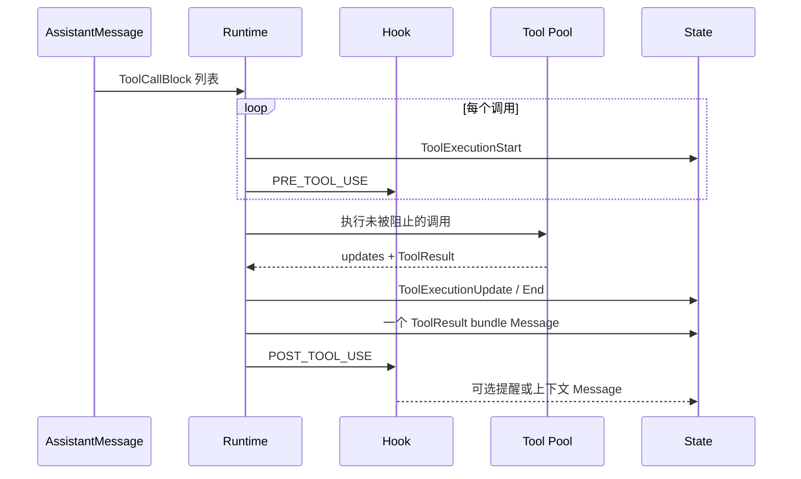
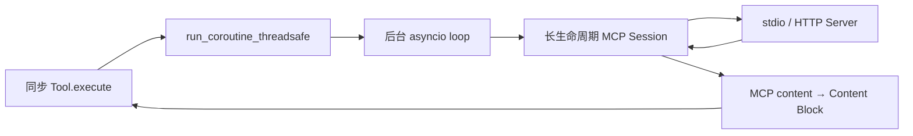

# 06. 工具与外部能力

> 本篇回答：模型如何通过统一能力契约作用于文件、Shell、外部服务和其他 Agent，以及执行失败怎样成为可处理反馈。

## 1. 工具为什么是独立边界

模型只能提出行动意图，真正的 I/O 由受控代码执行。工具边界必须同时服务两方：

- 向模型提供名称、描述和参数 Schema；
- 向 Runtime 提供可调用实现、超时、执行方式和结构化结果。

如果模型声明与执行逻辑混在 Provider Adapter，工具无法被 Fake 测试、MCP 或子 Agent 复用；如果工具直接修改 State，事件顺序和错误反馈会失去统一控制。

## 2. 统一工具契约

AgentTool 包含：

| 部分 | 面向谁 | 含义 |
| --- | --- | --- |
| name | 模型与 Runtime | 模型选择工具、Runtime 查找实现的唯一键 |
| description | 模型 | 何时使用以及能力边界 |
| parameters | 模型与校验层 | JSON Schema 参数合同 |
| execute | Runtime | 本地执行函数 |
| timeout_seconds | Runtime | 单次执行上限 |
| execution_mode | Runtime | parallel 或 sequential |

执行函数接收 call id、参数、abort 检查和可选 update 回调，返回 ToolResult。投影到 LLMTool 时只保留前三项，执行函数和控制策略永远留在本地。

## 3. ToolResult 的三层信息

| 信息 | 是否给模型看 | 用途 |
| --- | --- | --- |
| content | 是 | 文本或图片观察结果 |
| details | 否，进入消息 sidecar | 子事件、结构化产物、调试元数据 |
| is_error | 是，通过 ToolResultBlock 语义 | 告诉模型本次调用失败，可修正 |
| terminate | 控制层读取 | 要求 Runtime 在结果记录后停止 |

内容和控制不能混为一段字符串。模型需要知道错误内容，Runtime 需要知道是否停止，Trace 需要保留执行事实，调用者可能还需要非模型可见细节。

## 4. 一组工具调用的调度

Runtime 先为全部调用记录 start，再执行 Hook gate。被阻止的调用不会进入线程池，但会产生错误 ToolResult 和 end event。未知工具、执行异常和超时同样被转换为结果，保证每个请求都有反馈。

## 5. 并行、顺序与结果确定性

默认工具可在线程池并行，最大并发由调度入口限制。如果本轮任一有效工具声明为 sequential，则整组调用使用一个 worker，保护共享终端、编辑会话或其他不能安全并行的资源。

并发完成顺序可能不同，但最终 ToolResultBlock 按 Assistant 原始 ToolCall 顺序组装。这样：

- 模型每次看到稳定结果顺序；
- call id 保持因果配对；
- 测试和重放不依赖线程调度；
- 实时 update 仍可按实际完成过程记录。

## 6. 超时、Abort 与终止

### 6.1 超时

有 timeout 的工具由受控等待包装。超时形成 `is_error=true` 的文本结果，不抛弃调用身份。底层线程可能无法被 Python 强制杀死，因此工具实现仍应主动响应 abort，并避免不可控的永久阻塞。

### 6.2 Abort

Runtime 把 abort 函数传入工具。长操作应周期检查；MCP 同步桥也以短间隔轮询 abort。Abort 是调用者控制，不应由工具伪装成普通成功内容。

### 6.3 terminate

工具可以返回 `terminate=true`，用于环境已结束、连接永久失效或任务必须立即停止的情况。Runtime 仍先记录结果包，使停止原因和最后观察不丢失，然后以 tool_terminate 结束。

## 7. 错误为何通常成为数据

以下失败通常仍可由模型处理：

- 工具名称不存在；
- 参数格式或业务校验失败；
- Shell 命令非零退出；
- 文件不存在或编辑匹配失败；
- 单次调用异常或超时；
- Hook 策略阻止操作；
- MCP 工具返回错误。

它们成为结构化错误结果并进入下一轮。只有契约无法建立、资源已永久失效或调用者明确中止时，才停止或向上抛出。原则是：谁仍有机会修复，谁就应看到错误。

## 8. 内置工具的角色

内置工具是同一契约的不同实现，而不是特殊 Runtime 分支。

| 工具 | 解决的问题 | 关键边界 |
| --- | --- | --- |
| Bash | 运行命令并读取真实环境反馈 | 工作目录、超时、输出截断与 abort |
| Read | 按范围读取文本文件 | 路径、编码、大小与行区间 |
| Edit | 对现有文本做受控替换 | 匹配唯一性、预期内容与错误反馈 |
| Recall | 按 State 消息索引恢复压缩前信息 | 只读完整历史、每条与每次调用预算 |
| Task | 把工作委派给已注册子 Agent | 独立 State、类型选择、结果与子事件回传 |

工具描述应帮助模型判断何时使用；输入在工具边界校验；返回值保持可读且有界。具体业务不应进入核心调度器。

## 9. Hook 与工具策略

Hook 适合横切但范围有限的策略：

- 会话开始注入一次说明；
- 工具执行前做许可或安全判断；
- 工具结果记录后添加提醒；
- 会话结束观察并沉淀信息。

Hook 不适合实现任意中间件链、改写历史或替代工具。PRE_TOOL_USE 只允许阻止，不允许发消息；POST_TOOL_USE 才能安全追加上下文。Hook 的触发和决定由 HookFiredEvent 记录。

## 10. Task 工具：把 Agent 也变成能力

父 Agent 通过普通 ToolCall 选择 `subagent_type` 并提交任务。Task 工具：

1. 从受控注册表选择一个子 Agent；
2. 创建该子 Agent 的独立 State；
3. 可在迭代开始前写入委派上下文；
4. 完整消费子运行；
5. 将子 Agent 最终结果作为父运行 ToolResult；
6. 把子事件放入非模型可见 details，供 Trace 合并。

父循环不需要知道子 Agent 的内部回合。对子 Agent 来说，它仍运行同一个简单 Runtime；对父 Agent 来说，它只是一个工具。这是核心保持小而支持组合的关键。

## 11. MCP：把异步外部能力适配为同步工具

MCP SDK 使用异步 ClientSession，而核心工具边界是同步的。MCPConnection 使用专属后台线程和事件循环持有一个长连接：

长连接避免 stdio Server 每次调用都重新启动。连接的 open 是原子的：握手或发现失败会清理半启动线程、事件循环和子进程；close 幂等并可再次 open。

发现到的 MCP 工具被包装为 AgentTool。默认用 Server 名加前缀，避免不同 Server 工具名冲突；传给 MCP Server 的仍是原始名称。重复的模型可见名称必须显式失败，不能由字典静默覆盖。

## 12. MCP 内容转换与降级

MCP 结果比当前 Runtime 可见块更丰富：

| MCP 内容 | Runtime 表达 |
| --- | --- |
| text | TextBlock |
| image | ImageBlock |
| embedded text | TextBlock |
| embedded image | ImageBlock |
| audio、非图片二进制资源、resource link | 描述类型、MIME、大小或 URI 的 TextBlock 占位 |
| 未知类型 | 明确的 unsupported 占位文本 |

无法原样渲染的内容不能静默丢弃。占位文本让模型至少知道产物存在；真正支持音频时，应扩展核心 Content Block 和各 Provider Adapter，而不是在 MCP 层私自传递新字典。

连接已经死亡时，MCP ToolResult 会标记 terminate，避免 Agent 反复调用不可能恢复的资源；单次超时但连接仍活跃时保持可重试。

## 13. 资源所有权

工具值可以绑定外部资源，但 Agent Runtime 不拥有它们的创建和销毁。调用者或 Session 组装层负责：

- 创建临时工作区或选择 cwd；
- 打开 MCPConnection；
- 将已打开 Tool 绑定到 Agent；
- 完整消费运行；
- 在退出路径关闭资源。

这避免 Runtime 为每种集成增加特殊生命周期。Session 和 Toolset 的进一步组装在第 08 篇说明。

## 14. 安全边界

项目是教学与实验 Runtime，不是通用安全沙箱。工具实现和运行环境必须共同承担：

- 路径与工作目录约束；
- 命令权限和容器隔离；
- 机密不进入模型可见结果和 Trace；
- 输入大小、输出大小和 Recall 预算；
- 对外服务认证和超时；
- 高风险操作的 Hook gate 或宿主审批。

JSON Schema 帮助模型生成参数，但不是完整安全验证。真正的校验必须在输入进入工具时执行。

## 15. 关键不变量

- 每个 ToolCall 都产生可配对的结果，即使未知、被阻止或失败；
- ToolResult content 只含模型可见 TextBlock/ImageBlock；
- details 不自动暴露给模型；
- 并行执行不改变结果包的调用顺序；
- sequential 工具不会与同组其他调用并发；
- 工具不能直接篡改历史协议；需要注入消息时使用受控 Hook 或 State 入口；
- MCP 连接由明确所有者关闭；
- 外部内容无法表示时显式降级，不静默丢失。

## 16. 本篇理解检查

- AgentTool 与 LLMTool 的区别是什么？
- ToolResult 的 content、details、is_error、terminate 分别由谁读取？
- 为什么错误结果通常应进入下一轮模型？
- 并行工具完成顺序为何不决定结果展示顺序？
- Task 工具怎样复用普通 Agent Runtime？
- MCP 为什么需要长生命周期后台事件循环？
- 什么情况下 MCP 失败应终止 Agent？

## 17. 相关文档与参考依据

- [返回设计文档总览](README.md)
- [上一篇：模型访问边界](05-model-access.md)
- [下一篇：上下文与长周期能力](07-context-and-long-horizon.md)将说明 Recall 与其他长周期能力。
- [`tools/__init__.py`](../../src/simple_long_horizon_agent/tools/__init__.py)：AgentTool 与 ToolResult 契约。
- [`tools/bash.py`](../../src/simple_long_horizon_agent/tools/bash.py)：命令执行边界。
- [`tools/read.py`](../../src/simple_long_horizon_agent/tools/read.py)与 [`tools/edit.py`](../../src/simple_long_horizon_agent/tools/edit.py)：文件能力。
- [`tools/recall.py`](../../src/simple_long_horizon_agent/tools/recall.py)：按索引恢复历史。
- [`tools/task.py`](../../src/simple_long_horizon_agent/tools/task.py)：子 Agent 委派。
- [`hooks.py`](../../src/simple_long_horizon_agent/hooks.py)：工具生命周期策略。
- [`mcp/README.md`](../../src/simple_long_horizon_agent/mcp/README.md)与 [`mcp/client.py`](../../src/simple_long_horizon_agent/mcp/client.py)：MCP 生命周期和同步桥。
- [`tests/unit/test_core.py`](../../tests/unit/test_core.py)、[`tests/unit/test_hooks.py`](../../tests/unit/test_hooks.py)和 [`tests/unit/test_mcp.py`](../../tests/unit/test_mcp.py)：调度、Hook 与 MCP 验证。
