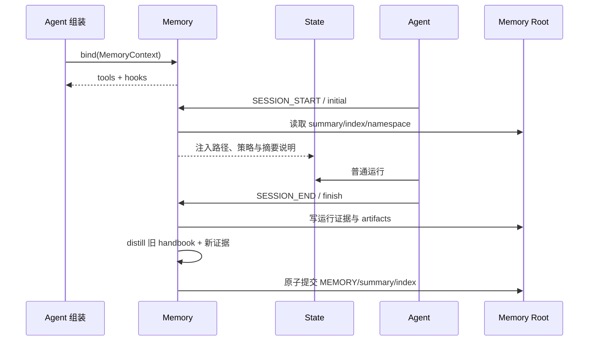

# 07. 上下文与长周期能力

> 本篇回答：有限的模型上下文怎样支撑长时间工作，以及 Compression、Recall、Skills 和 Memory 为什么是四种不同能力。

## 1. 长周期任务的真正矛盾

任务越长，历史越有价值，也越不可能全部放入模型窗口。系统同时需要：

- 保留原始证据，支持审计和恢复；
- 控制每次模型请求的上下文大小；
- 让重要任务、约束和最新进展持续可见；
- 在需要时重新取得被折叠的信息；
- 按需加载领域方法，而非把所有知识塞进 prompt；
- 将少量高价值经验带到下一次独立运行。

项目没有把这些统称为“Memory”，而是按时间范围和数据所有权拆分。

## 2. 四种能力的边界

| 能力 | 时间范围 | 解决的问题 | 主要载体 |
| --- | --- | --- | --- |
| Compression | 同一次运行 | 当前窗口太大 | 活跃索引、摘要 Message、压缩 Event |
| Recall | 同一次运行 | 摘要遗漏了原始细节 | State 完整消息索引、ToolResult |
| Skills | 通常跨项目安装、单次按需使用 | Agent 不知道某类任务的工作方法 | Skill 元数据、SKILL.md、初始说明 |
| Memory | 多次独立运行之间 | 过去经验值得复用 | Memory 接口、持久化文件、Hook 和 Tool |

Compression 管理“现在送给模型多少”；Recall 恢复“本次运行早先发生了什么”；Skills 提供“应该怎样做这类事”；Memory 保留“以前做过后学到了什么”。混合这些概念会导致无法说明信息来源和新鲜度。

## 3. 上下文预算

模型上下文预算至少要预留：

- 本轮历史输入；
- 即将产生的输出；
- Token 估算误差的安全缓冲。

有效输入预算可概念化为：

```text
context_window - output_reserve - safety_buffer
```

上下文大小优先使用最近一次 Provider 报告的完整窗口 usage，并只估算其后的新增消息；若历史已被压缩，旧 usage 包含已退出活跃视图的内容，必须失效并改用逐消息估算。没有 usage 时使用字符近似，图片采用保守固定估算。

这些数字用于触发策略和记录趋势，不声称替代每家模型的精确 tokenizer。

## 4. Compression 策略与执行框架分离

策略只回答两个问题：压缩哪些稳定消息索引，用哪一条 Message 替代。执行框架负责：

- 只把当前可见的活跃消息交给策略；
- 对齐 ToolCall/ToolResult；
- 校验一对一 rewrite 的结构；
- 计算前后 Token；
- 追加替代消息；
- 记录 ContextCompressionEvent；
- 更新活跃上下文投影。

策略不直接改 State。这样可以替换压缩方法，同时共享安全和可观测规则。

## 5. 三类压缩控制

### 5.1 ToolCompactStrategy

无模型、规则驱动。超过阈值后，把较旧工具调用/结果对折叠为带工具名和短预览的摘要，保留最近若干工具交换。适合大量命令输出，成本低、结果确定，但不能理解复杂语义。

### 5.2 SummarizeStrategy

调用一个独立 compressor Agent，把旧消息总结为延续性 working memory。默认保留 task、system、summary 和 context 消息，并保留最近若干普通消息。压缩请求与响应也成为 Trace Event，摘要 sidecar 保存模型和 usage 证据。

摘要使用续接前言，明确告诉主 Agent：这是先前会话的已建立工作记忆，应继续而非从头推导。

### 5.3 Agent-controlled compact

模型通过 `compact` 工具提交自己编写的摘要和可选保留数量。工具只把请求写入 ToolResult details；策略在下一轮开始读取并应用。请求与执行分离保证压缩仍发生在统一的请求前阶段，并通过较新的 summary high-water mark 防止重复应用。

### 5.4 TieredStrategy

ContextPolicy 只持有一个 strategy。TieredStrategy 把多个阶段组合为单一策略，按顺序选择首个可执行阶段，例如先做廉价工具折叠，再在仍超预算时调用模型摘要。

## 6. 压缩必须保护什么

默认锚点包括任务、运行规则、既有摘要和委派上下文。策略可以调整，但必须维持：

- 当前任务和接受标准不应无意消失；
- 工具调用与结果不能被拆开；
- 最近工作通常保持原文；
- 替代摘要需处于被折叠内容的逻辑位置；
- 被折叠消息仍留在完整历史；
- 一对一缩写必须保留 role 和 tool_call_id 集合。

压缩摘要是有损工作记忆，不是对原始事实的替代存档。

## 7. Recall：按稳定索引恢复证据

Recall 工具读取 State 的完整 Message 列表，而不是活跃 ContextView。因此，即使消息已被压缩出去，仍可按摘要引用的 transcript index 恢复。

为避免一次 Recall 重新撑爆窗口，它需要：

- 校验索引类型和范围；
- 限制单次最多索引数；
- 去重但保留首次出现顺序；
- 限制每条消息字符数；
- 限制整次返回总字符数；
- 明确标记截断和实际返回的 indices。

压缩负责有损缩小，Recall 负责有界恢复。二者共同形成“保留证据、按需加载”的机制。

## 8. Skills：渐进式加载工作方法

Skill 是带名称、描述和完整说明正文的文件资源。运行开始前从多个 scope 搜索并按优先级去重：仓库级可覆盖用户级同名 Skill，内置库提供最低优先级默认能力。

加载分两层：

1. 初始菜单只告诉模型有哪些 Skill、用途和路径；
2. 用户明确提及的 Skill 可以在初始 State 中直接注入正文；未提及时模型按说明使用 Read 工具加载。

`/no-skills` 可以对本次运行禁用技能，已知 `/name` 表示明确调用；普通绝对路径不能误判为 Skill。

Skills 通过 `Agent.init_state` 写入普通 RuntimeMessage，没有特殊 Agent 循环。菜单和正文在 State/Trace 中可见，因此可以解释模型为何知道某项流程。

## 9. Memory：跨运行的受控经验

Memory 接口只有与当前 Hook 能力匹配的三个入口：

```text
initial(ctx) -> Message 元组
tools(ctx)   -> AgentTool 元组
finish(ctx)  -> None
```

绑定 Memory 后：

- SESSION_START 注入普通 `kind="context"` RuntimeMessage；
- 组装阶段附加普通工具；
- SESSION_END 在工作区仍有效时执行沉淀；
- 核心 Message、ContextView 和 Provider 完全不知道 Memory 存在。

Memory 初始化失败应形成可见说明但不让主任务失败；结束沉淀失败也保留错误证据。Memory 是增强能力，不是任务正确性的单点依赖。

## 10. FilesystemMemory 的数据流



一个 namespace 包含：

| 路径 | 作用 |
| --- | --- |
| MEMORY.md | 唯一持久经验手册，由 distiller 整体重写 |
| memory_summary.md | 冷启动导航摘要 |
| INDEX.md | 指向每次运行证据 |
| runs/{run_id}/ | 有界原始证据、summary 与领域 artifacts |

FilesystemMemory 不在每轮自动做向量检索。启动时注入短说明和路径，模型通过普通 Read/Bash 工具主动读取。若需要向量召回，应实现另一种 Memory，而不是悄悄改变此实现。

## 11. Memory 的质量与一致性

持久记忆的目标不是最大召回，而是保存少量高价值、可验证经验：

- 不保存秘密、大段原始输出、当前任务临时状态或可直接从代码读取的事实；
- 用户纠正和工具证据优先于 Assistant 自述；
- 涉及当前文件、选项或仓库状态的旧记忆必须实时核验；
- “无需更新”是合法成功结果；
- distiller 返回完整新版手册，自行去重、改写和裁剪；
- 空白、超限或会删除全部经验的重写被拒绝并留下错误标记。

同一个 Memory root 使用跨进程单写者锁覆盖“读取—模型蒸馏—提交”全过程，单文件使用临时文件原子替换。运行数、namespace 数和总大小均有上限，写入后裁剪最旧证据。

## 12. 为什么不能合成一个笼统 Memory 模块

| 混淆 | 后果 |
| --- | --- |
| 用压缩代替持久 Memory | 摘要只属于当前运行，且可能有损 |
| 用 Memory 代替 Recall | 旧经验无法提供本次运行的精确原始消息 |
| 把全部 Skills 放进 system prompt | 上下文浪费，来源与触发不清晰 |
| 把压缩摘要写入永久 Memory | 临时、未经验证的状态污染未来运行 |
| 每轮隐式检索文件 Memory | 模型不知道信息为何出现，Trace 难解释 |

分离后，每条信息都能回答：它属于哪次运行、是否原始事实、是否可能过时、为何本轮可见、谁负责裁剪。

## 13. 关键不变量

- 完整 Event/Message 历史不因压缩被删除；
- 活跃上下文与模型可见性是两个阶段；
- 压缩策略不直接修改 State；
- Recall 只读稳定索引且输出有界；
- Skills 正文按需加载，菜单和注入内容可追踪；
- Memory 使用普通 Message、Tool、Hook 接入，不让核心反向依赖；
- 持久 Memory 失败不使有效主任务失败；
- Workspace 当前事实优先于可能过时的 Memory。

## 14. 本篇理解检查

- Compression、Recall、Skills、Memory 分别跨越什么时间范围？
- 为什么压缩后不能继续信任旧 usage 窗口基线？
- Agent-controlled compact 为什么在下一轮才应用？
- Recall 如何避免撤销刚完成的压缩效果？
- Skill 菜单与 Skill 正文为什么分开？
- FilesystemMemory 为什么让模型主动读文件，而不自动检索？
- 为什么 Memory 的“没有新经验”是成功结果？

## 15. 相关文档与参考依据

- [返回设计文档总览](README.md)
- [上一篇：工具与外部能力](06-tools-and-integrations.md)
- 下一篇 `08-agent-composition-and-workflows.md` 将说明子 Agent 和工作流怎样扩展任务跨度。
- [`context_view.py`](../../src/simple_long_horizon_agent/context_view.py)与 [`compression/`](../../src/simple_long_horizon_agent/compression/)：预算、策略与压缩执行。
- [`tools/recall.py`](../../src/simple_long_horizon_agent/tools/recall.py)：有界历史恢复。
- [`skills/`](../../src/simple_long_horizon_agent/skills/)：发现、指令和初始状态注入。
- [`docs/memory.md`](../memory.md)与 [`memory/`](../../src/simple_long_horizon_agent/memory/)：Memory 契约和文件实现。
- [`tests/unit/test_compression_control.py`](../../tests/unit/test_compression_control.py)、[`tests/unit/test_skills.py`](../../tests/unit/test_skills.py)和 [`tests/unit/test_memory.py`](../../tests/unit/test_memory.py)：行为验证。

