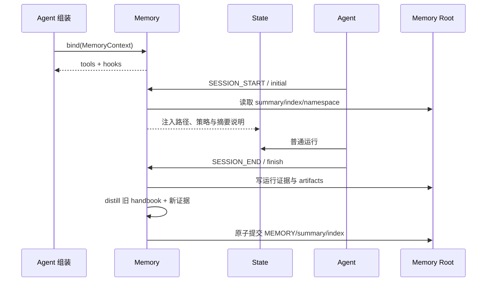

# 07. 上下文与长周期能力

> 本篇回答：有限的模型上下文怎样支撑长时间工作，以及 Compression、Recall、Skills 和 Memory 为什么是四种不同能力。

先把 [00. 用一个真实运行看懂 Agent](00-running-example.md) 中第二次请求的 3 条可见消息记住：长任务的复杂性不是换一套循环，而是在下一次 `ModelRequest` 前改变“哪些历史仍然活跃”。

## 1. 长周期任务的真正矛盾

任务越长，历史越有价值，也越不可能全部放入模型窗口。系统同时需要：

- 保留原始证据，支持审计和恢复；
- 控制每次模型请求的上下文大小；
- 让重要任务、约束和最新进展持续可见；
- 在需要时重新取得被折叠的信息；
- 按需加载领域方法，而非把所有知识塞进 prompt；
- 将少量高价值经验带到下一次独立运行。

项目没有把这些统称为“Memory”，而是按时间范围和数据所有权拆分。

## 2. 四种能力的边界

| 能力 | 时间范围 | 解决的问题 | 主要载体 |
| --- | --- | --- | --- |
| Compression | 同一次运行 | 当前窗口太大 | 活跃索引、摘要 Message、压缩 Event |
| Recall | 同一次运行 | 摘要遗漏了原始细节 | State 完整消息索引、ToolResult |
| Skills | 通常跨项目安装、单次按需使用 | Agent 不知道某类任务的工作方法 | Skill 元数据、SKILL.md、初始说明 |
| Memory | 多次独立运行之间 | 过去经验值得复用 | Memory 接口、持久化文件、Hook 和 Tool |

Compression 管理“现在送给模型多少”；Recall 恢复“本次运行早先发生了什么”；Skills 提供“应该怎样做这类事”；Memory 保留“以前做过后学到了什么”。混合这些概念会导致无法说明信息来源和新鲜度。

## 3. 上下文预算

模型上下文预算至少要预留：

- 本轮历史输入；
- 即将产生的输出；
- Token 估算误差的安全缓冲。

有效输入预算可概念化为：

```text
context_window - output_reserve - safety_buffer
```

上下文大小优先使用最近一次 Provider 报告的完整窗口 usage，并只估算其后的新增消息；若历史已被压缩，旧 usage 包含已退出活跃视图的内容，必须失效并改用逐消息估算。没有 usage 时使用字符近似，图片采用保守固定估算。

这些数字用于触发策略和记录趋势，不声称替代每家模型的精确 tokenizer。

### 3.1 新增工具结果怎样估算

Provider 不报告单条 UserMessage 或 ToolResult 的精确 Token。新结果进入 State 后、下一次模型 usage 返回前，系统按消息逐条估算：

```text
message_tokens = ceil(message_visible_chars / 3.5)
```

对工具结果消息，`message_visible_chars` 包含：

- ToolResultBlock 内部的模型可见文本；
- 图片的固定等价字符数，当前每张为 `7373`；
- Message 的 role、sender、target 和 kind；
- 每个 ToolResultBlock 的 tool_call_id 和 tool_name。

sidecar 中的 details、raw 和其他本地证据不进入模型正文，因此不计入估算。工具执行 Event 也不计入，除非其信息被显式转换为模型可见 Message content。

例如一条工具消息共有 875 个估算字符：

```text
840 字符结果正文
+ 35 字符消息路由与调用身份
= 875 字符

ceil(875 / 3.5) = 250 Token
```

`250` 是这条消息的近似值，不是 ToolResult 的固定开销。多结果包会累计所有 ToolResultBlock 的可见内容和身份；单张图片仅正文就约为 `ceil(7373 / 3.5) = 2107` Token。

### 3.2 两种上下文估算路径

未发生压缩，或压缩后已经产生新的可信 Assistant usage 时，最近 usage 可以作为前缀基线：

```text
estimated_context
= latest_usage.context_tokens
+ sum(基线之后每条消息的估算 Token)

示例：700 + 新 ToolResult 250 = 950
```

若压缩刚改变活跃视图，旧 usage 仍包含已经退出的历史，不能继续使用。系统改为估算全部当前活跃消息：

```text
task 80 + summary 180 + recent 120 + tool_result 300 = 680
```

直到压缩后下一次模型响应带回可信 usage，新的 `context_tokens` 才重新成为前缀基线。字符启发式只负责填补“尚无精确调用数据”的尾部或过渡阶段；成本统计仍以 Provider usage 为准。

## 3.3 Compression 与 Visibility：都减少输入，但改变的对象不同

这两个机制都可能让模型在本轮看到更少内容，但不能混为一谈：

| 机制 | 主要问题 | 是否修改完整历史 | 是否修改活跃索引 | 是否生成摘要 |
| --- | --- | ---: | ---: | ---: |
| Compression | 历史太长时，用什么替代旧内容？ | 否 | 是 | 通常是 |
| Visibility | 这类消息是否允许进入本轮模型请求？ | 否 | 否 | 否 |

### 一个共同例子

假设 State 中已经追加了以下消息：

```text
0 task: 请分析项目
1 assistant step: 请求读取 README
2 tool_result: README 内容
3 assistant step: 请求读取 architecture.md
4 tool_result: architecture.md 内容
5 assistant message: 当前阶段总结
6 user message: 继续分析最新部分
```

上下文太长时，Compression 可以追加一条替代消息，而不是删除旧消息：

```text
7 summary: 已读取 README 和 architecture.md，主要结论是……
```

并记录：

```text
完整 messages = [0, 1, 2, 3, 4, 5, 6, 7]
active_context_indices = [0, 7, 6]
```

此时消息 1～5 仍在完整历史中，供 Trace、Recall 和审计读取；当前模型主要使用 task、summary 和最近消息。摘要是新写入的 Message，压缩动作另有 `ContextCompressionEvent` 记录。

如果没有改变活跃索引，只配置：

```python
ContextPolicy(model_invisible_kinds=("task",))
```

完整历史和活跃索引仍然是：

```text
messages = [0, 1, 2, 3, 4, 5, 6, 7]
active_context_indices = [0, 7, 6]
```

但 `ContextView` 会在投影阶段过滤 0：

```text
模型实际看到 = [7 summary, 6 recent message]
```

没有删除 task，没有新增摘要，也没有追加压缩事件；它只是没有进入这一次 LLMRequest。

### `preserve_kinds` 与 `model_invisible_kinds` 不同

如果目标是“压缩时始终保留原始任务”，应在压缩策略中配置：

```python
preserve_kinds=("task", "system", "summary", "context")
```

它表示这些消息不会被旧消息折叠或摘要替代；它们仍可能进入活跃上下文，也仍可能被模型看到。

如果写成：

```python
model_invisible_kinds=("task",)
```

表达的却是“任务消息不允许进入模型请求”。它不是保护任务，而是隐藏任务；如果摘要没有完整保留目标，模型就可能失去原始要求。记忆方式是：

```text
preserve_kinds
  → 压缩阶段：这类消息不要被替代

model_invisible_kinds
  → ContextView 阶段：这类消息不要发送给模型
```

执行顺序上，压缩 Runtime 会先从活跃上下文中过滤不可见消息，再把剩余消息交给策略；策略的输入因此不会包含 `model_invisible_kinds` 中的消息。这个顺序是实现细节，不改变两种配置的语义边界：一个控制候选历史如何缩小，一个控制本轮消息如何投影。

### 3.4 什么时候会故意隐藏 `task`

普通用户任务不应隐藏。默认 `model_invisible_kinds=()`，因此普通 `task` Message 会进入模型上下文。只有当 `task` 承载的不是模型真正要执行的指令，或实验明确要测试可见性时，才可能配置 `model_invisible_kinds=("task",)`：

| 场景 | `task` 的实际含义 | 为什么可以隐藏 | 更推荐的做法 |
| --- | --- | --- | --- |
| 运行元数据 | 评测编号、内部路径、调度标签 | 保留在 State/Trace，但不暴露内部信息 | 将内部元数据放 `State.task`，把脱敏任务写成独立可见 Message |
| 子 Agent 委派 | 父流程的宽泛目标 | 避免子 Agent 被父任务范围污染 | 为子 Agent 创建独立 State，并直接写入正确的子任务 |
| 可见性实验 | 被测的原始输入 | 验证模型是否依赖某类消息 | 明确记录实验配置和对照结果 |
| 特殊 Workflow/facade | 外层编排目标 | 模型只应看到阶段化 context | 由 initializer/Workflow 生成准确的阶段任务 |

例如，内部运行标签可以保留在 State 中，而模型只看到脱敏后的工作说明：

```text
State.task = "评测 case-17：参考答案位于私有目录"

UserMessage(kind="task")
  评测 case-17：参考答案位于私有目录

RuntimeMessage(kind="context")
  请分析工作区中的测试失败并提出修复方案。
```

如果把完整内部标签写入 `task` Message，再用 Visibility 隐藏它，虽然可以避免发送给模型，但不如在初始化阶段就分离“运行身份”和“模型任务”清楚。对子 Agent 也是同理：独立 State + 正确 task 通常优于“先复制父 task，再用不可见规则遮住”。

隐藏 `task` 还不是安全边界。消息仍保存在完整 State、Trace 和可能的 Viewer 中；它只是不进入本轮 LLMRequest。若内容本身敏感，仍应在上游脱敏，并控制 Trace/raw 的访问权限。

## 4. Compression 策略与执行框架分离

策略只回答两个问题：压缩哪些稳定消息索引，用哪一条 Message 替代。执行框架负责：

- 只把当前可见的活跃消息交给策略；
- 对齐 ToolCall/ToolResult；
- 校验一对一 rewrite 的结构；
- 计算前后 Token；
- 追加替代消息；
- 记录 ContextCompressionEvent；
- 更新活跃上下文投影。

策略不直接改 State。这样可以替换压缩方法，同时共享安全和可观测规则。

## 5. 三类压缩控制

### 5.1 ToolCompactStrategy

无模型、规则驱动。超过阈值后，把较旧工具调用/结果对折叠为带工具名和短预览的摘要，保留最近若干工具交换。适合大量命令输出，成本低、结果确定，但不能理解复杂语义。

### 5.2 SummarizeStrategy

调用一个独立 compressor Agent，把旧消息总结为延续性 working memory。默认保留 task、system、summary 和 context 消息，并保留最近若干普通消息。压缩请求与响应也成为 Trace Event，摘要 sidecar 保存模型和 usage 证据。

摘要使用续接前言，明确告诉主 Agent：这是先前会话的已建立工作记忆，应继续而非从头推导。

#### 5.2.1 当前摘要消息的规范形状

当前 `SummarizeStrategy` 生成的是 `UserMessage(kind="summary")`，由 `sender="runtime"` 发给主 Agent。它使用 user role 是为了作为会话续接内容进入模型，而不是冒充固定 system prompt：

```python
UserMessage(
    kind="summary",
    sender="runtime",
    target="writer",
    content=(
        TextBlock(
            "[This session continues ...]\n\n"
            "此前已确认 State.events 是事实来源；"
            "下一步检查 ContextView。\n\n"
        ),
    ),
    sidecar={
        "compression": {
            "compressor": "compressor",
            "model": "compressor-model",
            "usage": {
                "input_tokens": 8000,
                "output_tokens": 300,
                "cache_read_tokens": 0,
                "cache_write_tokens": 0,
            },
        },
        "raw": {
            "request": {...},
            "response": {...},
        },
    },
)
```

这里的 `content` 才是主 Agent 下一轮实际读取的 working memory。`sidecar.compression` 是与这条摘要就近存放的生成证据，便于 Trace 或调试界面回答“谁生成、用了什么模型、报告了多少 usage”；`sidecar.raw` 是 Provider 边界核对材料，不参与正常 Runtime 决策。

#### 5.2.2 模型摘要的三层事实

模型摘要同时涉及三类问题，它们必须由不同结构回答：

| 问题 | 事实载体 | 主要读取者 |
| --- | --- | --- |
| 摘要写了什么，下一轮模型读什么 | summary Message 的 `content` | 主 Agent、transcript |
| 摘要由谁生成，模型和 usage 是什么 | compressor 的 ModelRequest/Response Event；summary sidecar 保留就近副本和 raw | Trace、成本层、调试界面 |
| 哪些消息被替代，活跃上下文如何变化 | ContextCompressionEvent | StateSnapshot、Span、压缩分析 |

例如 Runtime 应用摘要后记录：

```python
ContextCompressionEvent(
    agent="writer",
    compressed_message_indices=[1, 2, 3, 4],
    summary_message_index=8,
    active_context_indices=[0, 8, 5, 6, 7],
    before_tokens=9000,
    after_tokens=1600,
    strategy="summarize",
    start_elapsed=12.4,
)
```

这个 Event 不重复保存摘要正文，也不负责说明 compressor 的完整请求。它只表达“这次压缩动作怎样改变活跃视图”。原消息仍在完整历史中，`summary_message_index=8` 指向新追加的替代消息；高索引 8 可以被插回 5 之前，因此活跃索引不要求单调递增。

对 SummarizeStrategy，一次压缩在 Event Stream 中的顺序是：

```text
ModelRequestEvent(agent="compressor")
  → ModelResponseEvent(agent="compressor", model=..., usage=...)
  → MessageEvent(UserMessage(kind="summary"))
  → ContextCompressionEvent(strategy="summarize")
```

成本聚合以 `ModelResponseEvent` 上的 model 和 usage 为每次模型调用的正式事实；summary sidecar 是同一证据在摘要旁边的受控副本，不能再计费一次。规则压缩和 Agent-controlled compact 不一定增加 compressor Model Event，但仍会追加 replacement Message 和 ContextCompressionEvent。

#### 5.2.3 摘要生成与压缩应用是两个阶段

“compressor 生成摘要”不等于“compressor 完成了压缩”。四个角色分别拥有不同责任：

| 参与者 | 负责什么 | 不负责什么 |
| --- | --- | --- |
| compressor Agent / Provider | 读取待压缩消息，生成摘要文本 | 不决定主 State 的活跃索引，不写主 State |
| `SummarizeStrategy` | 选择压缩目标，构造 compressor 请求和 `CompressionDecision` | 不直接追加 Event 或修改 Snapshot |
| `compression.runtime` | 校验并应用 decision，追加摘要，重指向活跃上下文 | 不替 compressor 理解摘要语义 |
| `State` | 追加事件并统一盖章保存 | 不选择压缩策略 |

主 Agent 每轮开始时，调用链可以简化为：

```text
core.run()
  → maybe_compress_context()
  → SummarizeStrategy(active, agent_name)
  → compressor.generate(compressor_messages)
  → CompressionDecision
  → compression.runtime._apply_decision()
  → State.events / StateSnapshot
```

策略先选择旧消息并追加一条压缩指令，例如：

```text
active = [0 task, 1 old call, 2 old result, 3 old call,
          4 old result, 5 old note, 6 recent, 7 recent]
preserve_kinds = ("task", "system", "summary", "context")
keep_recent = 2
compress_indices = [1, 2, 3, 4, 5]
```

然后把待压缩消息和指令交给 compressor。`compressor.generate(...)` 返回的文本是摘要内容，例如 Goal、Done、State、Facts、Open 和 Next；它只回答“摘要写了什么”。Strategy 再把文本包装成 `UserMessage(kind="summary")`，并与 `ModelRequestEvent`、`ModelResponseEvent` 一起放进 `CompressionDecision`。此时这些对象还没有正式进入主 State。

Runtime 应用 decision 时，顺序是：

```text
1. record_event_at(ModelRequestEvent(agent="compressor"))
2. record_event_at(ModelResponseEvent(agent="compressor", usage=...))
3. record_event_at(MessageEvent(summary))
4. record_event_at(ContextCompressionEvent(strategy="summarize"))
```

最终主 State 同时拥有“摘要生成证据”和“活跃视图变化事实”：

```text
ModelRequestEvent(compressor)
ModelResponseEvent(compressor)
MessageEvent(UserMessage(kind="summary"))
ContextCompressionEvent(agent="writer", strategy="summarize")
```

这里要区分“创建事件对象”和“正式写入事件流”：Strategy 创建前两个模型事件和 `CompressionDecision`；Runtime 创建 `MessageEvent`、`ContextCompressionEvent` 并统一调用 `State.record_event_at()`；State 在追加时补齐 index、elapsed 和 UUID。`ContextCompressionEvent` 不能由 compressor 创建，因为 compressor 只看到一批消息，不掌握主 State 的当前活跃索引、替代消息位置、前后 Token 或所属主 Agent。

当前 compressor 使用 `self.compressor.generate(...)`，不是 `run(compressor, compressor_state)`。因此不会产生独立的 `AgentStartEvent`、`TurnStartEvent`、工具生命周期或 `AgentEndEvent`；只记录这一次内部模型调用对应的 ModelRequest/Response Event。它仍可被 Trace 层派生为压缩 Span，但 Span 是观察视图，不会反过来驱动主 Runtime。

如果把摘要正文、索引替换和控制指令全部塞进 sidecar，调用者就必须绕过 Message 和 Event 才能理解正常行为，sidecar 会演变为第二套协议。判断标准是：给模型看的正文进 `content`；改变运行历史投影的动作进 Event；只有非正文、局部、受控读取的边界证据留在 sidecar。

### 5.3 Agent-controlled compact

Agent-controlled compact 与 `SummarizeStrategy` 的关键差异是：摘要由主 Agent 自己写好，不再额外调用 compressor 模型。它把“提交申请”和“应用压缩”分成两个安全阶段。

#### 5.3.1 第一阶段：主 Agent 提交摘要申请

主 Agent 在一次普通模型调用中产生 `compact` ToolCall：

```python
compact(
    summary="已完成 README 和 StateSnapshot 检查；下一步确认压缩后的 usage 基线。",
    keep_recent=2,
)
```

这里的 `summary` 已经是主模型生成的 working memory。与 `SummarizeStrategy` 对照：

| 方式 | 摘要由谁写 | 是否额外调用模型 |
| --- | --- | ---: |
| `SummarizeStrategy` | 独立 compressor | 是 |
| `AgentCompactStrategy` | 主 Agent | 否 |

compact 工具本身只校验参数并返回 `ToolResult`；它不直接改 `State.snapshot`，也不立即写 `ContextCompressionEvent`：

```python
ToolResult(
    content="Compaction recorded ...",
    details={
        "compact_request": {
            "summary": "...",
            "keep_recent": 2,
        },
    },
)
```

Runtime 随后把它作为普通工具结果包写入一条 `UserMessage(kind="tool_result")`。工具开始/结束是 Event，不会进入 `state.messages`，也不会占用 Message 索引；这里的 compact ToolCall 和 ToolResult Message 才会获得 transcript 索引。

#### 5.3.2 第二阶段：下一轮开始时消费申请

下一轮开始时，统一 Runtime 在构建模型请求前执行：

```text
TurnStartEvent
  → maybe_compress_context()
  → AgentCompactStrategy 读取 active 消息 sidecar.details.compact_request
  → 生成 CompressionDecision
  → compression.runtime 应用 decision
  → MessageEvent(summary)
  → ContextCompressionEvent(strategy="agent-compact")
  → build_context_view()
  → ModelRequestEvent
```

Strategy 不依赖额外的可变 mailbox，而是从追加式 transcript 的 `sidecar.details` 读取请求。因此申请本身可以被 Trace、Recall 和审计读取。

假设当前活跃消息索引为：

```text
0 task
1 ... 9 旧消息
10 compact ToolCall
11 compact ToolResult(details.compact_request)
```

默认保护 `task/system/summary/context`，保留最近两个非保护消息后：

```text
保护：[0]
保留最近：[10, 11]
实际压缩：[1, 2, 3, 4, 5, 6, 7, 8, 9]
```

Runtime 创建摘要消息并应用压缩：

```python
UserMessage(
    kind="summary",
    sender="runtime",
    target="writer",
    content=(
        TextBlock(
            "[This session continues ...]\n\n"
            "已完成 README 和 StateSnapshot 检查；"
            "下一步确认压缩后的 usage 基线。"
        ),
    ),
)
```

若新摘要的 Message 索引是 12，最终投影为：

```text
完整 messages = [0, 1, 2, ..., 11, 12]
active_context_indices = [0, 12, 10, 11]
```

消息 1～9 没有从完整历史删除，只是被摘要 12 替代；摘要在活跃语义顺序中插回被压缩区域，所以 `active_context_indices` 不必按数字递增。

#### 5.3.3 high-water mark：exactly-once 且不延迟旧申请

申请所在的 ToolResult Message 索引为 11。Strategy 只在它仍是活跃消息中的最高索引时应用：

```text
第一次下一轮：request_index=11，max(active_indices)=11 → 应用
应用后：     active_indices=[0, 12, 10, 11]
再次检查：   request_index=11，max(active_indices)=12 → 不再应用
```

新摘要 12 就是 high-water mark，不需要额外维护 `processed_request_ids`。如果下一轮没有足够旧消息可折叠，Strategy 返回 no-op；一旦主 Agent 产生新消息 13，`max(active_indices)=13`，旧申请 11 也不会被未来延迟执行。这样主 Agent 写的摘要不会错误描述申请之后才产生的新消息。

### 5.4 TieredStrategy

`ContextPolicy` 只持有一个 strategy，Runtime 因此不需要区分 Agent 主动摘要、规则折叠、模型摘要或组合策略。多级逻辑由 `TieredStrategy` 包装后，仍作为一个普通 strategy 接入：

```python
tiered = TieredStrategy(
    stages=(
        agent_compact_strategy,
        ToolCompactStrategy(threshold_tokens=4000),
        SummarizeStrategy(
            compressor=summarizer,
            threshold_tokens=4000,
        ),
    )
)

policy = ContextPolicy(strategy=tiered)
```

#### 5.4.1 首个可执行阶段获胜

“首个”不是无条件执行第一个阶段，而是按顺序寻找第一个能根据当前活跃上下文返回非空 decision 的阶段：

```python
for stage in stages:
    decisions = stage.decisions(active, agent_name)
    if decisions:
        return decisions
return ()
```

例如：

```text
AgentCompactStrategy
  没有最新 compact_request → 无 decision，继续

ToolCompactStrategy
  超过阈值且存在旧工具交换 → 返回 decision，停止选择

SummarizeStrategy
  本次不再询问
```

这里“可执行”的准确含义是：该阶段此刻能给出至少一个 `CompressionDecision`。Agent compact 请求不存在、已经过期或没有足够旧消息可折叠时，AgentCompactStrategy 返回空；这只表示该阶段未命中，TieredStrategy 仍会继续尝试后面的阶段。

#### 5.4.2 多级压缩通常跨轮发生

假设第 N 轮请求前活跃上下文约为 5200 Token，策略顺序是 AgentCompact → ToolCompact → Summarize：

```text
0 task
1 read call
2 read result
3 search call
4 search result
5 普通分析
6 recent
7 recent
```

本次检查没有 compact 申请，但 ToolCompact 能折叠消息 1～4：

```python
CompressionDecision(
    compress_indices=(1, 2, 3, 4),
    replacement=tool_summary,
    label="tool-compact",
)
```

TieredStrategy 此时停止，不再调用 Summarize。即使应用后上下文仍约为 4300 Token，本次也会继续构建 ContextView 并进入第 N 轮主模型请求：

```text
ToolCompact decision
  → MessageEvent(replacement)
  → ContextCompressionEvent
  → build_context_view()
  → ModelRequestEvent（第 N 轮）
```

到第 N+1 轮请求前，Runtime 才重新从第一个阶段开始检查。如果 AgentCompact 仍无申请，ToolCompact 已无合适旧工具交换，而上下文仍超阈值，Summarize 才会命中并调用 compressor。

这样设计使一次请求前只采用一种压缩机制，避免不同算法连续改变上下文、突然增加多个昂贵调用，也让成本、延迟和 Trace 更容易预测。它不保证一次压缩就把上下文降到阈值以下。

#### 5.4.3 Stage 与 Decision 是两个层次

TieredStrategy 选择“本次使用哪种压缩机制”；`CompressionDecision` 描述“这种机制具体替换哪些消息”：

```text
Stage 选择
  → 不同 Stage 中首个非空者获胜

Decision 应用
  → 获胜 Stage 可以返回一个或多个 Decision
  → Runtime 在本次检查中依次应用它们
```

`SummarizeStrategy` 可能因为受保护的 task 锚点，把候选拆成两个不连续区间：

```text
0 旧消息 A
1 旧消息 B
2 task（受保护）
3 旧消息 C
4 旧消息 D
5 recent E
6 recent F
```

同一个 Summarize 阶段可以返回：

```python
(
    CompressionDecision(
        compress_indices=(0, 1),
        replacement=summary_a,
        label="summarize",
    ),
    CompressionDecision(
        compress_indices=(3, 4),
        replacement=summary_b,
        label="summarize",
    ),
)
```

Runtime 会依次记录两组摘要和压缩事件：

```text
MessageEvent(summary A)
ContextCompressionEvent(A)
MessageEvent(summary B)
ContextCompressionEvent(B)
```

如果新摘要索引分别为 7、8，最终活跃顺序可以是：

```text
[7, 2, 8, 5, 6]
```

这仍是“一个 Summarize Stage 命中并返回两个 Decision”，不是在 Decision A 与 B 之间又执行了 ToolCompact。记忆为：不同 Stage 首个命中即停止；同一 Stage 返回的多个 Decision 可以在本次检查中全部应用。

## 6. 压缩必须保护什么

默认锚点包括任务、运行规则、既有摘要和委派上下文。策略可以调整，但必须维持：

- 当前任务和接受标准不应无意消失；
- 工具调用与结果不能被拆开；
- 最近工作通常保持原文；
- 替代摘要需处于被折叠内容的逻辑位置；
- 被折叠消息仍留在完整历史；
- 一对一缩写必须保留 role 和 tool_call_id 集合。

压缩摘要是有损工作记忆，不是对原始事实的替代存档。

## 7. Recall：按稳定索引恢复证据

Recall 工具读取 State 的完整 Message 列表，而不是活跃 ContextView。因此，即使消息已被压缩出去，仍可按摘要引用的 transcript index 恢复。

为避免一次 Recall 重新撑爆窗口，它需要：

- 校验索引类型和范围；
- 限制单次最多索引数；
- 去重但保留首次出现顺序；
- 限制每条消息字符数；
- 限制整次返回总字符数；
- 明确标记截断和实际返回的 indices。

压缩负责有损缩小，Recall 负责有界恢复。二者共同形成“保留证据、按需加载”的机制。

## 8. Skills：渐进式加载工作方法

Skill 是带名称、描述和完整说明正文的文件资源。运行开始前从多个 scope 搜索并按优先级去重：仓库级可覆盖用户级同名 Skill，内置库提供最低优先级默认能力。

加载分两层：

1. 初始菜单只告诉模型有哪些 Skill、用途和路径；
2. 用户明确提及的 Skill 可以在初始 State 中直接注入正文；未提及时模型按说明使用 Read 工具加载。

`/no-skills` 可以对本次运行禁用技能，已知 `/name` 表示明确调用；普通绝对路径不能误判为 Skill。

Skills 通过 `Agent.init_state` 写入普通 RuntimeMessage，没有特殊 Agent 循环。菜单和正文在 State/Trace 中可见，因此可以解释模型为何知道某项流程。

## 9. Memory：跨运行的受控经验

Memory 接口只有与当前 Hook 能力匹配的三个入口：

```text
initial(ctx) -> Message 元组
tools(ctx)   -> AgentTool 元组
finish(ctx)  -> None
```

绑定 Memory 后：

- SESSION_START 注入普通 `kind="context"` RuntimeMessage；
- 组装阶段附加普通工具；
- SESSION_END 在工作区仍有效时执行沉淀；
- 核心 Message、ContextView 和 Provider 完全不知道 Memory 存在。

Memory 初始化失败应形成可见说明但不让主任务失败；结束沉淀失败也保留错误证据。Memory 是增强能力，不是任务正确性的单点依赖。

## 10. FilesystemMemory 的数据流



一个 namespace 包含：

| 路径 | 作用 |
| --- | --- |
| MEMORY.md | 唯一持久经验手册，由 distiller 整体重写 |
| memory_summary.md | 冷启动导航摘要 |
| INDEX.md | 指向每次运行证据 |
| runs/{run_id}/ | 有界原始证据、summary 与领域 artifacts |

FilesystemMemory 不在每轮自动做向量检索。启动时注入短说明和路径，模型通过普通 Read/Bash 工具主动读取。若需要向量召回，应实现另一种 Memory，而不是悄悄改变此实现。

## 11. Memory 的质量与一致性

持久记忆的目标不是最大召回，而是保存少量高价值、可验证经验：

- 不保存秘密、大段原始输出、当前任务临时状态或可直接从代码读取的事实；
- 用户纠正和工具证据优先于 Assistant 自述；
- 涉及当前文件、选项或仓库状态的旧记忆必须实时核验；
- “无需更新”是合法成功结果；
- distiller 返回完整新版手册，自行去重、改写和裁剪；
- 空白、超限或会删除全部经验的重写被拒绝并留下错误标记。

同一个 Memory root 使用跨进程单写者锁覆盖“读取—模型蒸馏—提交”全过程，单文件使用临时文件原子替换。运行数、namespace 数和总大小均有上限，写入后裁剪最旧证据。

## 12. 为什么不能合成一个笼统 Memory 模块

| 混淆 | 后果 |
| --- | --- |
| 用压缩代替持久 Memory | 摘要只属于当前运行，且可能有损 |
| 用 Memory 代替 Recall | 旧经验无法提供本次运行的精确原始消息 |
| 把全部 Skills 放进 system prompt | 上下文浪费，来源与触发不清晰 |
| 把压缩摘要写入永久 Memory | 临时、未经验证的状态污染未来运行 |
| 每轮隐式检索文件 Memory | 模型不知道信息为何出现，Trace 难解释 |

分离后，每条信息都能回答：它属于哪次运行、是否原始事实、是否可能过时、为何本轮可见、谁负责裁剪。

## 13. 关键不变量

- 完整 Event/Message 历史不因压缩被删除；
- 活跃上下文与模型可见性是两个阶段；
- 压缩策略不直接修改 State；
- 摘要正文、生成证据与压缩动作分别由 Message content、Model Event/受控 sidecar 和 ContextCompressionEvent 承载；
- Recall 只读稳定索引且输出有界；
- Skills 正文按需加载，菜单和注入内容可追踪；
- Memory 使用普通 Message、Tool、Hook 接入，不让核心反向依赖；
- 持久 Memory 失败不使有效主任务失败；
- Workspace 当前事实优先于可能过时的 Memory。

## 14. 本篇理解检查

- Compression、Recall、Skills、Memory 分别跨越什么时间范围？
- 为什么压缩后不能继续信任旧 usage 窗口基线？
- 模型摘要的 content、compression sidecar 和 ContextCompressionEvent 分别回答什么？
- Agent-controlled compact 为什么在下一轮才应用？
- Recall 如何避免撤销刚完成的压缩效果？
- Skill 菜单与 Skill 正文为什么分开？
- FilesystemMemory 为什么让模型主动读文件，而不自动检索？
- 为什么 Memory 的“没有新经验”是成功结果？

## 15. 相关文档与参考依据

- [返回设计文档总览](README.md)
- [上一篇：工具与外部能力](06-tools-and-integrations.md)
- [下一篇：Agent 组合与工作流](08-agent-composition-and-workflows.md)将说明子 Agent 和工作流怎样扩展任务跨度。
- [`context_view.py`](../../src/simple_long_horizon_agent/context_view.py)与 [`compression/`](../../src/simple_long_horizon_agent/compression/)：预算、策略与压缩执行。
- [`tools/recall.py`](../../src/simple_long_horizon_agent/tools/recall.py)：有界历史恢复。
- [`skills/`](../../src/simple_long_horizon_agent/skills/)：发现、指令和初始状态注入。
- [`docs/memory.md`](../memory.md)与 [`memory/`](../../src/simple_long_horizon_agent/memory/)：Memory 契约和文件实现。
- [`tests/unit/test_compression_control.py`](../../tests/unit/test_compression_control.py)、[`tests/unit/test_skills.py`](../../tests/unit/test_skills.py)和 [`tests/unit/test_memory.py`](../../tests/unit/test_memory.py)：行为验证。
