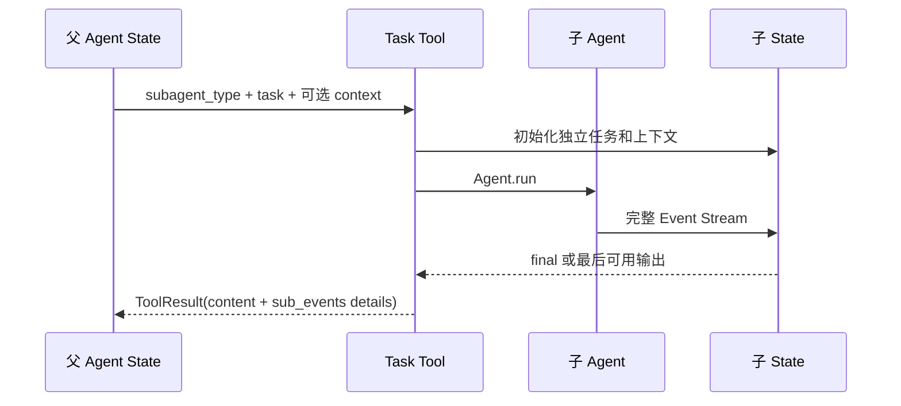
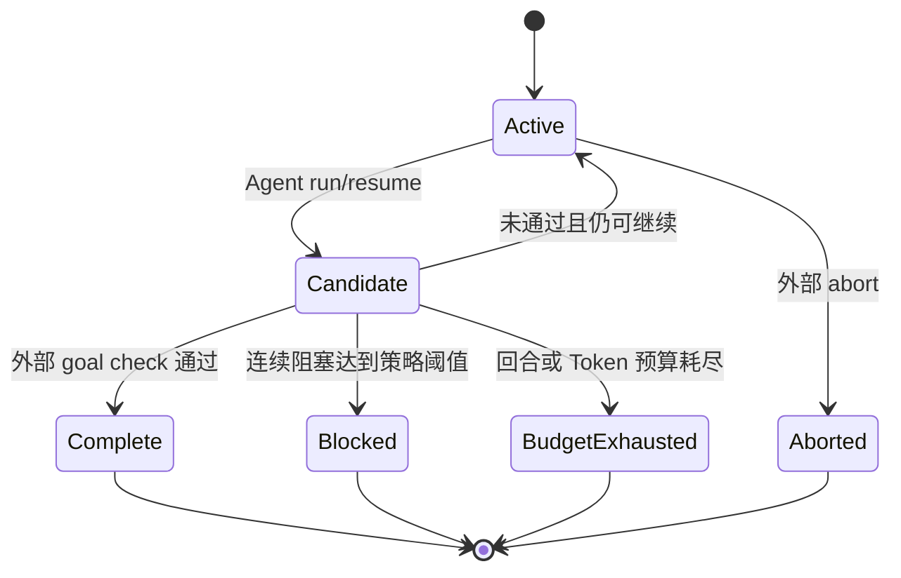

# 08. Agent 组合与工作流

> 本篇回答：如何在不增加第二套核心循环的前提下，用多个普通 Agent 处理委派、分工、反思、并行和外部目标验证。

## 1. 为什么需要组合层

单个 ReAct Agent 擅长逐步行动，但以下任务需要更明确结构：

- 不同角色需要不同 prompt 或工具权限；
- 规划与执行需要分开审计；
- 多个候选需要并行产生并汇总；
- 草稿需要独立批评者多轮检查；
- 模型说“完成”后还需要外部验证；
- 资源型工具需要明确打开和关闭。

组合层不改变 Agent 的内部循环，而是决定运行几个 Agent、以什么任务运行、怎样传递结果以及何时停止。

## 2. 三种组合粒度

| 粒度 | 入口 | 适用问题 |
| --- | --- | --- |
| Agent Builder | make_agent、命名 flavor | 把 Provider、prompt 和常用无状态工具组装成 Agent |
| Agent Session | agent_session、Toolset | 管理 MCP 等有生命周期资源 |
| Workflow / Task Tool | run_* workflow、子 Agent 工具 | 多个独立 Agent 运行之间的控制和数据传递 |

Builder 解决“一个 Agent 有什么”；Session 解决“这些资源活多久”；Workflow 解决“多个运行怎样协作”。

## 3. Builder 与 Flavor

通用 Builder 从 bash 能力开始，可按需增加 Read、自定义工具、Skills 和通用子 Agent。命名 flavor 为常见组合提供易懂入口，例如 bash、bash+task 或 skills Agent。

组装遵守：

- prompt、工具、上下文策略和 Hook 在运行前确定；
- Skills 通过 init_state 接入；
- General-purpose 子 Agent 通过 Task 工具接入；
- 用户可以替换 system prompt 或追加工具；
- Builder 只组合现有边界，不复制 Runtime。

预设是方便入口，不是新的 Agent 类型体系。

## 4. Session 与 Toolset

普通 Tool 不拥有长连接，可以直接返回 Agent。MCP 等资源必须在完整运行期间保持打开，因此使用 AgentSession：

1. 进入 Session；
2. 逐个打开 Toolset 资源；
3. 收集已就绪 AgentTool；
4. 构建 Agent；
5. 在 `with` 块内消费惰性 Event Stream；
6. 退出时按所有权关闭资源。

如果在 Session 外才消费 events，MCP 可能已关闭。Session 管理资源，不保存另一个对话 State，也不改变 `agent.run()` 的返回契约。

## 5. Task Tool 委派

父 Agent 把子 Agent 看作一个有类型选择的 Tool：

独立 State 防止父子消息、压缩索引和生命周期事件相互污染。父模型只接收子 Agent 结果文本；Trace 可从 details 读取子事件并合并 Span。未知子类型形成错误 ToolResult，而不是任意动态导入。

## 6. Workflow 基础结果

每次普通 Agent 运行被包装为 StepResult：名称、角色、任务、输出与完整 State。整个工作流返回 WorkflowResult：最终 output 和有序 steps。

`run_agent` 负责消费惰性 Event Stream并提取输出：优先当前 Agent 的 final；若回合耗尽，则回退到最后一条 Assistant 输出，使截断步骤仍可供上层判断，同时 State 中保留真实 max_turns 原因。

WorkflowResult 不把多个 State 强行合并为一个共享 transcript。每一步可单独审计，组合 Trace 时再派生统一视图。

## 7. 六种通用工作流

### 7.1 Sequential Chain

Agent 依次执行，后一阶段接收原始任务与前一阶段输出。始终携带原任务，防止中间转换逐步丢失目标。适合“提纲 → 草稿 → 润色”。

### 7.2 Planner / Executor

Planner 无工具地产生可检查计划，Executor 带实际工具执行计划。分开“决定做什么”和“改变环境”，便于权限控制与审计。

### 7.3 Reflection

Generator 产出草稿，Critic 审查；若未出现约定 approval marker，则 Generator 接收批评进行修订，直到批准或达到轮数预算。批准标记是协议，必须与 Critic prompt 同步；预算耗尽时返回最新草稿而非虚构批准。

### 7.4 Routing

Router 根据名称和描述选择一个 Specialist。选择必须解析为注册 Route；无法解析时可只返回 Router 结果，或使用显式 default。不能让模型输出任意模块名并动态执行。

### 7.5 Parallel

多个 Worker 各自拥有独立 State，可接受相同任务形成 ensemble，或接受不同任务形成 map。线程池并行完成后，steps 仍按 Worker 声明顺序排列；可选 Aggregator 最后综合。无 Aggregator 时返回带标签的结果拼接。

### 7.6 PDR

PDR 将并行探索、讨论/评审与最终汇总组织为多臂流程。它适合需要多种独立观点并经过结构化汇合的问题。每一臂仍由普通 Workflow/Agent 构成，失败和输出在步骤结果中显式保留。

## 8. Goal Loop：模型完成与外部完成分离

普通 Runtime 在 Agent 输出 final 时停止，这只证明模型认为本轮回答结束。对于可验证目标，需要外层 Goal Loop：

Goal Loop 记录 objective、状态、已用回合/Token 和原因。检查器可以读取工作区、测试或明确验证信号。模型的 final 是候选结果，不自动等于 goal complete；未通过时追加反馈并 resume 同一 State。

阻塞与预算耗尽不同：阻塞表示反复遇到同一无法推进的外部条件，预算耗尽表示资源边界先到。二者都不能标记为成功。

## 9. 状态、顺序与并发所有权

- 每个并行 Worker、子 Agent 和 Workflow Step 持有独立 State；
- 共享的只应是明确安全的只读配置或受控外部资源；
- 并发完成顺序不改变声明顺序的结果数组；
- 上一步输出通过新任务文本或 context Message 传递，不修改旧 State；
- 若需要全局轨迹，结束后从各 State 派生合并，而不是在运行时争抢一个 Event list。

这使并发边界容易说明，也让单步可独立重放。

## 10. Workflow Facade

复杂 Workflow 可以包装成对外仍像普通 Agent 的 facade。外层 `generate` 执行多个内部步骤并返回最终 Message；`compose_trace_state` 在最终导出时提供包含内部步骤的丰富轨迹。

Facade 用于统一调用入口，不应隐藏失败或伪造一个共享 Runtime。内部 StepResult 和 State 仍是事实，外层只是组合视图。

## 11. 选择组合方式

| 需求 | 优先选择 |
| --- | --- |
| 给一个 Agent 增加无状态能力 | Builder 参数或自定义 Tool |
| 能力持有连接/子进程 | Session + Toolset |
| 模型自行决定是否委派 | Task Tool |
| 阶段顺序固定 | Sequential / Planner-Executor |
| 需要独立质量审查 | Reflection |
| 任务只适合一个专家 | Routing |
| 多个独立候选或分片 | Parallel + Aggregator |
| 完成必须经外部信号验证 | Goal Loop |

不要仅因为流程超过一步就创建框架。普通 Python 组合能清楚表达时，应保持直接。

## 12. 关键不变量

- 所有子 Agent 和 Workflow Step 最终调用同一个核心 Runtime；
- 子运行拥有独立 State；
- StepResult 保存输出也保存完整 State；
- 路由目的地和子 Agent 类型来自受控注册集合；
- 并发结果顺序稳定；
- Session 覆盖惰性事件的完整消费生命周期；
- 模型声称 final 与外部 goal complete 分离；
- Workflow 的合并轨迹是派生产物，不反向覆盖子运行事实。

## 13. 本篇理解检查

- Builder、Session 和 Workflow 各负责什么？
- Task Tool 与固定 Workflow 有何区别？
- 为什么子 Agent 必须拥有独立 State？
- Planner/Executor 相比单 Agent 的价值是什么？
- Reflection 在什么条件下停止？
- 并行完成顺序为什么不应改变 Step 顺序？
- Goal Loop 为什么位于普通 Runtime 外层？

## 14. 相关文档与参考依据

- [返回设计文档总览](README.md)
- [上一篇：上下文与长周期能力](07-context-and-long-horizon.md)
- [下一篇：轨迹与可观测性](09-trace-and-observability.md)将说明多运行事件怎样形成统一可观测视图。
- [`agents/README.md`](../../src/simple_long_horizon_agent/agents/README.md)、[`agents/starter.py`](../../src/simple_long_horizon_agent/agents/starter.py)和 [`agents/toolsets.py`](../../src/simple_long_horizon_agent/agents/toolsets.py)：Builder、Session 与 Toolset。
- [`tools/task.py`](../../src/simple_long_horizon_agent/tools/task.py)：工具式委派。
- [`workflow/README.md`](../../src/simple_long_horizon_agent/workflow/README.md)与 [`workflow/`](../../src/simple_long_horizon_agent/workflow/)：工作流契约和模式。
- [`tests/unit/test_workflow.py`](../../tests/unit/test_workflow.py)、[`tests/unit/test_goal_loop.py`](../../tests/unit/test_goal_loop.py)、[`tests/unit/test_pdr.py`](../../tests/unit/test_pdr.py)和 [`tests/unit/test_agent_starter.py`](../../tests/unit/test_agent_starter.py)：组合行为验证。
