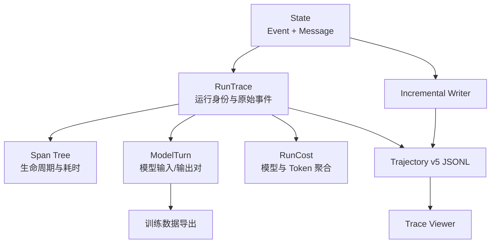
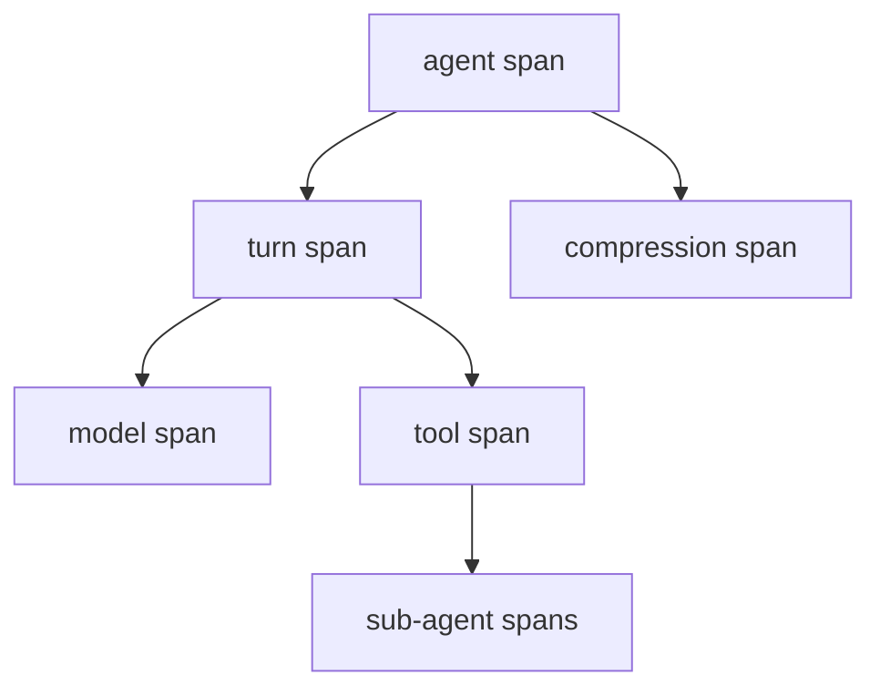

# 09. 轨迹与可观测性

> 本篇回答：如何从运行事实得到可阅读、可回放、可分析和可导出的轨迹，而不让观察层反向控制 Agent。

案例锚点：00 篇的 4 条 Message 和 16 条 Event 是 Trace 的原始事实。Span、ModelTurn、成本和 Viewer 数据都应从这些事件派生，而不是从终端打印文本猜测。

## 1. 为什么终端输出不够

长周期 Agent 的最终回答无法说明：

- 模型每轮看到了什么；
- 调用了哪些工具，哪些失败或被 Hook 阻止；
- Context 在何时压缩；
- 为什么停止；
- 使用了哪个模型、多少 Token 和成本；
- 子 Agent 内部做了什么；
- 哪些输入输出可以形成训练样本。

终端日志面向即时阅读，格式会变化，也难以恢复精确结构。项目以 Event Stream 为事实来源，再派生不同观察产品。

## 2. 可观测数据层次



RunTrace 可以理解为“从一次 Agent 运行的 State 截取的一份只读观察报告”。它不是新的 Runtime、第二个 Agent，也不是可以继续 `resume()` 的 State。构造时会复制当前列表目录：

```python
trace = run_trace_from_state(
    state=state,
    trace_id="demo.001",
    producer="demo:viewer",
    meta={"provider": "fake"},
)
# trace.events == list(state.events)
# trace.messages == list(state.messages)
```

因此，运行尚未结束时创建的 Trace 是“截至当前时刻”的快照；之后 State 新增的事件不会自动出现在这份已创建的 Trace 中。需要最新观察结果时，应重新构造 Trace，或使用 `IncrementalTraceWriter` 追加新事件。

RunTrace 封装 trace id、producer、任务摘要、Event、Message 和可选 meta；Span、ModelTurn 和 Cost 都在需要时从这些事实计算。`trace.task` 只保存便于阅读的文本摘要，多模态任务中的完整内容仍保存在 `trace.messages`。

整套观察层可以先记成一张“事实到账本、视图从账本派生”的地图：

| 组件 | 它从账本读取什么 | 它主要回答什么问题 | 是否驱动 Runtime |
| --- | --- | --- | --- |
| `RunTrace` | 一次运行的 Event、Message 和元数据 | 这次运行的只读观察对象是什么 | 否 |
| `ModelTurn` | `ModelRequestEvent` + 对应 Assistant `MessageEvent` | 某轮模型当时看到了什么、输出了什么 | 否 |
| `RunCost` | `ModelResponseEvent.usage`、`model` 和 `PriceBook` | 消耗了多少 Token、按当前价格如何估算 | 否 |
| `IncrementalTraceWriter` | State 的新增 Event | 如何把事实实时追加到 JSONL | 否 |
| Viewer | Trajectory、raw pool 和派生视图 | 人如何查看时间线、工具、模型和成本 | 否 |

```text
State.events 事实账本
      ↓
RunTrace / Reader 封装或读取
      ├─ ModelTurn：模型视角
      ├─ RunCost：资源与价格视角
      ├─ Span：时间与父子关系视角
      ├─ Trajectory v5：磁盘持久化视角
      └─ Viewer：人工查看视角
```

这些视图可以重新计算、导出和缓存，但不能反向修改 `State.events`，也不能因为 Viewer 中的筛选、Span 耗时或成本结果而自行停止 Agent。真正的继续、重试、压缩和终止，必须由 Runtime 写入相应的结构化 Event。

## 3. Event Stream 是事实来源

完整轨迹依赖事件的顺序、时间、UUID 和类型字段。MessageEvent 提供 transcript，其他事件提供生命周期、模型、工具、Hook、压缩和 Goal 状态。

`transcript` 在这里专指从 `MessageEvent` 提取的对话记录，不等于全部事件，也不等于某一次模型请求的输入：

```text
Event Stream = 发生过的全部运行事实
Transcript   = MessageEvent 对应的任务、Assistant、ToolResult 等消息
ContextView  = 压缩和可见性过滤后，本轮模型可见的消息
```

这一区分解释了为什么最终 transcript 不能用来反推每一轮模型当时看到的内容；每轮准确输入应以对应的 `ModelRequestEvent` 为准。

观察层遵守：

- 不修改 State 或补造缺失事件；
- 不用 UI 展示状态反向推断 Runtime 控制；
- 派生失败不改变已经完成的 Agent 结果；
- 相同 Event Stream 应产生一致的规范化视图；
- Provider raw 与规范事件并存，但职责不同。

## 4. RunTrace 与 Trajectory v5

规范持久化格式是事件流 JSONL：

1. 第一行是 header，包含 schema、type、trace identity、task 和 meta；
2. 后续每行是一条 Event；
3. schema 标识为 `simple-long-horizon-agent.trajectory.v5`；
4. Event 的 kind、index、elapsed 和 UUID 保留；
5. 可从 transcript 与 Agent registry 重建的逐轮 llm_payload 不在每条持久事件中重复保存。

一行一事件便于实时 tail、部分恢复和增量写入。Schema 版本是消费者契约；改变字段或可重建规则时必须同时更新 writer、reader、fixture 和 Viewer。

### 4.1 Header 与 Event Body 的职责

Header 说明“这是什么文件”，Event Body 记录“运行中发生了什么”：

| 部分 | 典型字段 | 作用 |
| --- | --- | --- |
| Header | `schema`、`trace_id`、`producer`、`task`、`meta` | 文件格式、运行身份和导出元数据 |
| Event Body | `index`、`elapsed`、`uuid`、`kind` 及事件字段 | 可追加的运行事实 |

几个标识不能混用：`index` 表示追加顺序，`elapsed` 表示相对时间，`uuid` 是跨文件引用身份，`kind` 决定 Reader 按哪种事件协议解析，`schema` 则描述整个文件的持久化契约。

### 4.2 为什么使用 JSONL

如果把所有事件放进一个大 JSON，追加一条事件通常需要重写整个数组。JSONL 将恢复单元缩小为“已经完整写入的一行”：

```text
写入 Header
  → 追加 Event 0
  → 追加 Event 1
  → 追加 Event 2
```

因此 Writer 可以只追加新行，Viewer 可以读取已完成的前缀并实时刷新，进程中断时 Reader 可以丢弃不完整的尾行而恢复前面的事件。Reader 也可以边读边更新 transcript、active context、Span 和成本聚合，不必一次把整个文件加载到内存。

### 4.3 为什么不在 Header 中重复保存分析结果

`messages`、`spans`、`model_turns`、`cost` 都可以从 Event Stream 派生。若把它们同时写入 Header，就会产生多份可能互相矛盾的事实：事件说有三次模型调用，成本数组却可能只记录两次。项目因此采用：

```text
Event Stream = 持久化事实来源
Reader       = 派生 transcript / Span / ModelTurn / RunCost
```

内存中的 `ModelRequestEvent.llm_payload` 是当时的规范请求投影；它在 v5 持久化时由 `event_record()` 移除，因为可结合 MessageEvent、Agent registry 和必要的 Provider raw 重建，避免每轮重复保存不断增长的历史上下文。

### 4.4 增量 Writer 的生命周期

`IncrementalTraceWriter` 在后台按间隔读取 State 的浅快照，并只追加上次 flush 之后新增的 Event：

```python
writer = IncrementalTraceWriter(
    path="out/trajectory.jsonl",
    state=state,
    trace_id="run-001",
    producer="suite:demo",
)
writer.start()
try:
    for event in agent_events:  # 消费事件才会驱动 Runtime
        observe(event)
finally:
    writer.stop()                # 默认执行最终 flush
```

首次 flush 写 Header，后续 flush 只写新增行；没有新事件时不写任何内容。Writer 负责观察和落盘，Agent/Runtime 仍负责推进运行，Viewer 只能读取文件，不能决定 Agent 是否继续。

### 4.5 Reader 如何恢复一条可分析的轨迹

Reader 的职责不是“把 JSONL 原样读成一个大对象”，而是按协议逐行消费：

```text
Header
  → 校验 schema / trace identity
Event line
  → 校验 index、kind 和 JSON 结构
  → 追加到事件序列
  → 更新 transcript、active context、Span 和成本聚合
raw_ref
  → 按需读取相邻的 *.raw.jsonl
```

如果进程在最后一行写完前中断，Reader 可以保留此前完整的 JSON 行，并忽略或报告不完整的尾行；这不会把半条 Event 当成已经发生的运行事实。读取完成后，`MessageEvent` 可重建消息历史，`ContextCompressionEvent` 可重建活跃上下文变化，生命周期事件可派生 Span，模型响应中的 usage 可聚合为 RunCost。

因此恢复得到的是“由持久化事实重新计算出的观察状态”，不是恢复一个可以直接继续执行的 Runtime。要继续 `resume()`，仍需原始 State、Agent 配置、工具注册和 ContextPolicy；Trajectory 主要用于回放、审计、Viewer 和训练导出。

## 5. Raw Provider 数据的外置池

每轮 raw request 都可能重复携带不断增长的历史，直接内嵌会造成长任务文件接近平方增长。写入时：

- 主 trajectory 中的 raw 替换为 `raw_ref`；
- 实际 blob 写入相邻 `*.raw.jsonl`；
- 引用索引保持稳定；
- 最终 whole-file 写入可去重，增量写入维护追加池；
- Viewer 仅在 Wire Debug 面板需要时解析。

主轨迹仍是规范行为记录，raw pool 是边界调试证据。缺少 raw 不应阻止普通 Span 和 transcript 阅读。

## 6. Span：把事件转换为时间结构

Span 从 Event 配对得到，表达 Agent、Turn、Model、Tool 和 Compression 等活动的开始、结束、输入、输出与属性。



Span 是派生树，不是另一个事实日志。缺少显式开始时间时可以按已定义规则回退，例如 Compression 使用内部 compressor 请求时间；规则必须确定且可测试。

Task 工具将子运行 events 放在 ToolResult details 中。合并视图把子 Span 时间平移到父 Tool Span，并重新设置 parent id；原父 State 和子 State 不被修改。

### 6.1 普通 Span 怎样从 Event 配对

Event 是按追加顺序记录的运行事实；Span 把可配对的开始和结束事件整理成一个不可变区间：

| Span | 开始事件 | 结束事件 | 主要回答 |
| --- | --- | --- | --- |
| `agent_run` | `AgentStartEvent` | `AgentEndEvent` | 整次运行何时开始、为何结束 |
| `turn` | `TurnStartEvent` | `TurnEndEvent` | 一轮控制循环持续多久、是否被工具终止 |
| `model_call` | `ModelRequestEvent` | `ModelResponseEvent` | 模型输入、输出、模型和 usage |
| `tool_call` | `ToolExecutionStartEvent` | `ToolExecutionEndEvent` | 工具调用身份、耗时、错误和终止信号 |
| `compression` | `ContextCompressionEvent.start_elapsed` 或确定的回退时间 | `ContextCompressionEvent` | 压缩动作耗时和策略 |

例如：

```text
ToolExecutionStartEvent(tool_call_id="bash_1", elapsed=2.0)
ToolExecutionEndEvent(tool_call_id="bash_1", elapsed=5.5, is_error=False)
```

会派生为：

```python
Span(
    id="trace.tool1",
    parent_id="trace.turn1",
    kind="tool_call",
    start=2.0,
    end=5.5,
    input=None,
    output=None,
    attributes={
        "tool_call_id": "bash_1",
        "tool_name": "bash",
        "is_error": False,
        "terminate": False,
    },
)
```

`Span` 不额外保存 duration 字段；耗时按 `end - start` 计算，上例为 `3.5` 秒。父节点来自创建开始事件时的 Span 栈，因此一次普通运行通常呈现为：

```text
agent_run 0.0 - 10.0
├── turn       0.5 - 6.0
│   ├── model_call 0.8 - 1.5
│   └── tool_call  1.7 - 5.5
└── turn       6.2 - 9.5
    └── model_call 6.5 - 9.0
```

Event 的追加顺序和 Span 的展示顺序不是同一概念：Span 生成器会按父子关系重新做深度优先排序，方便 Viewer 展示。并行工具仍可共享同一个 Turn 父节点，不能因为一个工具先完成就把另一个工具挂到它下面。

### 6.2 子 Agent Span 如何挂到父 Tool Span

Task Tool 的父子关系来自 `tool_call_id`，不是来自工具名或消息位置：

```text
父 AssistantMessage
  → ToolCallBlock(id="task_1")
  → 父 ToolExecutionStart/End(task_1)
  → UserMessage.sidecar["details"]["task_1"]["sub_events"]
```

`sub_events` 是子 Agent 独立 State 的事件序列。`RunTrace.merged_spans()` 的处理步骤是：

1. 先只从父事件生成父 Span；
2. 找到 `tool_call_id="task_1"` 对应的父 Tool Span；
3. 用子事件单独调用 `spans_from_events()`，子 Span 拥有自己的相对时间轴和 trace id；
4. 每个子 Span 的 `start`、`end` 都加上父 Tool Span 的 `start`；
5. 只有子根 Span 的 `parent_id` 改为父 Tool Span ID，子树内部的 parent ID 保持不变；
6. 对全部 Span 重新做树排序，得到 Viewer 使用的派生展示树。

时间换算是展示层的简单平移，而不是对真实时钟的重新测量：

```text
merged_start = child.start + parent_tool.start
merged_end   = child.end   + parent_tool.start
```

一个前后一致的模拟例子：

```text
父 Tool Span task_1：2.1 - 9.0
子 Agent 相对运行：0.0 - 6.5

子 agent_run：0.0 - 6.5  → 2.1 - 8.6
子 turn：     0.5 - 4.5  → 2.6 - 6.6
子 model：    1.0 - 2.0  → 3.1 - 4.1
子 tool：     2.1 - 4.0  → 4.2 - 6.1
```

合并后的树为：

```text
parent.agent_run 0.0 - 10.0
└── parent.tool_call(task_1) 2.1 - 9.0
    └── child.agent_run 2.1 - 8.6
        └── child.turn 2.6 - 6.6
            ├── child.model_call 3.1 - 4.1
            └── child.tool_call 4.2 - 6.1
```

父 Tool 可能比子根 Span 更晚结束，因为它还包括结果包装、details 写入和 Runtime 的收尾；子 Span 超出父 Tool 区间时，当前实现不会裁剪或缩放，而是忠实执行平移，Viewer 应把这理解为相对时间的嵌套展示，而不是经过同步校准的绝对墙钟时间。

合并器不会修改任何事实：父 `State.events`、子 `State.events`、父子消息和压缩索引都保持独立。它只重建一棵便于观察的树；如果没有 `sub_events`，`merged_spans()` 与普通 `spans()` 相同。

### 6.3 Span 不反向控制 Runtime

Span 只回答“发生了什么、持续多久、嵌套在哪里”，不能反过来决定运行：

```python
# 错误边界：Viewer/Span 不应凭展示结果停止 Agent。
if span.end - span.start > 10:
    agent.stop()
```

真正的超时、abort 和停止原因必须由 Runtime、工具策略或外部 Goal Loop 记录为事件。正确方向始终是：

```text
Runtime 产生 Event
  → Span 从 Event 派生
  → Viewer 展示 Span
```

## 7. ModelTurn：训练和分析的模型视角

每个 ModelRequestEvent 与随后属于同一 Agent 的 Assistant MessageEvent 配成一个 ModelTurn：

- input_messages：当时规范化模型输入；
- output_message：对应 Assistant 输出；
- tools：当时可用工具声明；
- meta：请求/响应事件位置、消息数量和 Adapter API。

这避免从最终 transcript 猜测每轮输入，因为压缩和可见性会使“最终全部消息”不同于“当时模型所见”。Fake 模型调用仍被记录并标记 `api="fake"`，下游可以过滤，而不是由 Runtime 隐藏事实。

### 7.1 一个具体的 ModelTurn

假设完整消息历史最终为：

```text
0 task
1 read call
2 read result
3 search call
4 search result
5 summary
6 recent note
7 第三轮 Assistant 输出
```

如果第三轮请求前，消息 1～4 已经被压缩出活跃上下文，且固定 system prompt 在请求边界才加入，那么该轮模型实际看到的输入可能只有：

```text
system prompt
task
summary
recent note
```

对应的 `ModelTurn` 近似如下：

```python
ModelTurn(
    step_id="demo.observatory.001.model3",
    agent="writer",
    input_messages=[
        {
            "role": "system",
            "content": [{"kind": "text", "text": "You are a code architecture assistant."}],
        },
        {
            "role": "user",
            "content": [{"kind": "text", "text": "分析 State、ContextView 和压缩机制。"}],
        },
        {
            "role": "user",
            "content": [
                {
                    "kind": "text",
                    "text": "[This session continues from compressed work...]\\n\\n"
                    "Done: 已确认 MessageEvent 更新 StateSnapshot。\\n"
                    "Next: 检查压缩后的 Token usage baseline。",
                }
            ],
        },
        {
            "role": "user",
            "content": [{"kind": "text", "text": "继续检查 compression/runtime.py。"}],
        },
    ],
    output_message={
        "role": "assistant",
        "kind": "step",
        "content": [
            {"kind": "text", "text": "我先读取 compression/runtime.py。"},
            {
                "kind": "tool_call",
                "id": "call_03",
                "name": "read",
                "arguments": {"path": "src/simple_long_horizon_agent/compression/runtime.py"},
            },
        ],
    },
    tools=[
        {"name": "read", "description": "读取文件内容", "parameters": {"type": "object"}},
        {"name": "bash", "description": "执行命令", "parameters": {"type": "object"}},
    ],
    "meta": {
        "visible_count": 3,
        "model_message_count": 4,
        "request_event_index": 24,
        "message_event_index": 26,
        "api": "openai-chat",
    },
)
```

这里 `visible_count=3` 表示 ContextView 过滤后有三条对话消息；`model_message_count=4` 还包括请求边界注入的固定 system prompt。`request_event_index` 和 `message_event_index` 让读者可以回到原始 Event Stream 核对这一次配对。`output_message` 保留规范化的 Assistant 内容块，而不是 Provider SDK 原始对象。

ModelTurn 的输入不是最终 transcript 的切片，而是 `ModelRequestEvent` 当时记录的 `llm_payload`。因此它可以回答“第三轮请求实际发了什么”，而不是事后根据压缩后的 State 猜测。训练导出、单轮重放和压缩效果分析都应以这个输入为起点。

Provider-neutral ModelTurn 可进一步转换为 OpenAI Chat 训练 JSONL。Provider 专用导出只存在于专用模块，复用真实 Adapter 的 wire 转换，保证“训练格式与运行格式一致”。

## 8. 成本与模型元数据

ModelResponseEvent 保存每次调用的 model、api 和 TokenUsage。成本层按模型价格表聚合输入、输出、缓存读写和美元成本，并可合并子 Agent 调用。

成本是可更新模型元数据与稳定 usage 事实的组合：

- usage 由运行时事件提供；
- price book 可使用内置值或调用者覆盖；
- 未知模型或缺失 usage 不能伪装为精确零成本；
- 成本分析不应回写运行结果。

## 9. 实时轨迹

IncrementalTraceWriter 在后台定期快照 State，只追加新增 Event：

1. 首次原子写入 header，并清理同名旧 raw sidecar；
2. 后续 append 完整 JSONL 行；
3. raw blob 同步追加到相邻池；
4. 无新事件时不写；
5. stop 时做最终 flush；
6. 最终导出可用 whole-file 原子写重建规范文件。

后台线程只读 State 浅快照并写观察文件，不驱动 Agent。写入失败通过回调报告，不能悄悄中断核心循环。完整行 flush 和最终原子替换避免 Viewer 读到撕裂文件。

## 10. Trace Viewer 的契约

Viewer 依赖三项稳定约定：

- 路径布局：`<run_root>/<run_id>/<instance_id>/out/trajectory.jsonl`；
- 固定文件名：`trajectory.jsonl`；
- v5 schema 与可解析事件。

它提供 transcript、时间 Span、工具、压缩、Agent registry 和 Wire Debug 等不同视图。Viewer State 属于前端交互，不回写 Runtime。Fixture 必须覆盖 raw、sub-agent details、失败工具、压缩和所有核心事件读取路径，防止 UI 与 writer 漂移。

## 11. 容器与远程实时观察

本地目录 Store 或 bind mount 可让 Viewer 直接 tail。容器内运行可周期性写 `out/trajectory.jsonl`；宿主也可按轮询间隔拉取。非本地 Store 需要先将 bytes 同步到 Viewer 可扫描的本地目录。

实时可见性不能假设双向网络：Worker 只需写自己的 Store 或被宿主拉取，不需要接受宿主入站连接。最终 `meta.in_progress` 应切换为 false，区分运行中快照与完成轨迹。

## 12. 可观测性与隐私

Trace 可能包含任务、文件内容、命令输出、模型 raw 和工具 details。生产或共享场景需要：

- 控制哪些环境变量和密钥进入请求；
- 对敏感内容做上游最小化或专门脱敏；
- 限制 raw pool 的访问与保留周期；
- 不把私有 Eval gold 数据注入模型可见 Trace；
- 明确 artifact root 的权限和清理策略。

轨迹完整不等于应无限保存所有秘密。数据治理由运行与存储所有者负责，Trace 层提供明确结构和隔离点。

## 13. 关键不变量

- State Event Stream 是运行事实，Span/Turn/Cost 是派生视图；
- 每个持久 Event 保留 kind、时序和唯一身份；
- 当时模型输入来自 ModelRequestEvent，不从最终 transcript 猜测；
- raw 外置不能改变引用或规范事件；
- 实时 writer 不控制 Runtime；
- 子 Agent 合并只重建展示树，不修改父子 State；
- Viewer、writer、schema fixture 必须同步演进；
- 轨迹写入失败不得伪装成 Agent 行为失败。

## 14. 本篇理解检查

- RunTrace、Span 和 ModelTurn 分别回答什么？
- 为什么 ModelTurn 不能只从最终 State.messages 生成？
- raw request 为什么要外置？
- 实时 writer 与最终 writer 有何区别？
- 子 Agent Span 如何合并而不共享 State？
- Viewer 为什么不能成为 Runtime 的控制器？

## 15. 相关文档与参考依据

- [返回设计文档总览](README.md)
- [上一篇：Agent 组合与工作流](08-agent-composition-and-workflows.md)
- [下一篇：评测与运行体系](10-evaluation-and-operations.md)将说明轨迹如何成为评测产物。
- [`trace/run_trace.py`](../../src/simple_long_horizon_agent/trace/run_trace.py)：RunTrace、schema 和序列化。
- [`trace/spans.py`](../../src/simple_long_horizon_agent/trace/spans.py)：Span 派生与子运行合并。
- [`trace/training.py`](../../src/simple_long_horizon_agent/trace/training.py)：ModelTurn 提取。
- [`trace/live.py`](../../src/simple_long_horizon_agent/trace/live.py)：增量与最终写入。
- [`trace/openai_export.py`](../../src/simple_long_horizon_agent/trace/openai_export.py)：Provider 专用训练导出。
- [`docs/docker-live-trace.md`](../docker-live-trace.md)：容器实时轨迹契约。
- [`tests/unit/test_live_trace.py`](../../tests/unit/test_live_trace.py)、[`tests/unit/test_trace_fixture_golden.py`](../../tests/unit/test_trace_fixture_golden.py)和 [`tests/unit/test_trace_viewer_contract.py`](../../tests/unit/test_trace_viewer_contract.py)：存储和 Viewer 验证。
