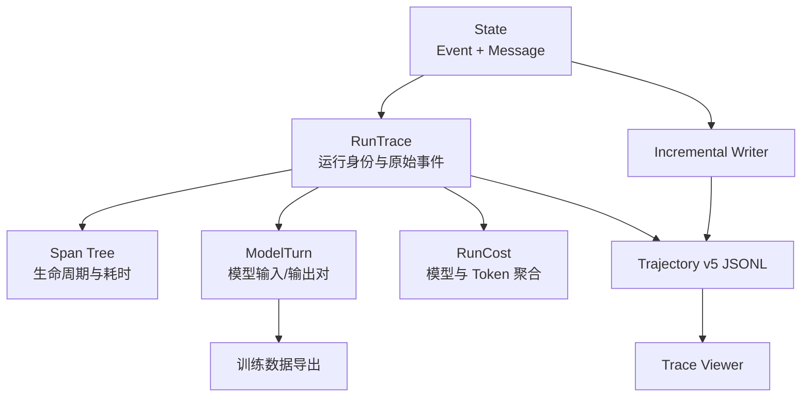
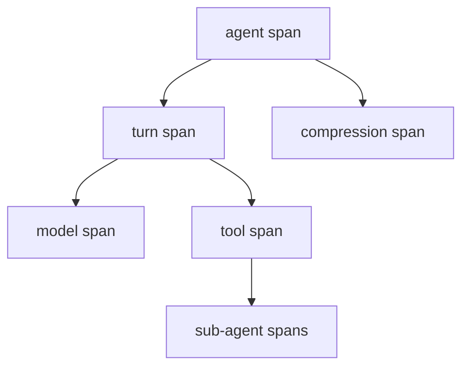

# 09. 轨迹与可观测性

> 本篇回答：如何从运行事实得到可阅读、可回放、可分析和可导出的轨迹，而不让观察层反向控制 Agent。

## 1. 为什么终端输出不够

长周期 Agent 的最终回答无法说明：

- 模型每轮看到了什么；
- 调用了哪些工具，哪些失败或被 Hook 阻止；
- Context 在何时压缩；
- 为什么停止；
- 使用了哪个模型、多少 Token 和成本；
- 子 Agent 内部做了什么；
- 哪些输入输出可以形成训练样本。

终端日志面向即时阅读，格式会变化，也难以恢复精确结构。项目以 Event Stream 为事实来源，再派生不同观察产品。

## 2. 可观测数据层次

RunTrace 不复制一套运行逻辑。它封装 trace id、producer、任务、Event、Message 和可选 meta；Span、ModelTurn 和 Cost 在需要时从事实计算。

## 3. Event Stream 是事实来源

完整轨迹依赖事件的顺序、时间、UUID 和类型字段。MessageEvent 提供 transcript，其他事件提供生命周期、模型、工具、Hook、压缩和 Goal 状态。

观察层遵守：

- 不修改 State 或补造缺失事件；
- 不用 UI 展示状态反向推断 Runtime 控制；
- 派生失败不改变已经完成的 Agent 结果；
- 相同 Event Stream 应产生一致的规范化视图；
- Provider raw 与规范事件并存，但职责不同。

## 4. RunTrace 与 Trajectory v5

规范持久化格式是事件流 JSONL：

1. 第一行是 header，包含 schema、type、trace identity、task 和 meta；
2. 后续每行是一条 Event；
3. schema 标识为 `simple-long-horizon-agent.trajectory.v5`；
4. Event 的 kind、index、elapsed 和 UUID 保留；
5. 可从 transcript 与 Agent registry 重建的逐轮 llm_payload 不在每条持久事件中重复保存。

一行一事件便于实时 tail、部分恢复和增量写入。Schema 版本是消费者契约；改变字段或可重建规则时必须同时更新 writer、reader、fixture 和 Viewer。

## 5. Raw Provider 数据的外置池

每轮 raw request 都可能重复携带不断增长的历史，直接内嵌会造成长任务文件接近平方增长。写入时：

- 主 trajectory 中的 raw 替换为 `raw_ref`；
- 实际 blob 写入相邻 `*.raw.jsonl`；
- 引用索引保持稳定；
- 最终 whole-file 写入可去重，增量写入维护追加池；
- Viewer 仅在 Wire Debug 面板需要时解析。

主轨迹仍是规范行为记录，raw pool 是边界调试证据。缺少 raw 不应阻止普通 Span 和 transcript 阅读。

## 6. Span：把事件转换为时间结构

Span 从 Event 配对得到，表达 Agent、Turn、Model、Tool 和 Compression 等活动的开始、结束、输入、输出与属性。

Span 是派生树，不是另一个事实日志。缺少显式开始时间时可以按已定义规则回退，例如 Compression 使用内部 compressor 请求时间；规则必须确定且可测试。

Task 工具将子运行 events 放在 ToolResult details 中。合并视图把子 Span 时间平移到父 Tool Span，并重新设置 parent id；原父 State 和子 State 不被修改。

## 7. ModelTurn：训练和分析的模型视角

每个 ModelRequestEvent 与随后属于同一 Agent 的 Assistant MessageEvent 配成一个 ModelTurn：

- input_messages：当时规范化模型输入；
- output_message：对应 Assistant 输出；
- tools：当时可用工具声明；
- meta：请求/响应事件位置、消息数量和 Adapter API。

这避免从最终 transcript 猜测每轮输入，因为压缩和可见性会使“最终全部消息”不同于“当时模型所见”。Fake 模型调用仍被记录并标记 `api="fake"`，下游可以过滤，而不是由 Runtime 隐藏事实。

Provider-neutral ModelTurn 可进一步转换为 OpenAI Chat 训练 JSONL。Provider 专用导出只存在于专用模块，复用真实 Adapter 的 wire 转换，保证“训练格式与运行格式一致”。

## 8. 成本与模型元数据

ModelResponseEvent 保存每次调用的 model、api 和 TokenUsage。成本层按模型价格表聚合输入、输出、缓存读写和美元成本，并可合并子 Agent 调用。

成本是可更新模型元数据与稳定 usage 事实的组合：

- usage 由运行时事件提供；
- price book 可使用内置值或调用者覆盖；
- 未知模型或缺失 usage 不能伪装为精确零成本；
- 成本分析不应回写运行结果。

## 9. 实时轨迹

IncrementalTraceWriter 在后台定期快照 State，只追加新增 Event：

1. 首次原子写入 header，并清理同名旧 raw sidecar；
2. 后续 append 完整 JSONL 行；
3. raw blob 同步追加到相邻池；
4. 无新事件时不写；
5. stop 时做最终 flush；
6. 最终导出可用 whole-file 原子写重建规范文件。

后台线程只读 State 浅快照并写观察文件，不驱动 Agent。写入失败通过回调报告，不能悄悄中断核心循环。完整行 flush 和最终原子替换避免 Viewer 读到撕裂文件。

## 10. Trace Viewer 的契约

Viewer 依赖三项稳定约定：

- 路径布局：`<run_root>/<run_id>/<instance_id>/out/trajectory.jsonl`；
- 固定文件名：`trajectory.jsonl`；
- v5 schema 与可解析事件。

它提供 transcript、时间 Span、工具、压缩、Agent registry 和 Wire Debug 等不同视图。Viewer State 属于前端交互，不回写 Runtime。Fixture 必须覆盖 raw、sub-agent details、失败工具、压缩和所有核心事件读取路径，防止 UI 与 writer 漂移。

## 11. 容器与远程实时观察

本地目录 Store 或 bind mount 可让 Viewer 直接 tail。容器内运行可周期性写 `out/trajectory.jsonl`；宿主也可按轮询间隔拉取。非本地 Store 需要先将 bytes 同步到 Viewer 可扫描的本地目录。

实时可见性不能假设双向网络：Worker 只需写自己的 Store 或被宿主拉取，不需要接受宿主入站连接。最终 `meta.in_progress` 应切换为 false，区分运行中快照与完成轨迹。

## 12. 可观测性与隐私

Trace 可能包含任务、文件内容、命令输出、模型 raw 和工具 details。生产或共享场景需要：

- 控制哪些环境变量和密钥进入请求；
- 对敏感内容做上游最小化或专门脱敏；
- 限制 raw pool 的访问与保留周期；
- 不把私有 Eval gold 数据注入模型可见 Trace；
- 明确 artifact root 的权限和清理策略。

轨迹完整不等于应无限保存所有秘密。数据治理由运行与存储所有者负责，Trace 层提供明确结构和隔离点。

## 13. 关键不变量

- State Event Stream 是运行事实，Span/Turn/Cost 是派生视图；
- 每个持久 Event 保留 kind、时序和唯一身份；
- 当时模型输入来自 ModelRequestEvent，不从最终 transcript 猜测；
- raw 外置不能改变引用或规范事件；
- 实时 writer 不控制 Runtime；
- 子 Agent 合并只重建展示树，不修改父子 State；
- Viewer、writer、schema fixture 必须同步演进；
- 轨迹写入失败不得伪装成 Agent 行为失败。

## 14. 本篇理解检查

- RunTrace、Span 和 ModelTurn 分别回答什么？
- 为什么 ModelTurn 不能只从最终 State.messages 生成？
- raw request 为什么要外置？
- 实时 writer 与最终 writer 有何区别？
- 子 Agent Span 如何合并而不共享 State？
- Viewer 为什么不能成为 Runtime 的控制器？

## 15. 相关文档与参考依据

- [返回设计文档总览](README.md)
- [上一篇：Agent 组合与工作流](08-agent-composition-and-workflows.md)
- [下一篇：评测与运行体系](10-evaluation-and-operations.md)将说明轨迹如何成为评测产物。
- [`trace/run_trace.py`](../../src/simple_long_horizon_agent/trace/run_trace.py)：RunTrace、schema 和序列化。
- [`trace/spans.py`](../../src/simple_long_horizon_agent/trace/spans.py)：Span 派生与子运行合并。
- [`trace/training.py`](../../src/simple_long_horizon_agent/trace/training.py)：ModelTurn 提取。
- [`trace/live.py`](../../src/simple_long_horizon_agent/trace/live.py)：增量与最终写入。
- [`trace/openai_export.py`](../../src/simple_long_horizon_agent/trace/openai_export.py)：Provider 专用训练导出。
- [`docs/docker-live-trace.md`](../docker-live-trace.md)：容器实时轨迹契约。
- [`tests/unit/test_live_trace.py`](../../tests/unit/test_live_trace.py)、[`tests/unit/test_trace_fixture_golden.py`](../../tests/unit/test_trace_fixture_golden.py)和 [`tests/unit/test_trace_viewer_contract.py`](../../tests/unit/test_trace_viewer_contract.py)：存储和 Viewer 验证。
