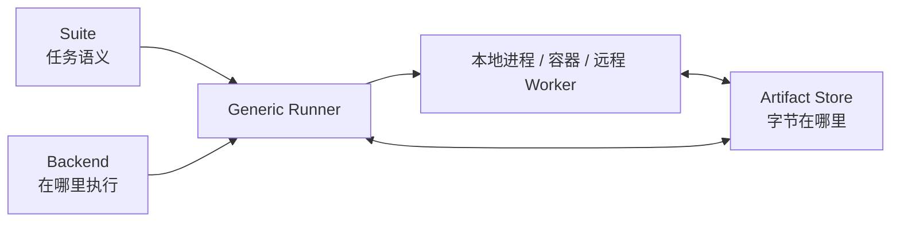
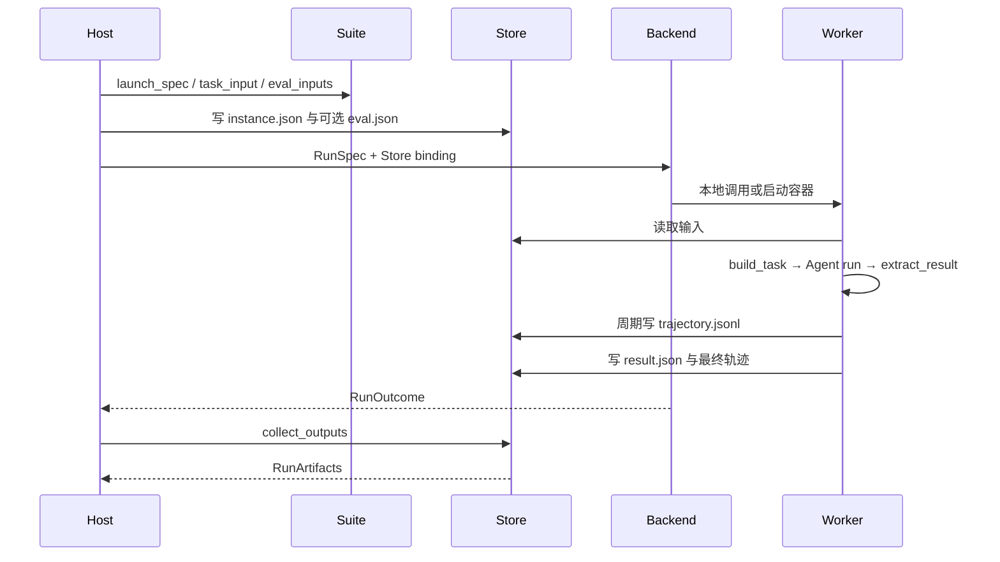

# 10. 评测与运行体系

> 本篇回答：如何把 Agent 放进可重复的真实任务环境，安全传递输入与私有评分数据，收集轨迹和产物，并在本地、容器或远程机器上使用同一运行协议。

## 1. Unit Test、Smoke Run 与 Eval 的区别

三类反馈信号服务不同问题：

| 信号 | 回答的问题 | 典型特点 |
| --- | --- | --- |
| Unit Test | 某个协议或纯逻辑是否正确 | 快、确定、无外部服务 |
| Smoke Run | 关键装配是否能实际运行 | 小任务、端到端、结果容易检查 |
| Eval | Agent 行为在一组任务上的效果如何 | 有真实环境、轨迹、产物和评分 |

Eval 不是把 Unit Test 放进 Docker，也不是只看模型最终文本。它需要把任务输入、执行环境、Agent 产品、轨迹、评分证据和失败类型分开保存。

## 2. 三个正交协议

评测引擎由三个可替换边界组成：



| 边界 | 负责 | 不负责 |
| --- | --- | --- |
| Suite | image/workdir、模型可见 task、私有 eval input、容器模块 | Docker 生命周期、远程传输 |
| Backend | 启动、等待、停止和收集某个执行环境 | Benchmark 任务含义、产物 Schema |
| ArtifactStore | 按 key 传递输入、结果、轨迹和 manifest | 运行容器、解释评分 |

Runner 只做通用装配。替换 Backend 不应修改 Suite，替换 Store 不应修改容器任务逻辑。

## 3. Suite 的 Host Half 与 Container Half

一个容器化 Suite 分为两段不同程序：

### 3.1 Host Half

位于仓库级 `evals/<suite>/`，可以依赖 Docker SDK、数据集和官方评分器。它提供：

- `launch_spec(instance)`：image、workdir、shell、entrypoint；
- `task_input(instance)`：删除 gold/private 字段后的模型任务；
- `eval_inputs(instance)`：只给评分逻辑的私有输入；
- Suite name 与 container module 路径。

### 3.2 Container Half

位于安装包的 `simple_long_horizon_agent.evals.suites.<suite>`，随 wheel 进入运行环境，只依赖轻量 Runtime。它至少提供：

- `build_task`：把公开实例转成 Agent 任务；
- `extract_result`：从工作区提取任务产品。

可选提供 prepare、agent spec、自定义 build_agent、evaluate 和 memory_artifacts。Host Half 负责“如何启动”，Container Half 负责“Agent 在环境内做什么”。两者不是重复实现。

## 4. 输入隔离

一次实例的输入分两条通道：

| 通道 | Store Key | 读取者 | 是否模型可见 |
| --- | --- | --- | --- |
| 任务输入 | `input/instance.json` | Container task、Agent | 是，经过 task_input 清洗 |
| 评测输入 | `input/eval.json` | 可选 evaluate hook | 否 |

Gold answer、隐藏测试和官方评分脚本不能通过普通 task 或 Context 泄漏给 Agent。Oracle 模式是显式的模型无关布线检查，可以使用完整实例应用参考方案；它必须被标记为 Oracle，不能与模型成绩混合。

## 5. 单实例运行的数据流



规范目录为：

```text
<run_root>/<run_id>/<instance_id>/
├── input/
│   ├── instance.json
│   └── eval.json        # 可选、私有
└── out/
    ├── result.json
    ├── trajectory.jsonl
    └── trajectory.jsonl.raw.jsonl  # 可选
```

路径片段必须规范化，不能允许实例 id 逃逸运行根目录。重跑时清理本次输出，但不得递归破坏其他 run 或 instance。

## 6. Backend：计算在哪里发生

| Backend | 环境 | 优点 | 约束 |
| --- | --- | --- | --- |
| LocalProcess | 当前 Python 进程和给定 workspace | 快、可调试、无镜像构建 | 共享 workspace 时不宜并发 |
| LocalDocker | 本机独立容器 | 环境隔离、可脱离 Host 长跑 | 需要 Docker 和镜像 |
| RemoteDocker | 远程 Docker daemon | 计算与 Host 分离 | 需明确网络和产物传输方向 |
| FakeBackend | 测试中的模拟执行 | 验证编排和 Store | 不代表真实环境行为 |

同一 RunSpec 驱动所有 Backend。LocalProcess 执行与容器相同的 Container Half，开发完成后只替换 Backend 即可部署。

## 7. Artifact Store：唯一结果总线

ArtifactStore 提供绑定 run directory、put/get、存在性和输出收集。输入、result、live trace 和 batch manifest 都走同一边界，避免 Runner 同时耦合 bind mount、HTTP 和 Docker archive。

### 7.1 LocalDirStore

适合单机：Host 和容器通过目录/bind mount 访问相同文件。写入采用原子替换，Viewer 可以直接扫描。

### 7.2 HostHttpStore

适合 Worker 能主动访问 Host 的网络：Host 启动标准库 HTTP 服务，Worker push/pull artifact，不依赖额外中间件。

### 7.3 Remote Docker Host-pull

如果只有 Host 能访问 Worker，RemoteDockerBackend 通过同一 Docker 连接使用 archive API 搬运文件；Worker 不需要反向访问 Host。实时轨迹由 Host 周期拉取。

对象 Store 适合双方都只能访问第三方存储或 Host 会离线的场景，但当前只是未来扩展点，文档不能声称已经提供。

## 8. result.json 是解耦产物

Container Half 的 `extract_result` 产生任务产品，例如补丁、答案或报告，写入 `out/result.json`。评分有三种位置：

1. **环境内 evaluate**：Suite 提供 eval_inputs，Container Half 的 evaluate 使用私有输入，判定合并进同一 result；
2. **后续 Judge Run**：读取候选 result 作为另一个 Suite 实例，使用同一运行原语；
3. **官方 Harness**：Host 侧 CLI 按官方协议评分，并做结果映射/一致性检查。

评分位置由数据和官方工具所有权决定，不应强迫所有 Suite 采用一个 Judge 接口。完成但未通过是有效 Eval 结果，不是基础设施异常。

## 9. Dataset 并发与重试

`run_dataset` 使用线程池对每个 instance 调用同一个单实例函数：

- 每个 instance 使用独立 run directory；
- 结果按输入实例顺序汇总；
- Docker/Remote 通常每实例独立环境，可安全并发；
- LocalProcess 若共享一个 workspace 应保持串行，或提供 workspace factory；
- 只有抛出的基础设施/暂时异常按 `max_attempts` 重试；
- 已完成但 exit code 非零或任务未通过，不自动重跑成“成功”。

Eval 失败分类必须区分 Agent 结果、评分失败和运行基础设施失败，否则比较数据不可信。

## 10. 长运行的 Submit / Reconcile

可脱离 Host 存活的 Backend 支持两阶段生命周期：

1. submit 启动每个运行，立即把可序列化 RunHandle 写入 `batch.json`；
2. 每成功启动一个实例就重写 manifest，避免 Host 中途崩溃产生孤儿；
3. 新进程读取 manifest 并 poll；
4. `result.json` 存在是终态事实，即使 daemon 已不再报告容器；
5. reconcile 可重复执行，并生成与阻塞 dataset 相同的报告。

LocalProcess 不能在 Host 退出后继续，所以只实现 run，不假装支持 submit/poll。

## 11. Chain：跨实例有序状态

某些评测不是独立样本，而是同一仓库上的连续任务。通用 Chain 引擎：

- 从 `input/chain_state.json` 恢复上一节点状态；
- 执行当前 instance；
- 写 `out/chain_state.json` 交给下一节点；
- 保留每节点独立 result 和 trajectory；
- Suite 只提供领域相关 handoff hook。

Chain State 是 Eval 编排状态，不等于 Agent State 或 Memory。它显式传递任务环境连续性，不能通过全局临时目录隐式共享。

## 12. Run Profile 与统一入口

`runs/run_bench.py` 提供 list、setup、单实例、batch、score、oracle 和 all 等入口。Profile JSON 把一组环境变量和 CLI 选项保存为可复现实验配置：

- `env` 标量转换为字符串；
- `run` 值转换为命令行参数；
- 下划线键作为说明忽略；
- 显式 CLI 参数优先于 Profile；
- 已有环境变量不被 Profile 覆盖；
- 示例 Profile 的 run key 由测试核对真实 parser。

Profile 保存可公开配置，不应包含长期密钥。密钥仍由运行环境注入。

## 13. 运行产物与可复现性

一次可解释 Eval 至少需要：

- Suite 与 instance identity；
- Provider/model/reasoning 和 Agent flavor；
- 回合、时间、并发等预算；
- 环境 image、workdir 和必要 setup；
- result.json；
- trajectory 及可选 raw pool；
- 评分方式和原始评分证据；
- 基础设施异常与重试记录。

分数本身不是可复现结果。必须能关联到配置、任务、运行事实和评分路径。

## 14. 关键不变量

- Suite、Backend、Store 可独立替换；
- task_input 与 eval_inputs 严格分离；
- LocalProcess 与容器执行同一 Container Half；
- result 与 trajectory 通过 Store 交换，不从终端输出抓取；
- 每实例目录隔离，路径不能逃逸；
- 任务未通过不等于基础设施异常；
- Batch manifest 在每次成功提交后持久化；
- 官方评分器保持在其所属 Host 边界；
- 尚未实现的对象 Store 不写成已有能力。

## 15. 本篇理解检查

- Suite、Backend 和 Store 为什么必须正交？
- Host Half 与 Container Half 分别依赖什么？
- 私有 gold 数据怎样避免进入模型上下文？
- LocalProcess 为什么能缩短 Suite 开发反馈周期？
- 哪种网络条件适合 HostHttpStore，哪种适合 Remote host-pull？
- 为什么 result.json 是评分解耦点？
- 什么错误应该重试，什么结果不应该重试？
- Submit/Reconcile 如何避免孤儿运行和重复协调？

## 16. 相关文档与参考依据

- [返回设计文档总览](README.md)
- [上一篇：轨迹与可观测性](09-trace-and-observability.md)
- [下一篇：配置与扩展原则](11-configuration-and-extension.md)将说明如何安全增加 Suite、Backend 和其他模块。
- [`evals/README.md`](../../evals/README.md)：评测体系现有操作说明。
- [`src/simple_long_horizon_agent/evals/protocols.py`](../../src/simple_long_horizon_agent/evals/protocols.py)：Suite、Backend、Store 与运行数据类型。
- [`src/simple_long_horizon_agent/evals/runner.py`](../../src/simple_long_horizon_agent/evals/runner.py)：单实例装配。
- [`src/simple_long_horizon_agent/evals/dataset.py`](../../src/simple_long_horizon_agent/evals/dataset.py)与 [`src/simple_long_horizon_agent/evals/batch.py`](../../src/simple_long_horizon_agent/evals/batch.py)：并发和长运行协调。
- [`docs/adding-an-eval-suite.md`](../adding-an-eval-suite.md)：新增 Suite 操作指南。
- [`docs/multi-machine-eval.md`](../multi-machine-eval.md)：远程网络与 Store 选择。
- [`runs/README.md`](../../runs/README.md)：统一运行入口和 Profile。
- [`tests/unit/test_evals_framework.py`](../../tests/unit/test_evals_framework.py)与 [`tests/unit/test_eval_chain.py`](../../tests/unit/test_eval_chain.py)：评测协议验证。
