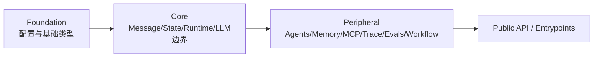

# 11. 配置与扩展原则

> 本篇回答：怎样增加 Provider、Tool、策略、Memory、Workflow 或 Eval 能力，同时保持项目简单、边界清楚且可以验证。

## 1. 扩展的基本判断

新增能力前先回答：

1. 它解决的是所有 Agent 的核心行为，还是一种可选能力？
2. 它产生运行事实、模型可见内容、外部资源还是派生产物？
3. 现有 Builder、Tool、Hook、Context Strategy、Workflow、Adapter 或 Eval Protocol 能否表达？
4. 它是否引入重型或可选依赖？
5. 最小反馈信号是什么？
6. 哪个模块拥有配置和生命周期？

只有改变所有 Agent 必须遵守的逐轮契约时才修改 core。大多数扩展应落在已有边界。

## 2. 稳定边界与可替换策略

| 稳定边界 | 可替换实现或策略 |
| --- | --- |
| Message / Content Block / Event | 新的合法领域类型，需全链路验证 |
| Agent.generate / Runtime loop | LLM-backed 或确定性 generate |
| ContextPolicy / CompressionStrategy | Tool compact、summarize、agent compact、tiered |
| AgentTool / ToolResult | Bash、Read、Edit、Task、MCP、自定义工具 |
| LLMRequest / StreamEvent | Fake、OpenAI、Anthropic、新 Adapter |
| Memory | FilesystemMemory 或其他明确实现 |
| Workflow StepResult / WorkflowResult | Chain、Reflection、Routing、Parallel、Goal Loop |
| Suite / Backend / ArtifactStore | 新 Benchmark、执行环境或存储 |

稳定边界需要少而明确；策略可以多样，但不能各自创造第二套 Message、State 或 Agent Loop。

## 3. 配置所有权

配置应由最接近行为的层拥有，而不是集中成一个万能全局对象。

### 3.1 注册式环境配置

通用行为环境变量声明为 EnvVar，包含：

- 唯一名称；
- 默认值；
- 解析与最小值规则；
- `domain.subsystem` 分组；
- 人可读用途。

统一优先级是：显式调用参数 > 环境值 > 声明默认值。空值使用默认；无法解析时按定义降级。所有 EnvVar 加入 REGISTRY，生成配置参考并由 CI 检查新鲜度。

### 3.2 专属配置所有者

Provider 凭据和模型别名具有独立解析需求，保留在轻量 LLM 配置模块；Memory、Eval 等未迁移配置仍由对应层拥有。集中不是目的，避免重复字符串与反向依赖才是目的。

### 3.3 环境访问约束

业务模块不直接散落 `os.environ` 读取。环境 lint 只允许登记的所有者或带原因的少数非行为性读取。Host Harness 转发配置名时，应导入轻量常量，而不是重新声明字符串。

## 4. 增加 Provider

最小步骤：

1. 确认现有 LLMMessage/Request/Response 能表达共同语义；
2. 增加 Provider 配置解析与 API kind；
3. 编写 Adapter，将 request 转为 wire、响应转为统一 StreamEvent；
4. 规范化 stop reason、usage、thinking、tool call 和 raw；
5. 注册 Adapter；
6. 使用 stub SDK 验证真实请求形状、缓存和多工具结果；
7. 确认 core、State 和 Tool 不导入 SDK。

只有出现多家 Provider 都需要的稳定能力时才扩展统一类型。单家特性先用 namespaced extra，并明确迁移标准。

## 5. 增加 Tool 或外部集成

普通工具应：

- 提供清楚名称、描述和 JSON Schema；
- 在输入边界校验并返回包含无效值的错误；
- 将可恢复失败变成 ToolResult；
- 设置合理超时、输出上限和 execution mode；
- 周期响应 abort；
- 把模型可见内容与 details 分开；
- 使用 Fake 或临时目录做无外部服务测试。

若能力拥有连接或子进程，实现 Toolset/Session 生命周期；若只是对子行动做许可，使用 Hook；若是异步外部协议，适配到同步 Tool 边界并明确资源所有者，不把 core 改造成某协议的客户端。

## 6. 扩展内容模型

新增 Content Block（例如未来 Audio）影响范围广：

1. 定义规范数据和不可变语义；
2. 确定哪些 Message role 可以承载；
3. 更新 normalize/validate 和可见内容规则；
4. 更新 Runtime → LLM Bridge；
5. 为每个 Adapter 实现原生转换或显式降级；
6. 更新 Token/大小估算；
7. 更新 Trace 序列化、Viewer 和 golden fixture；
8. 更新工具结果内部允许类型；
9. 增加跨边界测试。

不能只在某个 Provider 或 MCP 层塞字典，否则领域协议会分裂。

## 7. 增加 Compression 或 Memory

### Compression Strategy

只返回稳定消息索引与替代 Message；Runtime 负责工具配对、写事件和更新活跃视图。策略应声明阈值、保留 kind、摘要来源及成本，并测试多轮压缩、陈旧 usage 和 rewrite 结构。

### Memory

实现 initial/tools/finish，与普通 Message、Tool、Hook 组合。持久化实现负责锁、原子提交、容量、敏感信息和失败降级；核心不导入它。若需要新生命周期（例如每轮观察），必须先用真实需求增加对应 Hook，再增加 Memory 方法，不能预留空接口。

## 8. 增加 Workflow

优先用 `run_agent` 和普通 Python 组合：

- 每一步独立 State；
- 明确任务传递和终止条件；
- 返回 StepResult/WorkflowResult；
- 并发时保持结果顺序；
- 外部验证状态与模型 final 分离；
- 若包装为 facade，保留内部状态供 Trace 投影。

如果新 Workflow 需要修改 core 才能运行，先检查是否其实在创建第二套 Runtime 或把领域特定判断下沉到了核心。

## 9. 增加 Eval Suite、Backend 或 Store

### Suite

实现 Host Half 与轻量 Container Half，严格区分 task_input 和 eval_inputs，使用统一 result/trace artifact key，并提供 LocalProcess + Fake 的快速测试。

### Backend

只解释 RunSpec 如何在某环境执行，遵守 Store binding；若支持脱离 Host，才实现 submit/poll。不要解析 Benchmark 语义。

### Store

实现按 run directory 绑定和字节传输，保证路径安全和写入完整性。不要启动 Agent 或解释 result 内容。

## 10. 依赖方向

项目通过分区约束依赖：

箭头表示高层可以依赖低层。禁止低层导入外围模块；Provider SDK 只出现在 Adapter；Docker、MCP、datasets、swebench 等可选依赖只在所属模块。新增顶层模块必须分配 zone，不能逃避检查。

这不是为了形式整齐，而是确保最小 Runtime 能在没有重型依赖时被理解、安装和测试。

## 11. 可选依赖与发布边界

- 核心运行必需依赖进入主 dependencies；
- 开发工具进入 dev group；
- MCP、SWE-bench 等进入明确 extra；
- Host Half 可使用不随 wheel 发布的重型依赖；
- Container Half 必须随 wheel 且保持轻量；
- 不使用动态隐式插件发现隐藏核心行为；
- 新依赖通过 uv 管理并更新 lock；
- 未经所有者明确要求不修改版本、tag 或发布元数据。

## 12. 反馈信号先于实现

不同改动应选择最窄有效检查：

| 改动 | 最小反馈 |
| --- | --- |
| 纯数据/策略 | Unit Test |
| 新工具 | Fake 调用 + Runtime 工具回合 |
| 新 Adapter | Stub wire test + Fake end-to-end |
| 新资源集成 | 生命周期/失败清理测试 |
| 新 Workflow | 确定性 Agent 的步骤与停止测试 |
| 新 Trace Schema | writer/reader golden + Viewer contract |
| 新 Eval Suite | LocalProcess/Fake smoke + Oracle |
| 架构边界 | arch_lint / env_lint |
| 文档链接与配置参考 | lint_docs / generated-doc check |

完整门禁由 `bash runs/dev/run_ci.sh` 执行，并与 GitHub Actions 保持一致：格式、lint、文档、生成参考、架构、环境、类型、全量 Unit Test 和确定性 demo。

## 13. 文档如何随设计演进

- 代码和测试是当前行为事实；
- 设计文档保存职责、约束、理由和跨模块数据流；
- 不为不存在的 API 提前写承诺；
- 架构边界改变时，同步模块文档与验证；
- 同一事实只保留一个权威位置，其他文档链接过去；
- 外部架构想法先放入 gitignored reference note，再决定是否纳入项目；
- 不用日期戳声称新鲜度，使用可检查路径、命令和 schema。

## 14. 扩展评审清单

提交新能力前检查：

1. 问题和非目标是否明确？
2. 数据由谁创建、保存、读取和删除？
3. 是否选择了已有正确接入点？
4. 是否引入反向依赖或第二套协议？
5. 模型可见变化是否进入 Message/State/Trace？
6. 外部失败是否在有能力处理的层可见？
7. 可选资源是否有完整关闭路径？
8. 并发是否有明确 State 和结果顺序所有权？
9. 敏感数据是否跨越了不该跨越的边界？
10. 测试、设计文档和配置参考是否同步？

## 15. 本篇理解检查

- 什么时候应修改 core，什么时候应使用外围接入点？
- 为什么所有环境变量不能散落在调用位置？
- 新 Content Block 为什么是全链路架构变化？
- 新 Memory 方法为什么必须对应真实 Runtime Hook？
- Host Half 与 Container Half 的依赖策略是什么？
- arch_lint 和 env_lint 各保护什么？
- 一个新能力的最小反馈信号如何选择？

## 16. 相关文档与参考依据

- [返回设计文档总览](README.md)
- [上一篇：评测与运行体系](10-evaluation-and-operations.md)
- [下一篇：整体场景与完整性检查](12-system-scenarios-and-completeness.md)将用端到端场景检查这些扩展边界是否闭环。
- [`AGENTS.md`](../../AGENTS.md)：贡献与文档总约束。
- [`docs/configuration.md`](../configuration.md)与 [`config.py`](../../src/simple_long_horizon_agent/config.py)：配置登记和参考。
- [`scripts/arch_lint.py`](../../scripts/arch_lint.py)与 [`scripts/env_lint.py`](../../scripts/env_lint.py)：架构和环境边界。
- [`docs/development.md`](../development.md)：完整质量门禁。
- [`docs/adding-an-eval-suite.md`](../adding-an-eval-suite.md)：Suite 扩展实例。
- [`tests/unit/test_config.py`](../../tests/unit/test_config.py)与 [`tests/unit/test_run_profile.py`](../../tests/unit/test_run_profile.py)：配置和 Profile 验证。
