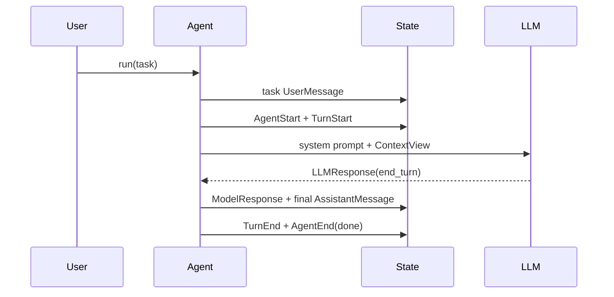
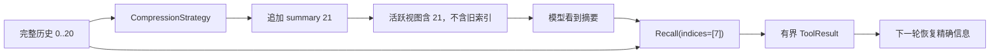
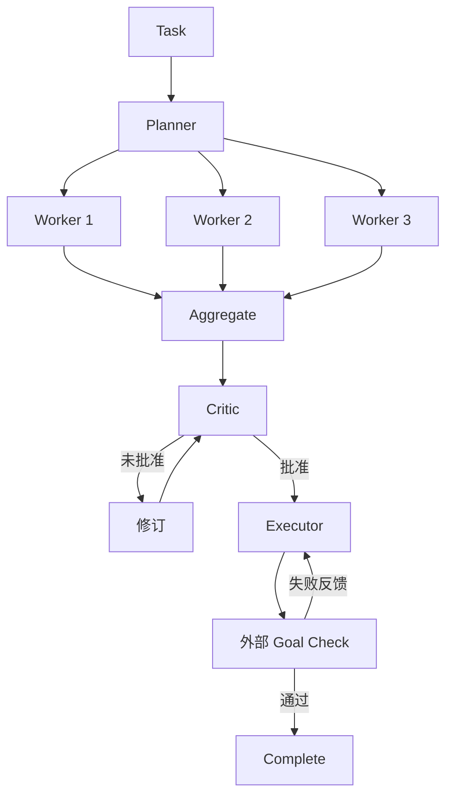
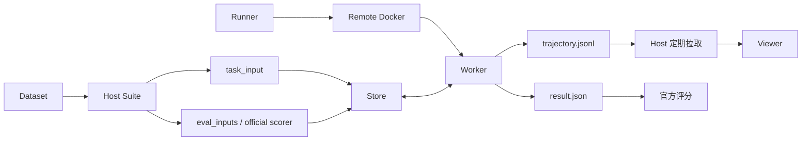

# 12. 整体场景与完整性检查

> 本篇不增加新模块，而是用端到端场景检查前 11 篇能否完整解释系统。每个场景都列出参与模块、关键数据、停止条件和可验证结果。

第一条基准场景就是 [00. 用一个真实运行看懂 Agent](00-running-example.md) 的 Bash Demo。后续场景都应回答同一组问题：输入是什么、State 增加了什么、模型看到了什么、谁执行了外部动作、停止原因是什么、失败留下了什么证据。

## 1. 如何使用本篇

对一个实现或一次架构修改，逐个走通下列场景。如果某一步无法回答“谁负责、数据在哪里、失败留下什么”，说明设计仍有遗漏或边界模糊。

场景覆盖矩阵：

| 场景 | 核心数据 | Runtime | LLM | Tool | 长周期 | Workflow | Trace | Eval |
| --- | --- | --- | --- | --- | --- | --- | --- | --- |
| 普通问答 | 是 | 是 | 是 |  |  |  | 是 |  |
| 多轮工具 | 是 | 是 | 是 | 是 |  |  | 是 |  |
| 压缩与 Recall | 是 | 是 | 是 | 是 | 是 |  | 是 |  |
| 子 Agent 委派 | 是 | 是 | 是 | 是 |  | 是 | 是 |  |
| 多阶段 Workflow | 是 | 是 | 是 | 可选 |  | 是 | 是 |  |
| 容器化 Eval | 是 | 是 | 是 | 是 | 可选 | 可选 | 是 | 是 |
| 跨运行 Memory | 是 | 是 |  | 是 | 是 |  | 是 | 可选 |

## 2. 场景一：无工具的普通问答

### 目标

用户给出一个文本或图文任务，模型一轮返回最终回答。

### 流程

### 必须成立

- 任务成为 State 中可见的 task Message；
- Provider wire 不进入核心 State；
- ModelRequestEvent 能说明模型当时看到什么；
- AssistantMessage 保存 content、model 和可用 usage；
- final 由当前 Agent 发出，停止原因为 done；
- Trace 可派生一个 ModelTurn 和完整 Agent/Turn/Model Span。

### 失败检查

限流由 LLM 边界有限重试；最终模型错误向调用者传播。它不能被记录成成功 final，也不能把此前 Event 删除。

## 3. 场景二：多轮并行工具调用

### 目标

模型同时读取两个信息源，看到结果后继续推理并完成。

### 流程

1. 模型输出 `kind="step"` 的 AssistantMessage，包含两个 ToolCallBlock；
2. Runtime 记录响应和消息，为两个调用写 start event；
3. PRE_TOOL_USE 可阻止某个调用；
4. 可并行工具在线程池执行，产生 update 和结果；
5. Runtime 按原调用顺序构造一个 UserMessage，其中两个 ToolResultBlock 分别指回 call id；
6. 下一轮 ContextView 包含调用和结果包；
7. Adapter 按 Provider 要求保持 bundle 或拆成 tool wire entries；
8. 模型返回 final。

### 必须成立

- 每个 ToolCall 都有结果，包括未知、阻止、异常和超时；
- 并发完成顺序不改变结果顺序；
- ToolExecutionEvent 与模型可见 ToolResult 分别完整；
- 部分失败不抹掉成功结果；
- terminate 工具先留下结果再停止；
- Trace 显示工具 Span、错误和耗时。

## 4. 场景三：上下文压缩与信息恢复

### 目标

长任务超过预算，系统压缩旧工具交换；稍后模型需要其中一个精确值，通过 Recall 恢复。

### 必须成立

- 压缩只更新活跃索引，不删除 MessageEvent；
- task/system/context 和工具配对按策略保护；
- 摘要明确记录来源索引或足以引导 Recall；
- 压缩 Event 保存前后大小、策略和新活跃顺序；
- 旧 usage 基线在压缩后不再作为完整窗口真值；
- Recall 校验索引并遵守每条/每次输出预算；
- Trace 同时能看到原消息、摘要与恢复调用。

### 失败检查

Compressor 返回空文本时使用明确占位，不删除旧事实；非法 rewrite 结构必须拒绝；Recall 越界返回错误结果供模型修正。

## 5. 场景四：父 Agent 委派子 Agent

### 目标

父 Agent 发现需要专项研究，通过 Task 工具选择已注册 Specialist。

### 流程

1. 父 Agent 输出 Task ToolCall；
2. Tool 验证 `subagent_type`；
3. 子 Agent 创建独立 State，记录任务和可选 context prelude；
4. 子 Agent 使用自己的 prompt、tools、hooks 和 ContextPolicy 运行；
5. 子 final 文本成为父 ToolResult content；
6. 子 events 进入 details，供 Trace 合并；
7. 父 Agent 读取结果并完成。

### 必须成立

- 父子 State、消息索引和压缩历史隔离；
- 父模型不直接接收全部子 transcript；
- 未知子类型成为错误 ToolResult；
- 子 Agent 的资源由其 Session/Toolset 所有者管理；
- 合并 Span 只改变展示 parent/time，不修改原事件；
- 父停止条件仍由自己的 final 或工具终止决定。

## 6. 场景五：多阶段 Workflow 与外部 Goal

### 目标

Planner 制定方案，多个 Worker 并行尝试，Critic 检查，Executor 修改环境；模型声称完成后由测试确认。

### 必须成立

- 每一步都是普通 Agent run，保存 StepResult 和独立 State；
- Worker 并行但结果数组按声明顺序；
- 原始 task 在阶段传递中保持；
- Critic approval marker 与 prompt 契约一致；
- Workflow 预算耗尽不会伪造批准；
- Agent final 只是 Goal 候选，外部 check 才能标记 complete；
- blocked、budget_exhausted、aborted 和 complete 可区分；
- 全局 Trace 从步骤 State 派生。

## 7. 场景六：带实时轨迹的容器化 Eval

### 目标

Host 在远程 Docker Worker 上运行一个 Benchmark 实例，实时查看轨迹，完成后使用官方评分器。

### 数据流

### 必须成立

- task_input 不包含 gold/private 字段；
- Host Half 可以依赖重型评分包，Container Half 保持可随 wheel 部署；
- Backend 只决定执行位置，Store 只决定字节位置；
- Worker 无需接受 Host 入站连接即可 host-pull；
- trajectory 使用固定目录、文件名和 schema；
- result、trace 和评分证据关联同一 run/instance identity；
- 官方未通过是 Eval 结果，不是基础设施异常；
- Provider 密钥只通过受控环境进入，不写入 Profile 或普通 Trace。

## 8. 场景七：跨运行 Memory

### 目标

第一次运行发现一个稳定工作方法并保存；第二次独立运行读取该经验，但先核验其中可能过时的仓库事实。

### 第一次运行

1. Memory binding 提供 Session Hook 和可选工具；
2. SESSION_START 注入 namespace 路径/旧摘要；
3. Agent 完成任务；
4. SESSION_END 收集有界 transcript 证据和领域 artifact；
5. distiller 读取旧 MEMORY.md 与新证据，整体重写手册；
6. 单写者锁和原子替换提交；
7. INDEX 与 run summary 始终可读，即使 distill 失败。

### 第二次运行

1. 新 State 不继承第一次运行的 Message/Event；
2. Memory 只注入说明、摘要和路径；
3. 模型通过 Read/Bash 主动读取相关内容；
4. 涉及当前代码、路径或配置的记忆与 Workspace 实时事实核验；
5. 若无值得沉淀的新经验，finish 可以不更新手册。

### 必须成立

- Memory 与 Agent State 生命周期不同；
- Memory 失败不让主任务失败；
- 不保存秘密、大原始输出或临时进度；
- 不把 Benchmark 标签/评分泄漏到未来任务；
- namespace/run id 有边界，容量和旧证据有裁剪；
- 读取 Memory 的行为可从 Message、Tool 和 Trace 解释。

## 9. 跨场景失败矩阵

| 失败 | 所属边界 | 期望结果 |
| --- | --- | --- |
| Message 结构非法 | 数据入口 | 立即拒绝，报告值和期望形状 |
| Provider 暂时限流 | LLM 边界 | 有限退避重试，不增加假 transcript |
| 模型工具参数非法 | LLM 修复层 | 临时纠正请求，有限重试 |
| 工具异常/超时 | Tool 边界 | 错误 ToolResult + 完整执行事件 |
| 外部 abort | Runtime/Tool | 明确停止原因，不伪装 final |
| Compressor 失败 | Context 策略 | 保留完整历史并明确报告 |
| Memory 失败 | Memory 外围 | 保留任务结果与错误证据 |
| Workflow 某步截断 | Workflow | Step State 保留 max_turns，上层决定是否继续 |
| 容器/网络异常 | Eval Backend | 基础设施错误，可按策略重试 |
| 任务完成但评分不通过 | Suite/Scorer | 有效失败结果，不当作 infra retry |
| Trace 写入失败 | Observability | 报告观察故障，不改 Agent 行为结论 |

## 10. 系统级不变量

前 11 篇共同要求：

1. 项目拥有自己的 Message、Event 和 LLM 边界；
2. State Event Stream 追加且可重建当前投影；
3. 普通 Agent 只有一套显式 Runtime；
4. 模型、工具和外部资源通过清楚边界接入；
5. 完整历史、活跃上下文和模型可见视图分离；
6. Provider、Benchmark 和 SDK 细节不下沉核心；
7. 子运行与并发任务拥有独立 State；
8. Trace、Span、成本和训练数据从事实派生；
9. 私有评测数据与模型任务严格隔离；
10. 配置、依赖和资源各有唯一所有者；
11. 所有停止和失败都留下结构化、可区分结果；
12. 简单实现、Fake 和窄测试始终可用。

## 11. 面向实现者的复建验收

一份独立实现不需要复制文件名和类名，但若要保留本项目设计，应能证明：

- 使用项目自有不可变消息和内容协议；
- 一轮时序和四种 Agent 停止原因可验证；
- 工具调用/结果身份、并行确定性和错误反馈成立；
- 至少一个 Fake Model 与 Fake Tool 能无网络运行；
- 至少一个真实 Adapter 不污染 core；
- 压缩不删除原始历史，Recall 可有界恢复；
- 子 Agent/Workflow 复用核心循环且 State 隔离；
- Event 可派生可持久化 Trace 和逐轮模型样本；
- Eval 可替换执行 Backend 并通过 Artifact Store 交换结果；
- 配置和可选依赖不形成反向耦合；
- 文档能解释为什么采用这些边界。

这是一份架构完整性验收，不是源码逐项对照表。

## 12. 发现遗漏时如何回补

若某个真实场景无法用现有文档解释：

1. 先在源码和测试中确认当前事实；
2. 判断遗漏属于已有模块，还是暴露了新的稳定边界；
3. 优先回补对应专题文档，不在本篇重复维护细节；
4. 若代码缺少明确契约，先定义反馈信号再修改实现；
5. 更新跨文档链接、架构/环境检查和相关测试；
6. 重新走通本篇所有受影响场景。

## 13. 全套文档阅读出口

- [返回设计文档总览](README.md)
- [项目目标与范围](01-product-goals-and-scope.md)
- [系统总体架构](02-system-architecture.md)
- [核心概念与数据流](03-domain-model-and-data-flow.md)
- [Agent 核心运行机制](04-agent-runtime.md)
- [模型访问边界](05-model-access.md)
- [工具与外部能力](06-tools-and-integrations.md)
- [上下文与长周期能力](07-context-and-long-horizon.md)
- [Agent 组合与工作流](08-agent-composition-and-workflows.md)
- [轨迹与可观测性](09-trace-and-observability.md)
- [评测与运行体系](10-evaluation-and-operations.md)
- [配置与扩展原则](11-configuration-and-extension.md)
- [面试深挖与证据边界](13-interview-deep-dive.md)
- [无代码上下文的面试问答](14-interview-questions-and-answers.md)

## 14. 参考验证入口

- [`tests/unit/`](../../tests/unit/)：各模块确定性行为。
- [`runs/demos/run_bash_agent_demo.sh`](../../runs/demos/run_bash_agent_demo.sh)：最小模型—工具闭环。
- [`runs/dev/run_ci.sh`](../../runs/dev/run_ci.sh)：本地完整质量门禁。
- [`.github/workflows/ci.yml`](../../.github/workflows/ci.yml)：远端 CI 对照。
- [`evals/README.md`](../../evals/README.md)：真实评测运行体系。
- [`tests/fixtures/`](../../tests/fixtures/)：Trace、Skills 等跨模块固定样本。
