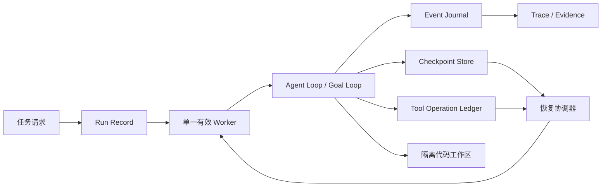

# 可恢复的软件工程长任务 Runtime 开发设计

## 1. 场景与目标

本设计依托一个具体场景：Agent 在隔离的代码工作区中完成一个需要多轮行动的软件工程任务。

典型任务是：

> 修复仓库中的一个 Bug，补充或修改测试，运行验证命令，直到结果通过并生成补丁和执行报告。

一次任务可能经历：

```text
读取仓库
  -> 定位问题
  -> 编辑文件
  -> 运行测试
  -> 分析失败
  -> 继续编辑
  -> 回归验证
  -> 输出补丁、结果和轨迹
```

本开发项的目标不是建设网页会话平台，而是让这类长任务具备三个性质：

1. **可恢复**：进程退出、服务器重启或 Worker 故障后，可以从持久化事实继续；
2. **可验证**：任务是否完成由外部检查和测试决定，不只相信模型的最终文本；
3. **可解释**：可以回答任务当前处于哪一步、为什么暂停、恢复后会做什么，以及工具副作用是否已经发生。

## 2. 当前能力与缺口

当前项目已经提供了实现基础：

| 能力 | 当前实现 | 作用 |
| --- | --- | --- |
| Agent Loop | `core.run()` | 驱动模型、工具、消息和停止条件 |
| 会话续跑 | `Agent.resume()` | 在同一个进程内继续已有 `State` |
| 运行事实 | `State.events` | 追加记录模型、工具、压缩和生命周期事件 |
| 派生上下文 | `StateSnapshot` | 从事件得到消息和活跃上下文 |
| 长任务编排 | `run_goal_loop()` | 通过独立 `CompletionCheck` 持续推进目标 |
| 观测与审计 | JSONL Trace | 增量写入并支持中断后的前缀读取 |
| 评测环境 | Local/Docker/Remote Backend | 为每个评测 Run 提供独立工作目录或容器工作区 |

当前已经补齐了单机文件系统原型：State Checkpoint、Run 租约与 fencing
token、Operation Ledger，以及 `RecoverableRunExecutor` 的基本接管流程。
剩余缺口主要是生产化边界：

- 已增加可停止的 `RecoveryScheduler`，周期扫描候选 Run 并交给调用方的恢复回调；它不替代租约竞争，也不持有 Agent 内存状态；
- 已增加 `FileEventJournal`，按 Run 追加 JSONL 事件并校验 index 连续性；生产环境仍需共享存储和事务边界；
- 工作区生命周期、快照和垃圾回收还没有纳入 Run 控制面；
- `RecoveryScanner` 能发现 runnable、reconciling 和过期租约 Run，`RecoveryScheduler` 可将扫描接入常驻后台循环；
- 文件系统存储还没有替换为带条件更新和事务边界的共享数据库；
- 优雅停机已覆盖单个执行器的释放语义，但尚未形成多 Worker 的服务级停机编排。

因此，本开发项只补齐“单个长任务可恢复执行”所需的最小边界，不引入通用多租户调度系统。

## 3. 非目标

本阶段不实现以下能力：

- 浏览器页面、会话 URL 或 IP 隐藏；
- 测试机注册、固定机器绑定和跨机资源调度；
- 完整的 Skill 社区、计费和发布平台；
- 任意 Python 对象、线程、连接或闭包的序列化；
- 对所有外部工具提供真正的 exactly-once 保证。

外部系统的 exactly-once 无法由 Agent Runtime 单独保证。本项目只提供操作账本、幂等键和恢复时的核对接口，具体语义由工具适配器负责。

## 4. 目标架构



四类持久化数据职责不同：

| 数据 | 回答的问题 | 是否作为恢复依据 |
| --- | --- | --- |
| Event Journal | 已经发生了什么 | 是，事实源 |
| Checkpoint | 如何快速得到当前可执行投影 | 是，事件的派生快照 |
| Operation Ledger | 外部工具副作用进行到哪一步 | 是，决定能否重试 |
| Trace/Evidence | 人和评测系统如何观察运行 | 否，只能由前三者派生 |

## 5. Run 生命周期

```text
created
  -> runnable
  -> leased
  -> running
  -> waiting_external
  -> reconciling
  -> complete / blocked / aborted / failed
```

状态含义：

- `created`：任务请求已创建，尚未进入执行队列；
- `runnable`：可以被 Worker 领取；
- `leased`：某个 Worker 暂时拥有推进权；
- `running`：正在执行模型回合或短工具；
- `waiting_external`：等待长时间外部操作或回调，释放 Run 执行租约；
- `reconciling`：恢复协调器正在确认一次可能已经发生的副作用；
- `complete`：独立完成检查通过；
- `blocked`：同一阻塞原因连续达到阈值；
- `aborted`：调用方取消或达到墙钟截止时间；
- `failed`：不可恢复的 Runtime 或环境错误。

同一个 Run 可以跨多个 Worker，但同一时刻只能有一个有效的推进者。这里的“会话独占”是逻辑 Run 的并发写独占，不是永久绑定某台机器。

## 6. 最小数据模型

### 6.1 RunRecord

```python
@dataclass(frozen=True)
class RunRecord:
    run_id: str
    status: str
    version: int
    latest_event_index: int
    checkpoint_event_index: int | None
    config_fingerprint: str
    tool_registry_version: str
    budget: dict[str, int | float | None]
    lease_owner: str | None
    lease_expires_at: float | None
    fencing_token: int
```

`version` 用于乐观并发控制，`fencing_token` 用于拒绝租约过期的旧 Worker 写入。

### 6.2 Checkpoint

Checkpoint 只保存项目自有、可版本化的数据：

```text
schema_version
run_id
checkpoint_id
covered_event_index
covered_event_uuid
run_version
fencing_token
messages
active_context_indices
workflow_position
goal_status
budget_remaining
workspace_ref
pending_operation_ids
content_sha256
```

不保存 API 连接、线程、文件句柄、模型客户端实例或密钥。恢复时根据 `config_fingerprint` 和 `tool_registry_version` 重建 Agent 与工具。

### 6.3 Operation Ledger

每次可能产生外部副作用的工具调用，都先生成稳定的 `operation_id` 和 `idempotency_key`：

```text
created -> intent_recorded -> started -> confirmed
                              |          |
                              v          v
                           unknown -> reconciled
```

如果只看到 `started` 而没有 `confirmed`，恢复流程必须进入核对，不得默认工具没有执行过。

## 7. 关键流程

### 7.1 正常执行

1. 创建 `RunRecord(status="runnable")` 和由 Backend 提供的工作区引用；
2. Worker 通过条件更新领取 Run，获得 `lease_owner` 和递增 `fencing_token`；
3. Runtime 执行 `Agent.run()` 或 `run_goal_loop()`；
4. 在模型响应、工具意图、工具结果和 Goal 状态边界持久化 Event；
5. 按事件数量、字节数或工作流节点完成情况生成 Checkpoint；
6. 完成检查通过后写入 `complete` 和最终 evidence pack。

### 7.2 调用端或前端断开

这里的“前端”是部署时可能存在的 Web 页面、CLI 控制台或其他调用客户端，
不代表当前仓库已经实现了 Web UI。客户端只是观察端，不持有 Runtime 的唯一状态。
客户端关闭或网络断开后：

- Worker 继续执行；
- 用户重新打开页面时读取 Run Record 和 Trace；
- 页面断线不等于任务取消；
- 只有显式取消请求才将 Run 标记为 `aborted`。

### 7.3 服务器重启

服务器重启会使当前 Worker 的内存调用栈消失，因此任务会短暂暂停，但不应丢失已提交的运行事实：

1. 新 Worker 扫描租约过期的 Run；
2. 领取新租约并获得更大的 fencing token；
3. 加载最近 Checkpoint；
4. 重放 Checkpoint 之后的 Event；
5. 检查未决模型请求和工具操作；
6. 安全时继续下一步，否则进入 `reconciling` 或 `blocked`。

恢复的对象是“足以决定下一步的状态”，不是 Python 调用栈。

### 7.4 优雅停机

收到停机信号后，Worker 应：

1. 停止领取新的 Run；
2. 当前模型请求结束后不再开启新的工具操作；
3. 写入最新 Event 和 Checkpoint；
4. 将可继续的 Run 置为 `runnable`，释放租约；
5. 关闭进程。

正在执行的长工具应先写入 Operation Ledger，Run 转为 `waiting_external`，由工具侧操作租约和回调继续管理。

## 8. 一致性与安全边界

- Event 追加、Run 版本更新和调度通知应使用同一提交边界；
- 所有 Worker 写操作都校验 `run_id + version + fencing_token`；
- 旧 Worker 的迟到结果必须被拒绝，不能覆盖新 Worker 的状态；
- 历史 Tool Call 不能因为重放而自动再次执行；
- Checkpoint 必须校验 schema 版本、覆盖的 Event 连续性和内容哈希；
- Trace 不参与恢复决策，避免把观察投影误当成控制状态；
- 任务输入、私有评测输入和模型上下文继续遵守现有 Eval 隔离规则。

## 9. 实施分期

### Phase 1：本地可恢复原型

状态：已完成第一版原型，已在 `codex/recoverable-runtime-phase1` 分支实现并通过完整 CI。

- 增加 `CheckpointStore` 协议和文件系统实现；
- 为 `State` 增加版本化序列化/反序列化，只覆盖 Message、Event 和 Snapshot；
- 实现从 Checkpoint 加载并重建 `State`；
- 增加“进程中断后继续”的单元测试。

### Phase 2：Run 协调与工具核对

状态：已完成文件系统协议原型，并已接入 `core.dispatch_tool_calls()` 的副作用工具边界；当前在 `codex/recoverable-runtime-phase1` 分支验证。

- 增加 `RunRecord`、租约和 fencing token；
- 增加 `Operation Ledger` 协议；
- `edit` 和可识别写副作用的 `bash` 调用会记录 `intent_recorded -> started -> confirmed/unknown` 生命周期；
- 恢复时遇到未决操作会返回需要核对的模型可见错误，避免静默重复执行；
- 增加旧 Worker 迟到提交和重复恢复测试。

这里的 `confirmed` 表示工具进程返回了成功结果，`unknown` 表示工具报错或超时、但外部副作用是否已经发生仍不确定。当前实现不宣称跨进程 exactly-once；`reconciled` 仍需要上层根据工作区状态或外部系统查询后显式推进。

### Phase 2.5：可恢复 Run 执行入口

状态：已完成最小文件系统协调器。

`RecoverableRunExecutor` 位于 `recoverable_runtime.py`，负责把现有
`RunStore`、`CheckpointStore`、`OperationLedger` 和 `core.run()` 串起来：

- 创建 Run 时保存初始 Checkpoint，并写入 `run_id`；
- 执行前领取租约、写入 `fencing_token`，再进入 `running`；
- 每 N 个 Event 或 Agent 结束时自动保存 Checkpoint 和进度；
- Agent 正常结束时将 Run 标记为 `complete`、`aborted` 或可继续的 `runnable`；
- Worker 异常退出时先保存当前状态、释放租约，使新 Worker 能从 Checkpoint 接管。
- 执行期间由心跳线程按租约的约三分之一间隔调用 `renew_lease()`；续租失败或 fencing token 变化时，旧 Worker 停止提交进度并以 `LeaseLostError` 结束。

这仍是单进程文件系统协调器，不包含后台扫描器、数据库事务或通用工作区恢复。心跳只保护 Runtime 的控制面；已经交给外部进程的命令仍需工具自身支持取消或后续核对。

### Phase 2.6：Event Journal 与恢复扫描

状态：已完成最小文件系统实现。

- `FileEventJournal` 为每个 Run 保存独立 JSONL 事件流，追加时校验事件序号连续，重复写入同一事件可安全去重；
- `RecoveryScanner` 扫描 `RunStore.list()`，返回 runnable、等待核对以及租约已过期的 Run；
- 扫描与抢租约分离，实际接管仍由 `RecoverableRunExecutor.execute()` 通过条件租约完成。
- 恢复执行时先加载 Checkpoint，再读取 Journal；Checkpoint 覆盖的事件必须逐条相等，Journal 超出的尾部事件会合并回新的 `State`，前缀冲突或 Journal 缺失则拒绝继续。
- 恢复执行前会查询 `started/unknown` 操作；有适配器时执行显式核对，确认成功才继续，无法判断的操作会将 Run 置为 `blocked`，不会盲目重试。

当前还没有跨机器通知或数据库级 Journal。服务器重启后的最小流程是：新 Worker 启动
`RecoveryScheduler`，扫描候选 Run，再使用自己的 Worker ID 调用执行器竞争租约。
调度器停止时不再领取新的 Run；当前执行器仍按已有的 checkpoint、lease 和 fencing
语义完成或释放自己的 Run。

当前提供了 `OperationReconciler` 协议和 `EditOperationReconciler` 文件哈希实现。
`bash` 等无法可靠推断结果的工具必须注册自己的核对器，否则恢复会失败关闭。

### Phase 2.7：常驻恢复调度

状态：已完成最小文件系统实现。

`RecoveryScheduler` 将 `RecoveryScanner` 接入可停止的后台循环。每轮扫描把候选
Run 交给调用方提供的恢复回调；回调应使用自己的 Worker ID 构造
`RecoverableRun`，再调用 `RecoverableRunExecutor.execute()` 竞争租约。调度器本身
不修改 Run 状态、不绕过 fencing，也不保存 Agent 的内存对象。

单个 Run 的恢复失败会通过 `on_error` 记录并继续处理同一轮的其他候选，避免一个
损坏工作区阻塞整个恢复循环。服务停机时调用 `stop()`，调度器停止新的扫描和新的
Run 领取；如果当前恢复回调仍在执行，`stop(join_timeout=...)` 会等待它自然返回，
并通过布尔值告知是否已经排空。已领取的 Run 仍由执行器按 lease、checkpoint 和
fencing 语义完成、释放或等待接管。

这仍是进程内调度线程，没有跨机器唤醒、持久化队列、并发度配额或退避策略。生产
部署应在共享 RunStore 上实现同样的条件租约语义，并由服务生命周期统一启动和停止
调度器。

### Phase 3：长任务证据与 Skill 观测

- 已增加 `SkillInvokedEvent`，记录 Skill 内容版本、任务输入摘要、来源和触发方式；
- 已增加 `EvidencePack` 派生函数，汇总 Skill、工具错误、工作区引用、验证元数据和停止原因；
- 已加入文件系统版故障注入验收：模拟写工具完成文件写入后、Ledger 确认前
  Worker 退出，再由新 Worker 从 Checkpoint + Journal 接管；
- 当编辑结果的 post-image 哈希匹配时，恢复会先完成 reconciliation，再继续模型执行，
  不会重复写入；哈希不匹配或缺少核对器时，Run 会进入 `blocked`，不会盲目重试。

证据包从 `State.events` 和 `State.data` 派生，不参与恢复决策，也不把原始任务或
Skill 正文重复写入观测数据。`FileEvidenceStore` 已提供原子 JSON 持久化；执行器在
完成、阻断和异常释放边界写入最新摘要，服务器重启后可直接读取。后续再补充验证
命令、补丁摘要和人工核对结果等更细粒度字段。对应验收测试位于
`tests/unit/test_recoverable_runtime.py` 的 `test_fault_injection_*` 用例。

本阶段不要求引入数据库。文件系统实现先验证协议和恢复语义，跨进程部署时再替换为具备条件更新能力的存储后端。

## 12. 工作区隔离说明

### 12.1 当前已经实现的部分

“隔离工作区”在当前评测执行路径中已经存在，但它不是一个独立的通用 Workspace Manager：

- `LocalProcessBackend` 默认用 `tempfile.mkdtemp()` 为每次运行创建临时目录；
- 传入 workspace factory 时，可以按 `instance_id` 为并发 Run 分配不同目录；
- Docker/Remote Backend 通过每个 Run 的目录和容器挂载提供独立工作区；
- SWE-bench 的并发链路还使用 Git worktree，让不同 rollout 的编辑互不污染；
- `bash` 和 `edit` 都绑定到组装时传入的 `cwd`，相对路径只能作用于该工作区。

对应实现和测试见
[`src/simple_long_horizon_agent/evals/backends/local_process.py`](../../src/simple_long_horizon_agent/evals/backends/local_process.py)、
[`src/simple_long_horizon_agent/tools/bash.py`](../../src/simple_long_horizon_agent/tools/bash.py)、
[`src/simple_long_horizon_agent/tools/edit.py`](../../src/simple_long_horizon_agent/tools/edit.py) 和
[`tests/unit/test_evals_framework.py`](../../tests/unit/test_evals_framework.py)。

### 12.2 当前没有实现的部分

Phase 1/2 还没有把工作区生命周期纳入通用 Run 控制面：

- `RunRecord.workspace_ref` 已保存由 `FileWorkspaceManager` 分配的稳定工作区 ID；
- Checkpoint 保存工作区引用，恢复执行时由 Workspace Manager 解析同一目录并写入 `workspace_path`；
- 服务器重启后，新的 Worker 仍需要底层 Backend 保证该引用对应的目录或挂载可用；
- 当前没有工作区快照、版本校验、租约绑定和自动垃圾回收调度，但已提供显式 `release(remove=True)` 和按 mtime 的 `gc()`。

因此，准确表述应该是：**评测 Backend 已经提供了运行级目录/容器隔离；可跨重启恢复的工作区管理仍是后续开发项。**

### 12.3 为什么需要隔离

隔离不是为了让 Agent “拥有一台专属机器”，而是为了保护任务边界：

1. **避免并发污染**：两个 Run 同时编辑同一个仓库时，不会互相覆盖文件或混入测试产物；
2. **保护基线**：Agent 的修改只作用于自己的副本，原始仓库和其他实验保持不变；
3. **限制副作用范围**：`bash`、`edit`、构建缓存和临时文件被限制在任务工作区内；
4. **支持可复现评测**：每个 Run 从明确的镜像、提交或目录开始，结果可以独立收集和比较；
5. **便于故障恢复**：恢复时可以根据 `workspace_ref` 找回同一工作区，而不是依赖某个 Worker 的本地进程状态；引用失效时 Run 会阻断并等待人工处理。

隔离也不是完整安全沙箱。命令权限、容器能力、网络策略和密钥管理仍由 Backend 与宿主环境共同负责。

## 10. 验收标准

### 功能验收

- 页面关闭后，Run 仍可继续，重新打开可看到累计 Trace；
- 在模型响应后、工具确认前模拟进程退出，恢复不会盲目重复副作用；
- 服务器重启后，Run 能从最近 Checkpoint 和 Event 前缀恢复；
- 两个 Worker 同时领取同一 Run 时，只有一个能获得有效推进权；
- `run_goal_loop()` 恢复后仍保留原有 GoalStatusEvent 和预算统计；
- Checkpoint 损坏或版本不兼容时，系统会明确失败或退回 Event 重放，而不是静默继续。

### 可观测性验收

一次恢复运行至少能回答：

- 上一次成功提交的 Event 是什么；
- 当前 Run 处于哪个生命周期状态；
- 是否存在未决工具操作；
- 恢复后采取了继续、等待、重试还是核对；
- 最终完成是由哪个外部验证得出。

### 回归检查

```bash
uv run python -m unittest discover -s tests/unit
uv run python -m scripts.lint_docs
git diff --check
```

## 11. 与项目定位的关系

这项改造延伸的是项目已有的核心设计：`State.events` 是事实源，`StateSnapshot` 是派生投影，`run_goal_loop()` 提供外部完成检查，Trace 负责观察和评测。

它没有把项目改造成一个隐藏了核心行为的生产框架，而是把“长任务如何在中断后继续”这个原本由调用方自行承担的边界，提升为一个可测试、可替换、可解释的 Runtime 协议。
