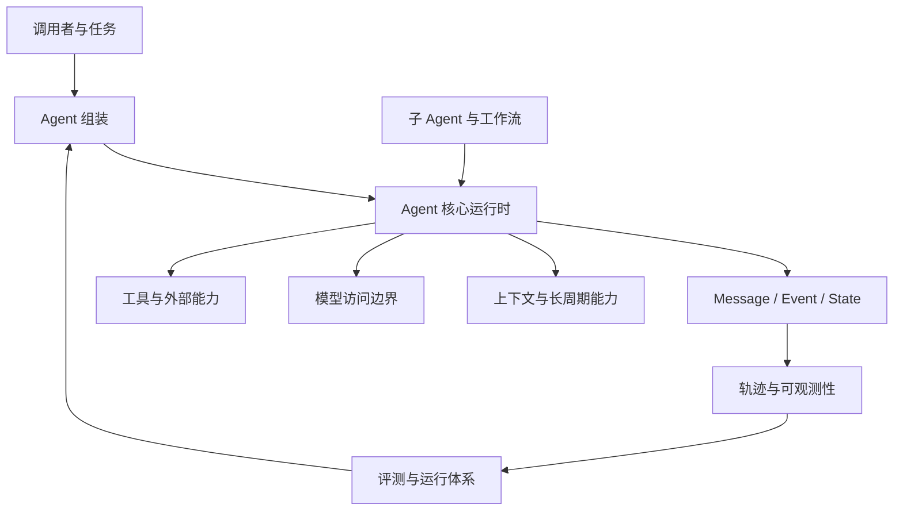

# Simple Long Horizon Agent 设计文档

> 当前状态：总体设计与 14 篇专题文档已经完成；后续以源码、测试和评审结果持续校正。
>
> 本目录通过阅读当前代码、测试和已有说明，反向整理项目的需求与设计。这里不会修改原项目，也不会逐行解释源码。

## 1. 为什么要写这套文档

Simple Long Horizon Agent 已经包含核心运行时、模型适配、工具、上下文管理、记忆、工作流、轨迹和评测等能力。单独阅读某个文件可以理解局部实现，却不容易回答下面这些整体问题：

- 项目最初想解决什么问题？
- 为什么系统需要这些模块？
- 每个模块负责什么，又刻意不负责什么？
- 一次任务如何经过模型、工具、状态和上下文持续推进？
- 长时间运行产生的信息如何保留、压缩、恢复和沉淀？
- 多 Agent、轨迹和评测为什么建立在当前核心之上？
- 为什么采用现在的边界，而不是一个功能齐全但难以理解的大框架？

这套文档的主要目标是帮助人建立清晰、完整、可持续维护的系统认知。读者应当能够从总体进入局部，理解每项设计的背景、作用、协作关系和取舍。

“仅根据文档能否重建一个架构和行为相近的系统”是检查文档是否遗漏关键设计的方法，但不是写作目的。文档优先服务人的理解，不写成源码复刻手册。

## 2. 写作原则

### 2.1 先解释问题，再介绍方案

每个模块都从它解决的问题开始。只有理解“为什么需要”，职责划分和实现取舍才有意义。

### 2.2 先建立整体，再进入局部

阅读顺序按照人的认知过程组织：项目目标、总体架构、核心概念、运行流程、外围能力，最后才是扩展和完整性检查。

### 2.3 关注设计，不翻译代码

正文描述稳定的模块职责、数据语义、协作方式、不变量和设计理由。私有函数、局部算法和代码组织只在确实影响理解时出现。

### 2.4 图与文字各自解决合适的问题

- 系统组成和依赖关系使用架构图；
- 跨模块交互使用时序图；
- 数据的来源、转换和去向使用数据流图；
- 生命周期和停止条件使用状态图；
- 精确的字段或职责对应关系使用表格。

图帮助理解关系，正文负责解释原因、约束和边界，两者不重复堆砌同一信息。

### 2.5 区分设计与参考实现

设计说明“系统是什么、如何协作、为什么如此”。当前仓库的源码和测试放在文档末尾作为事实证据和进一步阅读入口。读者不需要先读代码才能理解正文。

### 2.6 可复现性用于检查完整性

文档不要求另一份实现具有相同文件名、类名或内部算法，但应该足够清楚，使读者能够判断一个实现是否保留了项目的核心能力、模块边界、数据语义和运行行为。

## 3. 面向的读者

这套文档主要服务四类读者：

- **初次接触项目的人**：希望先理解项目全貌，再决定从哪里深入；
- **Agent 学习者**：希望理解模型、工具、状态、上下文和编排如何组成完整系统；
- **维护者与扩展者**：希望知道一项修改应该落在哪个模块，以及不能破坏哪些边界；
- **研究与实验人员**：希望理解行为如何被记录、比较、评测和复现。

不同读者不必阅读全部内容。第 01～04 篇构成核心理解路径，后续文档可以按需要选择。

## 4. 系统概览

从整体看，项目由一个小型 Agent 运行核心和围绕它建立的能力层组成：



粗粒度职责如下：

| 模块领域 | 主要作用 |
| --- | --- |
| 核心数据 | 用项目自己的数据表达消息、工具交互、状态和运行事件 |
| Agent 运行时 | 重复执行观察、决策、行动和反馈，直到结束或达到边界 |
| 模型访问 | 把项目数据转换为不同模型供应商能够理解的请求和响应 |
| 工具与集成 | 让模型与文件、命令、外部服务及其他 Agent 交互 |
| 上下文与长周期能力 | 管理有限上下文、压缩历史、按需恢复信息和跨运行记忆 |
| Agent 组合与工作流 | 将普通 Agent 运行组合成委派、串行、并行、反思和验证流程 |
| 轨迹与可观测性 | 把运行事实转换成可阅读、可回放、可分析的轨迹 |
| 评测与运行体系 | 在可控环境中执行任务、收集产物、评分并复现实验 |

这张图只用于建立初始认知。模块的准确边界和数据关系将在后续文档中逐篇展开。

## 5. 文档目录与阅读顺序

文档按“人的理解顺序”组织，而不是按源码目录或编码步骤排列。

```text
docs/design/
├── README.md
├── 01-product-goals-and-scope.md       # 已完成
├── 02-system-architecture.md            # 已完成
├── 03-domain-model-and-data-flow.md     # 已完成
├── 04-agent-runtime.md                    # 已完成
├── 05-model-access.md                     # 已完成
├── 06-tools-and-integrations.md            # 已完成
├── 07-context-and-long-horizon.md          # 已完成
├── 08-agent-composition-and-workflows.md   # 已完成
├── 09-trace-and-observability.md           # 已完成
├── 10-evaluation-and-operations.md         # 已完成
├── 11-configuration-and-extension.md       # 已完成
├── 12-system-scenarios-and-completeness.md # 已完成
├── 13-interview-deep-dive.md               # 已完成
└── 14-interview-questions-and-answers.md    # 已完成
```

每篇文档都可以独立阅读；首次了解项目建议仍按编号顺序阅读。第 12 篇用于从完整场景反查前面各专题是否闭环。

### 00. 总体入口——当前文档

建立整套设计文档的目标、系统初步印象、阅读路线和写作标准。

### 01. [`01-product-goals-and-scope.md`](01-product-goals-and-scope.md)——项目目标与范围

回答“为什么要建设这个项目”：

- 长周期 Agent 要解决的核心问题；
- 目标用户和典型使用场景；
- 项目必须具备的能力；
- 易理解、可修改、可观察、可验证等质量目标；
- 项目的非目标和适用边界；
- 什么结果可以说明项目实现了自己的使命。

本篇不介绍具体模块实现，它为所有后续设计提供判断依据。

### 02. [`02-system-architecture.md`](02-system-architecture.md)——系统总体架构

回答“系统由什么组成，为什么这样划分”：

- 系统上下文和外部参与者；
- 核心层、能力层、编排层、可观测层和实验层；
- 各模块职责、非职责和依赖方向；
- 核心运行路径和外围扩展路径；
- 简单性与扩展性之间的整体取舍。

读完本篇，读者应该能看懂项目全景图，并知道某个问题属于哪个模块。

### 03. [`03-domain-model-and-data-flow.md`](03-domain-model-and-data-flow.md)——核心概念与数据流

回答“系统用什么信息描述正在发生的事情”：

- Message、Content Block、Tool Call、Tool Result、Event、State 等概念；
- 运行时数据、模型数据和供应商数据的区别；
- 数据的创建、转换、记录和读取过程；
- 不可变消息、追加式事实和派生视图的意义；
- 一次普通任务的端到端数据流。

本篇强调数据语义和关系，不要求读者理解具体语言类型声明。

### 04. [`04-agent-runtime.md`](04-agent-runtime.md)——Agent 核心运行机制

回答“Agent 如何持续推进任务”：

- Agent 循环中的观察、生成、记录、执行和反馈；
- 上下文如何进入一次模型请求；
- 工具调用如何触发下一轮；
- 正常完成、工具终止、中止和预算耗尽的区别；
- 恢复运行和继续对话的语义；
- 为什么核心循环保持紧凑和显式。

这是理解项目行为的核心文档。

### 05. [`05-model-access.md`](05-model-access.md)——模型访问边界

回答“系统如何使用不同模型而不污染核心设计”：

- Runtime Message、LLM Message 和 Provider Wire 三层边界；
- 模型请求、响应、流事件和使用量信息；
- Provider 与 Adapter 的职责；
- 工具调用、图片和思考内容如何跨越边界；
- 超时、限流重试和非法工具调用修复；
- 为什么供应商对象不能直接进入核心状态。

### 06. [`06-tools-and-integrations.md`](06-tools-and-integrations.md)——工具与外部能力

回答“模型如何作用于真实环境”：

- 工具的统一能力契约；
- 工具调用、执行更新、结果和错误的关系；
- 并行与顺序执行、超时和终止；
- Bash、Read、Edit、Recall、Task 等内置能力的角色；
- Hook 如何在有限生命周期点施加策略；
- MCP 等资源型集成如何管理连接生命周期。

本篇关注能力边界与交互语义，而不是逐个解释工具代码。

### 07. [`07-context-and-long-horizon.md`](07-context-and-long-horizon.md)——上下文与长周期能力

回答“有限模型窗口如何支撑长时间工作”：

- 完整历史、活跃上下文和模型可见上下文的区别；
- 上下文大小如何估算和约束；
- 压缩如何缩小活跃视图而不删除原始证据；
- Recall 如何按需恢复被压缩的信息；
- Skills 如何提供按需知识；
- Memory 如何在不同运行之间保存经验；
- 为什么这些能力不能混成一个笼统的“记忆模块”。

### 08. [`08-agent-composition-and-workflows.md`](08-agent-composition-and-workflows.md)——Agent 组合与工作流

回答“一个简单循环如何处理更复杂的任务”：

- Agent 预设、Session 和资源组装；
- 父 Agent 通过工具委派子 Agent；
- 串行、规划执行、反思、路由、并行和 PDR 等模式；
- Goal Loop 如何把模型声明的完成与外部验证分开；
- 子运行为什么持有独立 State；
- 多步骤结果和轨迹如何重新组合。

### 09. [`09-trace-and-observability.md`](09-trace-and-observability.md)——轨迹与可观测性

回答“人如何知道 Agent 做过什么”：

- Event Stream 为什么是运行事实来源；
- Trace、Span 和 Model Turn 分别表达什么；
- 原始供应商数据如何与规范化轨迹共存；
- 实时写入、JSONL 存储和 Trace Viewer；
- 成本分析和训练数据导出；
- 为什么可观测产品应从事实派生，而不反向控制运行时。

### 10. [`10-evaluation-and-operations.md`](10-evaluation-and-operations.md)——评测与运行体系

回答“如何在真实任务中运行、比较和验证 Agent”：

- Eval Suite、Runner、Backend 和 Artifact Store 的边界；
- 本地进程、本地容器和远程容器的差异；
- 任务输入、私有评分数据、轨迹和结果如何流转；
- 单任务、批量、提交后协调和链式运行；
- Oracle、环境内评分和官方评测器；
- Runs、Profiles 和可复现实验入口。

### 11. [`11-configuration-and-extension.md`](11-configuration-and-extension.md)——配置与扩展原则

回答“如何修改系统而不破坏其核心性质”：

- 配置由哪个层级拥有；
- 如何接入新的 Provider、Tool、Memory、Workflow 或 Eval Suite；
- 哪些是稳定边界，哪些是可替换策略；
- 可选依赖和资源生命周期如何隔离；
- 核心不能反向依赖外围模块的原因；
- 文档、测试和架构检查如何随设计一起演进。

### 12. [`12-system-scenarios-and-completeness.md`](12-system-scenarios-and-completeness.md)——整体场景与完整性检查

通过若干完整场景串联前面的模块：

- 无工具的普通问答；
- 多轮工具调用；
- 上下文压缩与信息恢复；
- 子 Agent 委派；
- 多阶段工作流；
- 带实时轨迹的容器化评测；
- 跨运行 Memory。

本篇不是新的功能设计，而是检查前面是否已经把系统讲完整。若一个关键行为无法通过已有概念和模块解释，就说明前面的文档仍有遗漏。

### 13. [`13-interview-deep-dive.md`](13-interview-deep-dive.md)——面试深挖与证据边界

围绕面试中容易被继续追问的六类问题整理证据：

- 定量实验与结果归因；
- 性能与容量；
- 安全威胁模型；
- 故障恢复；
- 方案演进；
- 个人贡献。

本篇把已有事实、当前缺失和模拟回答分开。它不新增系统能力，也不把建议实验、
设计方案或模拟经历写成已经发生的项目事实。

### 14. [`14-interview-questions-and-answers.md`](14-interview-questions-and-answers.md)——无代码上下文的面试问答

假设面试官只看过简历项目描述并听过候选人的介绍，从项目目标、架构、长周期能力、
工具与编排、评测、可靠性和个人贡献逐层提问。每个问题都提供可口述的模拟回答，
不要求面试官了解文件、类型或具体代码实现。

## 6. 推荐阅读路线

### 第一次了解项目

```text
01 项目目标
  → 02 总体架构
  → 03 核心概念与数据流
  → 04 Agent Runtime
```

这四篇构成最小完整认知路径。

### 关注 Agent 能力

```text
04 Agent Runtime
  → 05 模型访问
  → 06 工具与集成
  → 07 长周期能力
  → 08 Agent 组合
```

### 关注实验和评测

```text
03 核心数据
  → 09 轨迹与可观测性
  → 10 评测与运行体系
```

### 准备项目面试

先按首次了解项目路线掌握核心，再阅读 07、09、10 和 12，使用第 13 篇检查证据
边界，最后用第 14 篇演练完整问答。模拟回答必须结合真实实验记录和个人经历校正。

### 准备扩展项目

先阅读 01～04，再阅读目标模块文档和第 11 篇；最后用第 12 篇检查改动是否仍能融入整体系统。

## 7. 每篇文档的通用结构

不同主题会按需要调整，但模块设计文档通常按照下面的理解路径展开：

1. **本篇解决的问题**：为什么值得单独讨论。
2. **在整体系统中的位置**：与上下游模块的关系。
3. **职责与边界**：负责什么，不负责什么。
4. **关键概念**：理解模块所需的最少术语。
5. **核心数据**：信息的语义、来源、去向和约束。
6. **典型流程**：使用图和文字解释正常路径。
7. **异常与边界情况**：失败、停止、恢复和降级行为。
8. **设计理由与取舍**：为什么采用当前方案。
9. **扩展与变化影响**：修改时需要关注哪些边界。
10. **理解检查**：用典型场景确认本篇是否讲清楚。
11. **相关文档**：前置、后续和专题说明链接。
12. **参考实现索引**：当前源码和测试中的对应位置。

并非每篇都需要机械包含全部章节。文档应以读者能自然建立认知为准，避免为了统一格式制造重复内容。

## 8. 需要完整说明的关键数据流

后续文档至少需要共同覆盖以下流程：

1. 任务如何成为运行时消息并进入 State；
2. State 如何形成模型可见上下文；
3. Runtime Message 如何转换为 LLM 请求和供应商请求；
4. 模型输出如何成为文本、思考或工具调用；
5. 工具调用如何执行并反馈到下一轮模型；
6. 完整历史如何形成活跃上下文、压缩摘要和 Recall 结果；
7. Skills 与 Memory 如何在运行开始和结束时参与；
8. 子 Agent 与 Workflow 如何产生独立状态并汇总结果；
9. Event 如何派生 Trace、Span、Viewer 数据和训练记录；
10. Eval 输入如何经过 Backend 和执行环境形成轨迹、产物与评分。

每条数据流都应说明：数据从哪里来、由谁转换、保存在哪里、谁可以读取，以及出现异常时留下什么事实。

## 9. 如何判断文档足够清晰

每篇完成后使用以下问题检查，而不是只检查篇幅：

- 不读源码，读者能否说明该模块为什么存在？
- 能否指出它的输入、输出和上下游？
- 能否区分它负责的问题与相邻模块负责的问题？
- 能否讲清一次典型流程中的数据变化？
- 能否理解关键异常、停止或恢复行为？
- 能否解释当前设计的主要理由和取舍？
- 修改或替换该模块时，能否判断哪些系统性质必须保留？
- 文档中的事实能否在当前代码、测试或运行结果中找到依据？

如果这些问题都能回答，文档通常也会具备足够的完整性，使人或 AI 工具能够据此设计相近的系统；但正文仍然以清晰理解为第一目标。

## 10. 与现有文档的关系

本目录负责解释整体设计和模块之间的关系。已有文档继续承担具体术语、使用方法和运维说明；相同事实不在多个地方重复维护。

- [`README.md`](../../README.md)：项目定位、特点和快速开始。
- [`README.zh-CN.md`](../../README.zh-CN.md)：项目中文介绍。
- [`AGENTS.md`](../../AGENTS.md)：贡献者协作原则和架构约束。
- [`CONTEXT.md`](../../CONTEXT.md)：消息协议的权威术语。
- [`docs/glossary.md`](../glossary.md)：项目通用词汇。
- [`llm/README.md`](../../src/simple_long_horizon_agent/llm/README.md)：模型访问层现有说明。
- [`agents/README.md`](../../src/simple_long_horizon_agent/agents/README.md)：Agent 组装与 Session 说明。
- [`workflow/README.md`](../../src/simple_long_horizon_agent/workflow/README.md)：工作流行为和使用方式。
- [`mcp/README.md`](../../src/simple_long_horizon_agent/mcp/README.md)：MCP 集成说明。
- [`docs/memory.md`](../memory.md)：文件系统 Memory 的边界和结构。
- [`evals/README.md`](../../evals/README.md)：评测体系和套件入口。
- [`runs/README.md`](../../runs/README.md)：运行、复现和质量门禁入口。
- [`tests/README.md`](../../tests/README.md)：测试范围与运行方式。

设计文档引用这些资料并补充“为什么”和“如何协作”，不会把已有操作说明复制一遍。

## 11. 编写与评审方式

文档将逐篇完成，而不是一次性生成：

1. 开始一篇文档前，先确认它要回答的问题和边界；
2. 阅读对应源码、测试和已有说明，建立事实清单；
3. 先给出结构清晰的初稿；
4. 单独评审其中的模块划分、流程和设计理由；
5. 修正后再进入下一篇；
6. 后续文档发现新的整体关系时，回到相关文档补充链接和说明；
7. 全部完成后，用第 12 篇检查端到端场景和遗漏。

当前 14 篇专题已经形成完整阅读路径。后续发现事实变化或证据缺口时，回补对应
专题并重新执行第 12 篇的完整性检查；面试证据边界和问答口径同步在第 13、14 篇
校正。
