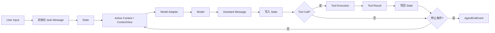

# 01. Agent Runtime 与核心抽象

本文对应 [`question-checklist.md`](question-checklist.md) 中第一部分的问题。现有内容先
覆盖项目介绍、架构和核心抽象，后续 Agent Loop 与状态协议问题继续在本文补充。回答以
当前代码、测试、设计文档和已发布结果为事实边界。

## 1. 用 3 分钟介绍一下 Simple Long Horizon Agent，它解决的核心问题是什么？

Simple Long Horizon Agent 解决的是：怎样让模型在多个回合里持续操作真实环境，而不是只
生成一次答案。比如修复代码时，模型需要读取仓库、修改文件、运行测试，再根据真实结果继续
调整。模型只负责决定下一步，Runtime 负责把行动执行、结果反馈、状态连续性和停止控制组成
闭环。

项目里实际使用一个显式 Agent Loop。用户任务先写入 `State`，每轮再从当前上下文调用模型；
如果模型返回 Tool Call，Runtime 就执行工具，把结果写回 State，下一轮模型基于新结果继续
决策。`Message` 保存模型需要看到的内容，`Event` 记录模型请求、工具执行和停止原因等运行
事实，`State` 保存完整事件历史并维护当前消息投影。不同 Provider 的协议差异放在 Adapter
边界处理，不进入核心 Runtime。

针对长任务的上下文膨胀，我把完整历史和 Active Context 分开。Compact 只缩小下一轮模型
输入，原始消息和 Event 仍然保留，需要时可以 Recall。更复杂的 Planner-Executor、子 Agent
和 Goal Loop 都复用同一个 Runtime；Trace 和 Eval 则从运行事实中生成轨迹，并通过测试或
官方 scorer 区分“模型说完成”和“任务实际完成”。

当前公开结果包括 SWE-bench Pro 63.20%、Terminal-Bench 2.1 77.53% 和
PostTrainBench 45.88%。这些是完整配置的端到端结果，目前没有足够的组件级 Ablation，所以
我不会把提升单独归因到某一个机制。项目当前主要面向学习、实验和小团队任务，不是生产级
分布式 Agent 平台。

## 2. 为什么自己做 Agent Runtime，而不是直接使用成熟框架？

因为这个项目要研究和展示的对象就是 Runtime 本身，而不只是使用 Runtime 构建一个业务
Agent。项目里实际把主循环直接写在 `core.run()` 中，由它按顺序完成上下文构建、模型调用、
工具执行、State 更新和停止判断；`Message / Event / State` 也使用项目自己的协议。

这样做的价值是控制流可以直接阅读和修改，并且能够用 Fake Model 测试完整闭环。LangGraph、
AutoGen 和 OpenAI Agents SDK 更适合快速构建已有框架覆盖的应用；如果目标变成生产级持久化
编排和组织级治理，我会优先评估这些框架。当前选择的代价是 Provider、Trace、恢复和工具边界
都需要自己维护。

## 3. 你怎么定义 Long Horizon？

我不按固定的 Turn、Token 或执行时间阈值定义 Long Horizon。核心标准是：任务不能通过一次
模型响应完成，后续决策必须依赖前面行动产生的真实反馈，需要持续经历“观察、行动、检查和
修正”才能得到可验证结果。

项目里实际把 Turn、Tool Call、Token、墙钟时间和成本作为观测或预算指标，而不是定义本身。
核心 `run()` 用 `max_turns` 和 abort 保证运行有界，Context Compact 控制长期输入，Goal Loop
再增加 Token、时间预算和外部完成检查。一个 Agent 即使循环很多次，如果没有有效状态推进，
也不能说明它具备 Long Horizon 能力。

## 4. Runtime 的核心架构和完整数据流是什么？

Runtime 的核心是一个小型控制循环，外围分别负责模型适配、工具执行和上下文策略。项目里
实际的数据流是：用户任务先进入 `State`；Runtime 从 Active Context 构建模型输入；模型输出
先记录回 State；如果包含 Tool Call，就执行工具并把 Tool Result 再写回 State，然后开始
下一轮。

`run()` 统一决定停止原因：模型输出 `final` 是 `done`，回合耗尽是 `max_turns`，工具主动
终止是 `tool_terminate`，调用者取消是 `abort`。这里的 `done` 只表示内层 Agent Loop 结束，
任务是否真正成功仍由测试、Goal Loop 或 Eval scorer 等外部检查确认。

## 5. Runtime 里面最核心的 abstraction 是什么？

如果必须只选一个，我会选以 `State` 为中心的追加式运行事实协议。项目里每条 Message 都通过
Event 写入 State，模型请求、工具执行、上下文压缩和停止原因也分别记录为 Event；
`StateSnapshot` 只是由这些 Event 派生出来的消息和 Active Context 缓存。

它解决的是 Long Horizon 任务的连续性问题：上下文可以压缩，模型和工具可以替换，但完整运行
事实不能丢失。需要说明的是，当前 State 仍然是进程内对象，项目支持在同一个 State 上
`resume()`，但还没有实现生产级跨进程 Checkpoint 和 exactly-once 工具恢复。

## 核对依据

- [`core.py`](../../src/simple_long_horizon_agent/core.py)
- [`state.py`](../../src/simple_long_horizon_agent/state.py)
- [`messages.py`](../../src/simple_long_horizon_agent/messages.py)
- [`protocols.py`](../../src/simple_long_horizon_agent/protocols.py)
- [`context_view.py`](../../src/simple_long_horizon_agent/context_view.py)
- [`01-product-goals-and-scope.md`](../design/01-product-goals-and-scope.md)
- [`02-system-architecture.md`](../design/02-system-architecture.md)
- [`03-domain-model-and-data-flow.md`](../design/03-domain-model-and-data-flow.md)
- [`15-resume-project-description.md`](../design/15-resume-project-description.md)
- [`README.md`](../../README.md)
