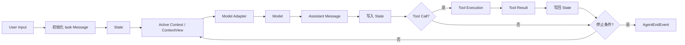

# 01. Agent Runtime 与核心抽象

本文对应 [`question-checklist.md`](question-checklist.md) 中第一部分的问题。当前覆盖项目
介绍、架构、核心抽象以及第 6～11 题的 Agent Loop 与完成判断。回答以当前代码、测试、
设计文档和已发布结果为事实边界。

## 1. 用 3 分钟介绍一下 Simple Long Horizon Agent，它解决的核心问题是什么？

### 口述主回答

Simple Long Horizon Agent 解决的是：怎样让模型在多个回合里持续操作真实环境，而不是只
生成一次答案。比如修复代码时，模型需要读取仓库、修改文件、运行测试，再根据真实结果继续
调整。模型只负责决定下一步，Runtime 负责把行动执行、结果反馈、状态连续性和停止控制组成
闭环。

项目里实际使用一个显式 Agent Loop。用户任务先写入 `State`，每轮再从当前上下文调用模型；
如果模型返回 Tool Call，Runtime 就执行工具，把结果写回 State，下一轮模型基于新结果继续
决策。`Message` 保存模型需要看到的内容，`Event` 记录模型请求、工具执行和停止原因等运行
事实，`State` 保存完整事件历史并维护当前消息投影。不同 Provider 的协议差异放在 Adapter
边界处理，不进入核心 Runtime。

针对长任务的上下文膨胀，我把完整历史和 Active Context 分开。Compact 只缩小下一轮模型
输入，原始消息和 Event 仍然保留，需要时可以 Recall。更复杂的 Planner-Executor、子 Agent
和 Goal Loop 都复用同一个 Runtime；Trace 和 Eval 则从运行事实中生成轨迹，并通过测试或
官方 scorer 区分“模型说完成”和“任务实际完成”。

当前公开结果包括 SWE-bench Pro 63.20%、Terminal-Bench 2.1 77.53% 和
PostTrainBench 45.88%。这些是完整配置的端到端结果，目前没有足够的组件级 Ablation，所以
我不会把提升单独归因到某一个机制。项目当前主要面向学习、实验和小团队任务，不是生产级
分布式 Agent 平台。

## 2. 为什么自己做 Agent Runtime，而不是直接使用成熟框架？

### 口述主回答

因为这个项目要研究和展示的对象就是 Runtime 本身，而不只是使用 Runtime 构建一个业务
Agent。项目里实际把主循环直接写在 `core.run()` 中，由它按顺序完成上下文构建、模型调用、
工具执行、State 更新和停止判断；`Message / Event / State` 也使用项目自己的协议。

这样做的价值是控制流可以直接阅读和修改，并且能够用 Fake Model 测试完整闭环。LangGraph、
AutoGen 和 OpenAI Agents SDK 更适合快速构建已有框架覆盖的应用；如果目标变成生产级持久化
编排和组织级治理，我会优先评估这些框架。当前选择的代价是 Provider、Trace、恢复和工具边界
都需要自己维护。

## 3. 你怎么定义 Long Horizon？

### 口述主回答

我不按固定的 Turn、Token 或执行时间阈值定义 Long Horizon。核心标准是：任务不能通过一次
模型响应完成，后续决策必须依赖前面行动产生的真实反馈，需要持续经历“观察、行动、检查和
修正”才能得到可验证结果。

项目里实际把 Turn、Tool Call、Token、墙钟时间和成本作为观测或预算指标，而不是定义本身。
核心 `run()` 用 `max_turns` 和 abort 保证运行有界，Context Compact 控制长期输入，Goal Loop
再增加 Token、时间预算和外部完成检查。一个 Agent 即使循环很多次，如果没有有效状态推进，
也不能说明它具备 Long Horizon 能力。

## 4. 整个 Agent Runtime 的核心架构是什么？能不能画一下从 `User Input → Model → Tool → State → Model → Stop` 的完整数据流？

### 口述主回答

Runtime 的核心是一个小型控制循环，外围分别负责模型适配、工具执行和上下文策略。项目里
实际的数据流是：用户任务先进入 `State`；Runtime 从 Active Context 构建模型输入；模型输出
先记录回 State；如果包含 Tool Call，就执行工具并把 Tool Result 再写回 State，然后开始
下一轮。



`run()` 统一决定停止原因：模型输出 `final` 是 `done`，回合耗尽是 `max_turns`，工具主动
终止是 `tool_terminate`，调用者取消是 `abort`。这里的 `done` 只表示内层 Agent Loop 结束，
任务是否真正成功仍由测试、Goal Loop 或 Eval scorer 等外部检查确认。

## 5. Runtime 里面最核心的 abstraction 是什么？

### 口述主回答

如果必须只选一个，我会选以 `State` 为中心的追加式运行事实协议。项目里每条 Message 都通过
Event 写入 State，模型请求、工具执行、上下文压缩和停止原因也分别记录为 Event；
`StateSnapshot` 只是由这些 Event 派生出来的消息和 Active Context 缓存。

它解决的是 Long Horizon 任务的连续性问题：上下文可以压缩，模型和工具可以替换，但完整运行
事实不能丢失。需要说明的是，当前 State 仍然是进程内对象，项目支持在同一个 State 上
`resume()`，但还没有实现生产级跨进程 Checkpoint 和 exactly-once 工具恢复。

## 6. 把 Agent Loop 写成伪代码，并说明每一步由谁负责

### 口述主回答

我的 Agent Loop 是一个显式有限循环。初始化器先创建 State 并写入用户任务；Runtime 每轮负责
检查中止、整理上下文、调用模型、记录响应、执行工具和判断停止。模型只决定下一步行动，工具只
执行副作用，所有结果最终都由 Runtime 写回 State。

```python
state = init_state_with_task_message(task)
record(agent_start)

for _ in range(max_turns):
    if abort():
        reason = "abort"
        break

    record(turn_start)
    maybe_compress(state)
    visible = build_context(state)

    record(model_request)
    reply = agent.generate(visible)
    record(model_response)
    record(reply)

    if reply contains tool_calls:
        results = dispatch_tools(reply.tool_calls)
        record(tool_results_message(results))
        if any result requests termination:
            record(turn_end(terminated=True))
            reason = "tool_terminate"
            break

    record(turn_end)
    if reply is final:
        reason = "done"
        break
else:
    reason = "max_turns"

record(agent_end(reason))
```

### 技术追问补充

- `Agent.run()` 先通过默认或自定义 initializer 创建 `State`；默认 initializer 会记录一条
  `kind="task"` 的 UserMessage，然后返回惰性的 Event 迭代器。
- `core.run()` 是唯一主循环，顺序固定为：AgentStart → TurnStart → 可选压缩 →
  ModelRequest/Response → Assistant Message → 可选工具执行与结果消息 → TurnEnd → AgentEnd。
- `Agent.generate()` 只接收当前可见消息并返回下一条 Message；`AgentTool.execute()` 只返回
  `ToolResult`；State 的追加和停止原因都由 Runtime 统一处理。

## 7. 一个 Agent Turn 的严格定义是什么？

### 口述主回答

当前项目中，一个 Turn 从 `TurnStartEvent` 开始，包含请求前压缩、上下文构建、一次主模型调用、
助手消息写入，以及该响应直接触发的全部工具执行和结果写回，最后以 `TurnEndEvent` 结束。

所以 Turn 不只是一次模型调用。工具结果写入 State 后仍属于当前 Turn；下一次模型读取这些结果时，
才进入下一个 Turn。

### 追问问题与回答

**追问：一次 Tool Call 是否单独算一个 Turn？**

不算。Tool Call 和它触发的执行过程属于模型产生该调用的当前 Turn。

**追问：工具结果写回属于当前 Turn，还是下一个 Turn？**

写回 State 属于当前 Turn；下一次模型读取结果并继续决策时，才开始下一个 Turn。

### 技术追问补充

- 正常 Turn 的事件范围是 `TurnStartEvent` 到 `TurnEndEvent`，中间只有一次主 Agent 的模型调用，
  但可以包含多个工具调用。
- 同一 Assistant 响应产生的全部 Tool Result 会被合并成一条 `kind="tool_result"` UserMessage；
  这条消息写入后，本轮才结束。
- 下一轮会重新从 State 构建 `ContextView`，模型在这一轮才读取上一轮写回的工具结果。

## 8. 模型一次返回多个工具调用时，Runtime 如何处理？

### 口述主回答

Runtime 会先按模型输出顺序为每个调用记录开始事件，再经过执行前 Hook。允许并行的调用进入线程池；
如果本批存在必须顺序执行的工具，整批就串行运行。

工具可以按不同顺序完成，结束事件反映实际完成过程；但 Runtime 最终按模型原始调用顺序组装一条
工具结果消息，每个结果通过调用编号与原请求配对，然后模型在下一 Turn 统一读取。

### 技术追问补充

- `dispatch_tool_calls()` 先按原顺序记录全部 `ToolExecutionStartEvent`，再执行
  `PRE_TOOL_USE` Hook。被阻止的调用直接生成错误结果，不进入线程池。
- `PRE_TOOL_USE` 是工具执行前的确定性拦截点。Hook 可检查 Agent、State、工具名称、调用编号和
  参数，返回空决定表示放行，返回 `block_reason` 表示拒绝。
- 被拒绝的调用会记录 `HookFiredEvent` 和错误 `ToolExecutionEndEvent`，并在结果包中把原因反馈给
  模型。Hook 不能改写调用参数；此阶段的 `emit_messages` 也会被忽略，以免破坏 Tool Call/Result
  配对。
- 若有效调用中存在 `execution_mode="sequential"`，工作线程数为 1；否则使用
  `min(8, 调用数)` 个线程并行执行。
- 结果暂存在以 `tool_call_id` 为键的字典中；结束事件可按实际完成顺序出现，但最终
  `ToolResultBlock` 按原始 Tool Call 顺序组装。
- 未知工具、执行异常和超时仍会生成保留原调用编号的错误结果，维持调用与结果一一配对。

## 9. Tool 执行失败后，系统应该重试、把错误返回给模型、中断运行，还是执行 fallback？这个决策由 Tool、Runtime、模型还是 Workflow 负责？

### 口述主回答

默认做法是把失败变成模型可见的错误结果，而不是立即中断整个 Run。未知工具、参数问题、异常和
超时都会保留原调用编号写回 State，模型下一轮可以修正参数、改用其他工具或调整方案。

是否重试和 fallback 要分层决定：工具可以处理自身明确安全的局部重试，模型负责根据错误反馈重新
决策，Workflow 负责跨工具或跨服务的确定性 fallback。Runtime 不做不了解业务语义的通用工具重试。

### 技术追问补充

- `_execute_one()` 将未知工具、执行异常和 Runtime 单工具超时统一转换为
  `ToolResult(is_error=True)`；具体参数校验通常由工具实现完成。
- Runtime 不自动重试普通工具，也不选择 fallback。错误结果进入下一轮后，模型可以修改参数或
  选择其他工具；确定性跨服务 fallback 应由 Workflow 显式编排。
- `ToolResult.terminate=True` 是工具要求停止的独立控制信号。Runtime 会先记录结果和
  `TurnEndEvent(terminated=True)`，再以 `tool_terminate` 结束。
- 模型访问层对 429、限流和部分服务错误有自己的有限退避重试，这与可能产生副作用的工具重试是
  两套边界。

## 10. Agent Loop 有哪些停止条件，如何避免无限循环？

### 口述主回答

当前有四类停止原因：模型输出 `final`、回合预算耗尽、工具请求终止，以及调用者 abort。硬性的
无限循环保护是 `max_turns`，因为核心循环本身使用有限 range 驱动。

`max_turns` 是粗粒度保护，不是任务成功判断。达到上限只能标记运行被截断；如果外部判断任务还差
一步，可以由调用者在同一 State 上 `resume()`，或者由有额外预算的 Goal Loop 继续。

### 追问问题与回答

**追问：如果模型不断重复调用同一个 Tool，Runtime 如何检测和处理？**

当前核心没有专门的重复检测，只能由模型纠正、Hook 阻止或 `max_turns` 最终截断。

**追问：`max_turns` 是否是一种过于粗粒度的停止机制？**

是。它不理解任务进度，只提供一个一定生效的失控上限。

**追问：达到 `max_turns` 时任务只差一步完成，系统应该如何处理？**

仍然记录预算耗尽，不能标记成功；外层可以明确增加预算并在原 State 上继续。

### 技术追问补充

- `AgentEndReason` 是封闭集合：`done`、`max_turns`、`tool_terminate` 和 `abort`，由
  `core.run()` 统一产生。
- 核心循环直接使用 `range(max_turns)`，因此预算一定生效；当前没有针对“重复调用同一工具”的
  专门检测器。
- `ToolResult(terminate=True)` 只表示工具要求结束当前这段 `run()`，不表示任务已经成功。Runtime
  仍会先把工具结果写入 State，并记录 `ToolExecutionEndEvent(terminate=True)` 和
  `TurnEndEvent(terminated=True)`，然后以 `AgentEndEvent(reason="tool_terminate")` 退出，不再发起
  下一次模型调用。
- 当前 `run()` 不会因为 `tool_terminate` 自动恢复。调用者或 Goal Loop 需要读取工具结果的
  `details`，再结合 `CompletionCheck` 或实际验证器判断是否完成；如果没有完成，可以在同一个 State
  上追加 follow-up 并调用 `resume(state, followup, max_turns=...)`。之前的停止事件会保留，新的运行会
  继续追加到同一份 State。
- `max_turns` 只表示截断，不表示成功。调用者可以通过 `resume(state, followup)` 在原 State
  上增加预算继续，旧的停止事件仍保留。
- Goal Loop 可以在外层加入 Token、墙钟时间和完成检查，但同样不会把预算耗尽标记为完成。

## 11. 模型声明“任务完成”时，Runtime 是否应该相信？

### 口述主回答

Runtime 可以接受模型的 `final` 来结束当前内层循环，但不能把它直接当成任务客观完成。模型可能
漏做要求、误读工具结果，或者在测试失败时仍然声称已经完成。

项目把三层职责分开：模型提出完成声明，Runtime 记录并停止本段运行，外部验证器通过测试、命令、
规则或 Judge 判断目标是否满足。Goal Loop 在验证未通过时会继续同一个会话。

### 追问问题与回答

**追问：Agent 的“完成”应该由模型判断、Runtime 判断，还是由外部验证器确认？**

模型负责声明，Runtime 负责停止当前循环，外部验证器负责确认任务是否客观完成。

### 技术追问补充

- 模型输出属于当前 Agent 的 `kind="final"` 时，内层 Runtime 记录
  `AgentEndEvent(reason="done")`；该事件只表示模型正常结束本段运行。
- `run_goal_loop()` 在每段 `run()` 或 `resume()` 后调用独立 `CompletionCheck`。检查未通过时，
  它会在同一 State 上追加继续任务并再次运行。
- 项目提供模型声明、固定命令、重新执行验证命令和独立 Judge 等检查方式；确定性命令证据优先于
  模型自评。
- Goal Loop 的终态包括 `complete`、`blocked`、`budget_exhausted` 和 `aborted`，并受回合、
  Token、墙钟时间和 abort 限制。

## 12. 为什么要把 Message、Event 和 State 分开？

### 口述主回答

三者回答的是不同问题。Message 表示模型可能看到的对话内容，核心字段包括角色、内容、发送方、
接收方和消息类型；Event 表示 Runtime 中发生的事实，除了事件类型，还带顺序、时间和唯一标识；
State 则拥有一次运行的完整事件历史，并维护当前消息和活跃上下文投影。

用户、Runtime 和模型会产生 Message；核心循环、工具调度、压缩和 Workflow 会产生 Event；
State 统一记录并盖章。模型上下文消费 Message，Trace 和成本分析消费 Event，Runtime 通过 State
读取完整历史与当前投影。分开后，观察事实不会污染模型输入，压缩上下文也不会删除运行证据。

### 技术追问补充

- Runtime Message 的公共字段是 `role`、`content`、`sender`、`target`、`kind` 和
  `sidecar`；AssistantMessage 另外保存 `usage` 和 `model`。
- Event 是冻结 dataclass，公共身份字段是 `kind`、`index`、`elapsed` 和 `uuid`，不同事件再
  携带模型、工具、压缩或停止相关字段。
- State 的核心字段是 `task`、`events`、`snapshot` 和扩展用 `data`；`events` 是运行历史的
  主事实来源，Snapshot 是可重建缓存。
- 每条 Message 进入 State 时都会包装成 `MessageEvent`；非消息 Event 不会自动进入模型上下文。

## 13. Tool Result 和 Model Response 分别属于 Message 还是 Event？

### 口述主回答

它们都需要“模型可见内容”和“运行事实”两种表示。工具结果正文要作为 `ToolResultBlock` 写入
UserMessage，让模型下一轮读取；工具何时开始、是否报错和何时结束则记录为工具执行 Event。

模型响应也一样：模型访问层先得到统一 `LLMResponse`，Runtime 记录 `ModelResponseEvent`，再把
内容包装成 `AssistantMessage` 写入 State。两种表示不是重复数据，而是分别服务上下文和审计。

### 追问问题与回答

**追问：为什么 Tool Result 可能同时需要消息表示和执行事件？**

消息表示让模型看到结果；执行事件记录工具是否真正运行、是否失败、耗时和是否要求终止。

**追问：Model Response 写入上下文与记录运行事实时，是否需要两种表示？**

需要。`AssistantMessage` 进入后续上下文，`ModelResponseEvent` 保存调用级结果、用量和模型信息。

### 技术追问补充

- 模型请求工具时，`ToolCallBlock` 保存在 AssistantMessage 中；Runtime 再记录
  ToolExecutionStart/Update/End Event。
- 同一轮的工具结果被组装成一条 `kind="tool_result"` UserMessage，其中每个
  `ToolResultBlock.tool_call_id` 指回原调用。
- 模型响应的顺序是：记录 `ModelResponseEvent`，再记录承载 `AssistantMessage` 的
  `MessageEvent`。
- 供应商原始响应可以保存在消息 sidecar 的 raw 中供调试，但正常控制流读取规范化 Message 和
  Event，不直接读取 SDK 对象。

## 14. State 是 append-only 还是 mutable？

### 口述主回答

State 本身是进程内可变容器，但标准变更路径是追加 Event。已经记录的 Message 和 Event 都是
不可变值；可变的是 State 持有的事件列表，以及为快速读取维护的 `StateSnapshot`。

`State.events` 是事实来源，Snapshot 中的消息列表和活跃上下文索引只是派生投影。Snapshot 丢失
或需要校验时，可以按顺序重新应用 Event 重建。

### 追问问题与回答

**追问：哪些部分只允许追加，哪些部分是可变的派生投影？**

Event Stream 和已经记录的 Message 按契约只追加、不原地修改；Snapshot 的消息缓存和活跃索引会
随新 Event 更新。

**追问：如果存在可变投影，如何通过 Event Replay 重建？**

从空 `StateSnapshot` 开始，严格按 Event 顺序调用 `apply()`。`MessageEvent` 依次恢复完整消息列表；
`ContextCompressionEvent` 不删除旧消息，只把 `active_context_indices` 替换成压缩后的可见索引；
后续新消息再同时追加到完整消息列表和当前活跃索引。这样即使内存 Snapshot 丢失，也能从同一组
Event 重建出相同的完整 History 和 Active Context。

### 技术追问补充

- `State.record_event()` 为事件补齐 index、相对 elapsed 和 UUID，然后追加到 `events`，再调用
  `snapshot.apply()`。
- Snapshot 只处理影响当前消息投影的 Event；生命周期、模型和工具 Event 仍保留在完整历史中。
- `State.rebuild_snapshot()` 会创建空 Snapshot，顺序重放全部 Event，并用重建结果替换当前缓存。
- 一个最小 Event Replay 过程可以表示为：

  ```text
  0. MessageEvent("用户任务")
  1. MessageEvent("模型回答")
  2. MessageEvent("很长的工具结果")
  3. MessageEvent("压缩摘要")
  4. ContextCompressionEvent(active_context_indices=[0, 3])
  5. MessageEvent("压缩后的新消息")
  ```

  重建时不读取旧 Snapshot，而是重新创建一个空投影：

  ```python
  snapshot = StateSnapshot()
  for event in state.events:
      snapshot.apply(event)
  ```

  按顺序应用这些事件时，Snapshot 的变化是：

  ```text
  初始：
    messages = []
    active_context_indices = None

  重放 Event 0～3：
    messages = [用户任务, 模型回答, 很长的工具结果, 压缩摘要]
    active_context_indices = None

  重放 Event 4：
    messages = [用户任务, 模型回答, 很长的工具结果, 压缩摘要]
    active_context_indices = [0, 3]

  重放 Event 5：
    messages = [用户任务, 模型回答, 很长的工具结果, 压缩摘要, 压缩后的新消息]
    active_context_indices = [0, 3, 4]
  ```

  其中索引 1、2 对应的模型回答和原始工具结果始终保留在完整 `messages` 中；压缩事件只把下一轮
  使用的 Active Context 改为索引 0、3。压缩之后的新消息位于索引 4，所以应用新的
  `MessageEvent` 时，它会同时进入完整消息列表和当前活跃索引。
- `ContextCompressionEvent.active_context_indices` 在应用时会复制到 Snapshot，避免后续追加新消息
  修改这条历史 Event 自身保存的索引列表。
- 只要 Event 顺序和内容相同，重放结果就应一致；现有测试会在压缩后调用
  `rebuild_snapshot()`，核对重建出的 Active Context 索引。
- 当前 `state.events` 仍是公开 Python list，因此 append-only 是 Runtime 契约，不是容器级防篡改。

## 15. Event 是否需要全局唯一 ID？

### 口述主回答

需要，但全局唯一 ID 不能替代运行内顺序和时间。项目同时保存递增 index、相对 elapsed 和 UUID：
index 回答同一运行中谁先谁后，elapsed 回答相对运行起点何时发生，UUID 用于跨文件、合并轨迹或
续接运行时稳定引用同一事件。

这些身份都由 State 写入，而不是让不同模块各自生成顺序和时间规则。

### 追问问题与回答

**追问：运行内递增 index、时间戳和全局唯一 ID 分别解决什么问题？**

index 负责本次运行的确定顺序；elapsed 负责耗时和时间线；UUID 负责跨文件和跨视图的稳定身份。

### 技术追问补充

- `_BaseEvent` 预留 `index=-1`、`elapsed=0` 和空 UUID，正式记录时由 State 统一替换。
- 当前 UUID 使用 UUID4；index 使用 `len(state.events)`，从 0 开始递增。
- elapsed 使用单调时钟的运行相对时间，不是可用于跨机器比较的墙钟时间。
- `record_event_at()` 允许嵌套操作在稍后写入父 State 时保留显式的运行相对时间。

## 16. 工具成功但结果写入 State 前崩溃，恢复时怎么办？

### 口述主回答

当前项目不能安全自动恢复这个窗口。Trace 中可能只有工具开始事件，但外部副作用其实已经成功；
如果恢复时直接重放工具，就可能重复执行。

正确做法是把这次调用标记为状态不确定，先使用稳定幂等键或外部操作 ID 查询目标系统，确认结果后
补写完成状态；无法确认时转人工处理。这里需要事务日志和 Reconcile，当前 Runtime 尚未实现。

### 追问问题与回答

**追问：Replay Trace 时如何避免再次执行有副作用的 Tool？**

Trace Replay 只重建历史，不能把历史 Tool Call 当成待执行命令。恢复协调器必须先检查幂等记录和
外部系统状态。

**追问：如何区分已经发生的历史事件和恢复后仍需要执行的动作？**

需要显式状态机区分执行意图、执行中、已确认完成和状态不确定；只有确认尚未执行的动作才能重试。

### 技术追问补充

- 当前 Runtime 在执行前记录 `ToolExecutionStartEvent`，完成后才记录 End Event 和结果消息；
  两次写入之间没有数据库事务。
- 当前事件没有持久化执行意图、幂等键或外部操作 ID，也没有 exactly-once 工具账本。
- 生产方案应先持久化意图和稳定幂等键，再执行副作用，最后提交结果；崩溃窗口由 Reconcile 查询
  外部状态。
- `RunTrace` 和 Event Replay 是观察与重建机制，不负责重新调度未决动作。

## 17. 为什么不直接维护一个 messages 列表？

### 口述主回答

因为消息列表只能说明对话中出现了什么，不能说明 Runtime 实际做了什么。只保存 messages，无法
知道模型请求何时发生、工具是否真正执行、是否超时、上下文何时压缩，以及 Run 为什么停止。

项目因此用 Event Stream 保存完整运行事实，再从 MessageEvent 派生 messages。模型读取消息，
Trace、Span、成本、恢复分析和停止判断则读取更完整的事件历史。

### 追问问题与回答

**追问：只有消息列表时，哪些运行事实、恢复信息和可观测性会丢失？**

会丢失模型请求、工具开始与结束、Hook 决策、压缩动作、停止原因、相对耗时和 Goal 状态等事实。

### 技术追问补充

- AssistantMessage 中出现 Tool Call 只能证明模型提出了调用，不能证明工具已经开始或完成。
- ToolExecution Event 记录真实执行、错误和终止信号；ModelRequest/Response Event 记录调用级
  输入统计、模型和 usage。
- ContextCompressionEvent 记录原消息索引和新活跃视图；仅看最终 messages 无法恢复每轮模型当时
  看到了什么。
- AgentEndEvent 和 GoalStatusEvent 区分正常结束、预算耗尽、中止、阻塞和客观完成。

## 核对依据

- [`core.py`](../../src/simple_long_horizon_agent/core.py)
- [`state.py`](../../src/simple_long_horizon_agent/state.py)
- [`messages.py`](../../src/simple_long_horizon_agent/messages.py)
- [`protocols.py`](../../src/simple_long_horizon_agent/protocols.py)
- [`context_view.py`](../../src/simple_long_horizon_agent/context_view.py)
- [`tools/__init__.py`](../../src/simple_long_horizon_agent/tools/__init__.py)
- [`workflow/goal_loop.py`](../../src/simple_long_horizon_agent/workflow/goal_loop.py)
- [`workflow/goal_checks.py`](../../src/simple_long_horizon_agent/workflow/goal_checks.py)
- [`01-product-goals-and-scope.md`](../design/01-product-goals-and-scope.md)
- [`02-system-architecture.md`](../design/02-system-architecture.md)
- [`03-domain-model-and-data-flow.md`](../design/03-domain-model-and-data-flow.md)
- [`15-resume-project-description.md`](../design/15-resume-project-description.md)
- [`README.md`](../../README.md)
