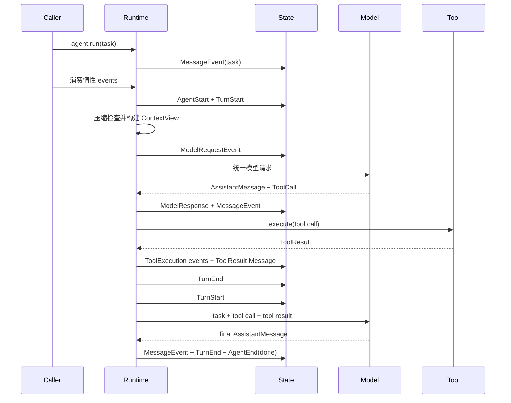

下面以“项目负责人 / 核心开发者”的第一人称回答。第 6 题的故障经历是依据当前架构反推的模拟案例，正式面试时应替换成你的真实经历。

## 1. 用 2 分钟介绍项目

Simple Long Horizon Agent 是我主导设计和实现的一套轻量级长周期 Agent Runtime。它解决的不是单轮问答，而是模型如何在有限上下文中持续观察环境、调用工具、读取结果、修正方案，并通过外部信号确认任务是否真正完成。

核心设计是一套基于同步生成器的显式 Agent 循环。运行过程统一使用项目自有的 `Message`、`Event` 和 `State` 协议：Message 承载模型可见的任务、输出和工具反馈；Event 记录模型请求、工具执行、压缩、停止等运行事实；State 以追加方式保存完整历史。不同模型供应商的协议差异由 Provider Adapter 消化，核心 Runtime 不依赖 OpenAI 或 Anthropic 的原始对象。

为了支持长任务，我把完整历史、活跃上下文和单轮模型输入分开。历史始终保留，压缩只改变当前活跃投影；如果摘要遗漏了细节，Agent 可以通过 Recall 按稳定索引恢复原始信息。在此基础上，我又实现了工具系统、MCP、子 Agent、工作流、Trace Viewer 和容器化 Eval。

项目已在 SWE-bench Pro、Terminal-Bench 2.1 和 PostTrainBench 上完成评测，分别达到 63.20%、77.53% 和 45.88%。这些结果说明整套 Agent 配置在相同模型和任务预算下有效，但由于目前没有完整消融实验，我不会把提升单独归因于某个组件。项目当前主要面向学习、架构研究和小团队实验，而不是生产级多租户平台。

## 2. 这是个人还是团队项目？你负责什么？

我是项目发起人和核心开发者，主导了产品定位、架构边界和核心实现。我的主要工作可以分成八个部分：领域协议与 State、Agent Runtime、Provider Adapter、工具与 MCP、上下文与 Memory、多 Agent 工作流、Trace 可观测性，以及 Eval 基础设施。

我不会把外部依赖描述成自己的原创实现。模型 API、MCP 协议、Docker、Benchmark 数据集和官方评分器属于外部系统；我负责的是如何把它们接入统一架构、隔离差异、记录失败，并形成可测试和可复现的工程闭环。

如果确实有其他贡献者，应补充其负责范围，不要使用“全部由我完成”的绝对表述。

## 3. 哪些是独立设计，哪些参考了现有方案？

独立设计和实现的重点，是项目内部的一致性架构：自有 Message/Event/State 协议、追加式 Event Stream、Snapshot 投影、显式生成器循环、完整历史与活跃上下文分离、压缩后 Recall、统一工具结果包，以及由同一事件事实派生 Trace 和 Eval 产物。

参考的主要是行业通用思想：单 Agent 的观察—行动循环来自 ReAct 类范式；工具协议参考模型供应商的 Tool Calling；外部工具接入采用 MCP；SWE-bench 的链式运行参考了类似 ChainSWE 的思路；评分遵循各 Benchmark 的官方方法。

我借鉴的是问题和模式，没有把 LangGraph 或 AutoGen 的图、节点、消息总线直接搬进项目。项目需要证明的是我如何选择边界和完成工程落地，而不是声称这些概念都由我首次提出。

## 4. 项目有多少代码、测试和模块？

按当前仓库物理行数统计，主包有 106 个 Python 文件，约 26,729 行；测试有 53 个 Python 文件，约 16,270 行，包含约 698 个测试函数。这里包含空行和注释，也包含约 8,200 行 Eval 基础设施，所以不能把总行数等同于核心 Runtime 的复杂度。

核心控制路径集中在 `core.py`、`state.py`、`messages.py`、`protocols.py` 和 `context_view.py`，合计约两千行。概念上可划分为八个模块：Runtime、领域数据、模型访问、工具集成、长上下文、组合工作流、可观测性和评测运行。

## 5. 技术难度最高的三个问题是什么？

**第一，供应商无关但不损失能力。**

OpenAI Chat、Responses 和 Anthropic 对工具调用、工具结果、system prompt、流式响应和推理连续性的表达都不同。我没有采用最低公共字段，而是先定义统一 Content Block、LLMRequest 和 LLMResponse，再由 Adapter 转换 Wire 格式。供应商特例保留在命名空间数据中，不能渗入 Runtime。

**第二，压缩上下文但不丢失运行事实。**

长任务不能把全部历史一直送给模型，也不能直接删除旧消息。我把 Event Stream 作为事实来源，把活跃上下文作为可重建投影。压缩追加摘要和 Compression Event，不覆盖原消息；Recall 可以恢复旧证据。难点是同时维持工具调用配对、Token 预算和 Trace 可解释性。

**第三，让运行、观察和评测使用同一事实体系。**

Agent final 只代表模型认为结束，不代表任务客观成功。系统需要区分 done、max turns、abort、tool terminate 和外部 Goal Check。Trace、Span、成本、容器结果和评分都从结构化事件与产物派生，不能从终端文本猜测。

## 6. 哪个设计曾经错误？如何重构？

以下是符合当前架构的模拟回答：

早期我尝试把 transcript 同时作为完整历史和模型上下文。当上下文过长时，直接用摘要替换旧消息。短任务没有明显问题，但在长任务中暴露了三个缺陷：摘要遗漏路径或错误码后无法恢复；工具调用和结果可能失去配对；Trace 只能看到压缩后的内容，无法解释 Agent 当时为什么做出决定。

后来我把它重构成“事实与投影分离”：Event Stream 只追加；MessageEvent 形成完整 transcript；StateSnapshot 缓存当前投影；`active_context_indices` 决定哪些历史进入当前上下文；摘要作为新 Message 追加，压缩动作单独记录为 ContextCompressionEvent；Recall 始终从完整消息列表读取。

同时增加了 Snapshot 回放、压缩后 Recall、ToolCall/ToolResult 配对和 Trace 重建测试。代价是数据模型更明确、索引逻辑更复杂，但换来了可恢复性和可审计性。

## 7. 如果只能保留三个核心能力

第一，保留显式 Agent Runtime 和项目自有的 Message/Event/State 协议，这是所有行为的一致基础。

第二，保留受控工具闭环和明确停止语义，让模型能够作用于真实环境，并让失败、超时和中止成为结构化反馈。

第三，保留“完整历史、活跃上下文、外部验证”这一长周期机制，包括压缩、Recall、Trace 和 Goal Check。

Provider Adapter、Memory、多 Agent Workflow、MCP 和 Docker 都可以作为外围能力逐步加回；前三项不存在，项目就不再是一个可解释的长周期 Agent Runtime。

## 8. 为什么不直接使用 LangChain、LangGraph 或 AutoGen？

这些框架更适合快速集成生态能力或构建复杂图编排，但我的项目目标是研究和教学 Agent 最核心的运行机制。如果直接引入大型框架，模型调用、状态变化、工具反馈和停止判断容易隐藏在框架生命周期里。

我并不认为自研框架天然更好。代价是我要自己维护 Adapter、工具协议、Trace 和工作流。选择自研的理由是这些边界本身就是项目要研究和展示的内容，而不是因为现有框架无法实现这些功能。

如果目标变成企业集成和快速交付，我会重新评估是否在外围接入成熟框架，而不会坚持所有能力都自行实现。

## 9. “轻量级”体现在哪里？

轻量级不是说整个仓库只有几百行，而是核心语义和依赖保持轻量。最小 Agent 不依赖 Memory、MCP、Workflow、Docker 或 Benchmark，也不要求异步框架和图执行引擎。

核心只有一条显式循环；Agent 是配置而不是隐藏状态容器；工作流使用普通 Python 函数组合；子 Agent 仍复用同一个 Runtime；外围模块只能依赖核心，核心不能反向依赖外围。

所以它是“内核轻、外围按需组合”，不是“功能和代码总量都很少”。

## 10. 项目偏研究还是生产？还缺什么？

当前定位是学习、架构研究和小团队实验，已经能够运行真实任务和 Benchmark，但不是生产级多租户平台。

生产化至少还需要：持久化任务状态与跨进程幂等恢复、消息队列和分布式调度、租户隔离、强安全沙箱、秘密管理、工具审批、Provider 熔断和故障切换、服务级 SLO、容量与压力测试，以及更完整的隐私和数据保留策略。

评测方面还需要增加组件消融、多次重复实验、置信区间和成本—成功率曲线。现阶段我更愿意明确边界，而不是把“能在 Docker 中运行”包装成“已经生产可用”。

## 11. 去掉 Adapter、Memory、Workflow，最小内核是什么？

```text
Agent(generate + tools + policy)
        ↓
State(task + append-only events)
        ↓
ContextView
        ↓
generate(visible messages)
        ↓
AssistantMessage
   ├─ final → AgentEnd(done)
   └─ ToolCall → AgentTool.execute
                    ↓
              ToolResult Message
                    ↓
                 下一轮
```

最小内核是 `Agent + Message + State + ContextView + run()`，再加一个可选的 AgentTool 契约。`generate` 可以是确定性函数，因此完全不需要 Provider Adapter；不启用工具时，它甚至可以一轮直接 final。

## 12. 一次完整任务的调用链



关键点是 `agent.run()` 返回惰性生成器，真正的模型调用和工具执行发生在调用者消费事件时。

## 13. 哪个技术亮点真正原创？

我不会声称某个算法是全球首次提出。项目层面最有原创性的部分，是把追加式运行事实、上下文投影、精确 Recall 和 Trace/Eval 放在同一套数据语义上。

同一条 Event Stream 既驱动 StateSnapshot，也能解释压缩、恢复模型当时所见、派生 Span 和成本，并进入容器化评测。这样长上下文、可观测性和评测不是三个后加模块，而是共享同一事实模型。

我的贡献不是发明 Event Sourcing 或摘要，而是针对 Agent 的 ToolCall 配对、Provider 差异、有限上下文和外部验证，把这些机制组合成一套可读、可测试且前后一致的实现。
